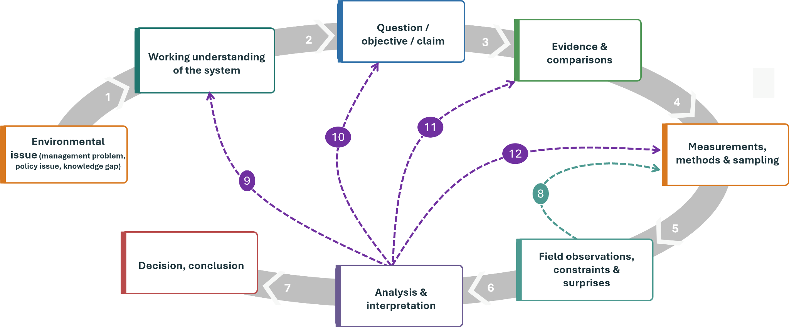
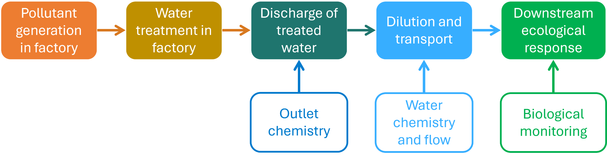
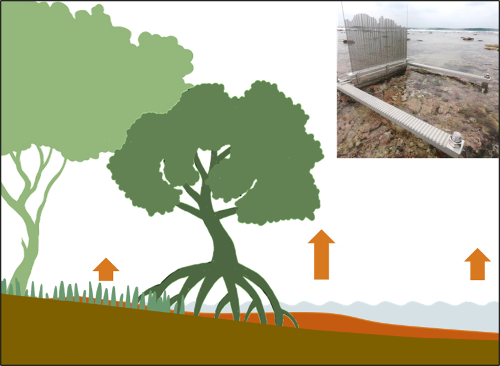

Environmental studies depend on methods, and using those methods well requires technical competence: instruments must be calibrated and used correctly, protocols followed, and data recorded in a form that someone else can understand. It is probably obvious that neglected protocols or an incorrectly applied method can lead to poor, or plainly wrong, study results. However, technical competence alone is not enough. Over the course of this book, I hope you will develop a good sense of why and how a poorly designed study can produce poor results, or results that do not answer a useful question. Take, for example, a surface-elevation table, or SET, installed in a mangrove forest. It is a highly specialised and expensive monitoring system that can detect very small changes in ground elevation through time and, when used carefully, produces a very precise local long-term record of those changes. That record is relevant to whether the forest is keeping pace with sea-level rise, but you could ask yourself whether that is enough. The answer you will often hear in the lectures and read in these notes is: ***it depends***. Does the SET’s location represent the wider mangrove? How many locations are needed to capture variation in sediment supply, hydrology, vegetation and geomorphic setting across the forest? How long should elevation be monitored, and how often should it be measured? The usefulness of the long-term SET record depends on these study-design decisions as well as on the precision of the instrument. This is just one example; similar questions, limitations and choices arise with any other method. A botanical survey may follow its protocol exactly while concentrating plots alongside a road; a water sample may be analysed accurately but collected after a pollution pulse has passed; and a standard bird count may detect a larger fraction of the birds present in open woodland than in dense vegetation. In each case, the immediate measurement may be reliable while the study as a whole provides incomplete or biased information for the question being asked.

## 1.1 From an environmental problem to a study question

Most studies begin with a reason for doing the work, such as a management problem, conservation concern, policy question or scientific uncertainty. Before choosing measurements, we need a working understanding of the system that is sufficient to identify plausible processes, important sources of variation and the conditions under which they operate. Complete understanding is neither possible nor required: if everything were already known, there would be little reason to conduct the study. The practical aim is to understand the system well enough to formulate a question and recognise what information could answer it. One way to represent that reasoning is: environmental issue or knowledge gap → working understanding of the system → question or objective → information and comparisons → measurements, methods and sampling → field observations and constraints → analysis and interpretation → conclusion or decision ([Figure 1.1](#fig_1_1)). The sequence is not a rigid recipe. Field reconnaissance may reveal a gradient or access problem that changes the sampling plan; preliminary analysis may expose an omitted comparison; and unexpected results may force a revision of the proposed explanation. Decisions later in the sequence can therefore send us back to earlier ones.

That working understanding must include **people** where they are part of the system. Land use, management and institutions can influence environmental outcomes, while livelihoods, power and values affect which questions are asked and which interventions are possible. People may be causes of change, managers of the system, holders of knowledge, beneficiaries of an intervention or communities that bear its costs. Historical activities can also leave ecological effects long after the activity has stopped: former cultivation may alter soils, drainage or vegetation for decades, while past grazing and fire can influence which species dominate a regenerating forest. Treating people only as an external disturbance can therefore omit part of the system that produced the present conditions. Some questions require biophysical measurements, some require information about behaviour, experience or institutions, and many require both. Temperature sensors can describe thermal conditions but not how residents experience heat, which routes they can use or why some groups are more exposed; interviews can help explain those experiences and decisions but do not replace measurements of the physical environment. Which methods you combine should therefore follow from your working understanding of the system, your research question and the information needed to answer it, rather than from a hierarchy in which one form of information is assumed to be more scientific.

‘Urban heat’ illustrates the difference between a topic and a question. One study might map the hottest parts of a neighbourhood, while another might compare shaded and unshaded sites, examine how trees alter radiation and evapotranspiration, ask which people experience the greatest heat burden, or evaluate whether a planting programme reduced exposure. Although these studies may all use temperature sensors, they require different locations, times, populations, comparisons and supporting information. A topic identifies an area of concern; a question identifies what the study is trying to learn about it. Questions also differ in the kind of conclusion they seek. A descriptive study may estimate the current temperature distribution across a neighbourhood or map the occurrence of a threatened species. A comparative study asks whether defined groups, places or conditions differ. A study of change needs observations at more than one relevant time or another defensible historical reference. A causal question asks whether one factor contributes to an outcome and must contend with other processes that could produce the same pattern, while evaluating an intervention adds the need to judge whether the observed change would plausibly have occurred without it. None of these questions is inherently more scientific than another. What changes is the information needed to support the intended conclusion. Describing where temperatures are highest requires representative measurements of temperature across the area and time period of interest. Asking whether tree cover explains those differences additionally requires information about tree cover and plausible alternative drivers. Evaluating whether a planting programme *caused* a reduction in heat exposure requires a comparison that says something credible about what would have happened without the intervention. The stronger conclusion is not produced by a more sophisticated instrument; it is produced by a design that contains the information needed for that claim.

::: {.try-it-yourself}
**Try it yourself – Turn a topic into a study question**

Start with the topic *urban heat*. Write one descriptive question, one comparative or relational question, and one intervention question. For each, state the minimum kind of information or comparison you would need before choosing a specific measurement method.

Suggested approach

A descriptive question might ask how daytime temperature varies across a neighbourhood, requiring measurements distributed across the area and relevant times. A relational question might ask whether locations with greater tree cover are cooler, requiring temperature and tree-cover information across a useful range of tree cover together with consideration of other variables that covary with it. An intervention question might ask whether a new planting programme reduced heat exposure, which additionally requires a credible temporal and/or untreated comparison. Many other formulations are possible. In each case, the question determines what information the study must contain before the choice of instrument is considered.

:::

{width=92% fig-alt="Study-design reasoning from environmental issue or knowledge gap through system understanding, question, information needs, measurements, sampling, observations, analysis and a bounded conclusion, with feedback to earlier decisions."}

**Figure 1.1.** The recurring logic of an environmental field study. Later observations and analysis can lead us back to revise earlier decisions rather than moving through the sequence only once.

## 1.2 Different questions require different information

Suppose a factory installs a treatment system intended to reduce pollution in a river. Measurements at the outlet before and after installation may show that the effluent changed. That is important information, but it does not yet show that the treatment reduced ecological harm downstream. Concluding that the treatment reduced ecological harm downstream requires considering the sequence of processes through which one change may lead to another. Such a sequence is a causal pathway: industrial activity determines which pollutants enter the treatment system → treatment alters the discharged effluent → transport and dilution determine downstream exposure → exposure affects organisms and ecological processes → ecological recovery unfolds over time ([Figure 1.2](#fig_1_2)). Different observations address different links in this pathway: water-chemistry measurements at the factory outlet describe pollutant concentrations in the discharge; upstream and downstream chemistry help characterise exposure; and measurements of flow and rainfall help us understand transport and dilution. Assessing how organisms or communities responded requires biological monitoring. But other causal pathways can produce similar observations, a problem considered more fully in [Chapter 2](02-system-understanding.qmd). A decrease in pollutant concentration after the treatment system was installed does not by itself establish that the treatment caused the decrease. Factory production, and therefore pollutant generation, may have declined during the same period, or unusually high rainfall may have reduced measured concentrations through dilution. Pollution from other sources may also prevent a reduction at the outlet from producing a comparable reduction in downstream exposure. Even when the intervention demonstrably reduces that exposure, damaged populations and communities may recover slowly because reproduction, recolonisation and habitat recovery take time. Measuring outlet concentrations before and after treatment therefore cannot distinguish among all these possibilities: it may show that discharge concentrations declined after treatment was introduced, but attributing that decline to the treatment requires additional information or comparisons. Concluding that the river ecosystem recovered requires information about downstream exposure and ecological responses collected over an appropriate period. A limited study need not measure every link in the pathway, but we should restrict our conclusions to the part addressed by the observations. “Discharge concentrations declined after treatment was introduced” may be well supported when “the intervention restored the river ecosystem” is not.

{width=82% fig-alt="Causal pathway from pollutant generation and treatment through discharge and downstream exposure to ecological response, with measurements aligned to different links."}

**Figure 1.2.** A causal pathway from pollutant generation and treatment to downstream exposure and ecological response. Different measurements provide information about different links in the pathway.

## 1.3 Trade-offs in measurements, methods and sampling choices

The choice of methods is sometimes treated as a technical decision made separately from the development of the sampling plan, although in field studies the two are closely intertwined. Consider a sensor that measures **photosynthetically active radiation (PAR)** accurately at a particular place and time. This may be exactly what is needed to relate leaf gas exchange to the light reaching a leaf at that moment. Using PAR sensors to study seedling growth and survival, however, requires measurements that represent the light conditions experienced by seedlings over the relevant period. Describing both daily and spatial variation in understory light would therefore require logging over time at many locations across the forest. Because PAR sensors are expensive, the number of locations that can be monitored simultaneously is often limited, while repeatedly deploying or moving them requires additional field time. Hemispherical photography measures something different: canopy geometry, from which potential light transmission over longer periods can be estimated. This estimate is indirect and depends on several assumptions, including how the image is classified and how patterns of direct and diffuse radiation are represented. It does not record the actual sequence of light conditions, but it may allow many more locations to be characterised with the available time and equipment. Neither method is generally superior: one may be appropriate for studying an immediate physiological response, while the other may be more useful for comparing longer-term canopy environments across many locations. The choice therefore depends not only on what needs to be measured, but also on the **spatial and temporal coverage** required.

The earlier surface-elevation table (SET) example reveals the same trade-off at a larger scale. In mangroves and other coastal wetlands, the soil surface may rise as sediment and organic matter accumulate, or fall through erosion, compaction and other below-ground processes. These changes influence whether the wetland can maintain its elevation relative to rising sea level. An SET consists of a fixed benchmark anchored deep in the ground from which the height of the soil surface within a small surrounding area can be measured repeatedly ([Figure 1.3](#fig_1_3)). One SET installation may therefore provide a detailed long-term record for one part of a coastal ecosystem. If the purpose is to understand the local processes driving elevation change, repeated precise measurements at that location may be appropriate, particularly when combined with measurements of sediment accumulation and other processes expected to affect elevation. If the purpose is to describe variation across a heterogeneous mangrove landscape, however, a single installation may be inadequate no matter how precisely it is measured. Broader spatial coverage using measurements that are less precise at each location may then provide more useful information than still greater precision at the original location. Sections 3.5–3.6 develop the measurement side of this trade-off, while Chapters 5 and 6 develop how that effort is divided among sampling levels and across space.

These examples also show why a **protocol**, although essential, cannot replace your judgement: you still need to make decisions about the study design in light of your understanding of the system, the question or objective, and the observations and constraints encountered in the field. Protocols make procedures more consistent, transparent and repeatable, and can make fieldwork safer; by specifying what should be done, they also reduce avoidable differences among observers and the scope for changing a procedure because a result is inconvenient. Yet a protocol cannot tell you whether the selected locations represent the system, whether the measurement scale matches the process, whether an important comparison is missing or whether a proxy is adequate for the question. Following a protocol correctly therefore answers one question (‘Was this procedure followed?’) but not necessarily another: ‘Was this the right procedure and design for the conclusion you want to draw?’ Environmental fieldwork requires technical competence as well as reasoned judgement, and you should make the basis of that judgement explicit: explain how your understanding of the system led to the measurements and comparisons you selected, which assumptions that reasoning depends on, and how field constraints limit the conclusions you can draw.

{width=78% fig-alt="A precise time series from one surface-elevation table contrasted with a spatially variable mangrove landscape containing many possible monitoring locations."}

**Figure 1.3.** A surface-elevation table can provide a precise long-term record at one location, while inference about the wider mangrove depends on how monitoring locations represent spatial variation.

## 1.4 More data do not automatically provide better information

Sensor networks, drones, satellites, automated recorders and existing databases can produce quantities of environmental information that were previously impossible to obtain. **Remote sensing** and geospatial analysis, in particular, have expanded the spatial and temporal scales at which vegetation dynamics can be studied (Schmid et al., 2026) and may reveal relationships that were not anticipated when the data were collected. This kind of **exploratory research** is extremely valuable because an unexpected pattern can provide the starting point for a new explanation and a more focused study. The difficulty begins when the distinction between **exploration** and **testing** disappears. A pattern may first be discovered in an available dataset, after which a research question is presented as though the data had been collected specifically to answer it. This reverses the sequence introduced earlier in the chapter (Figure 1.1), but research often moves productively from observation to question; the problem is failing to acknowledge that the question emerged from the data and then interpreting the result as though the proposed explanation had been tested independently. A pattern used to generate an explanation does not provide the same independent test as new observations collected to evaluate that explanation against plausible alternatives. Regardless of how the question arose, a large dataset has its own **data-generating process**. Consider the construction of a map of a global forest. Before any map can be produced, analysts must decide what qualifies as forest. A relatively open woodland may be included under one minimum-canopy threshold and excluded under another. Satellite observations record the landscape at a particular spatial resolution, so narrow forest strips and small patches may disappear within larger pixels. Classification procedures must then translate the observed signal into categories, usually using algorithms trained with reference data from selected locations. The resulting map is therefore not a direct and unambiguous record of where forest exists, but an estimate shaped by definitions, spatial resolution, reference observations and modelling decisions.

Castle et al. (2026) illustrate how consequential these choices can be. They compared ten widely used global forest datasets and found that, across the area identified as forest by at least one dataset, only about 26% was identified as forest by all of them. Agreement was particularly low in dry forests and fragmented landscapes, where tree cover is sparse or occurs in complex mosaics. Converting the datasets to a common spatial scale improved agreement only modestly, indicating that spatial resolution was not the only source of divergence. Differences among the maps also produced markedly different estimates of forest carbon, habitat loss and the number of people living in poverty near forests. Even maps that produced similar totals did not necessarily place the forest in the same locations, so the choice of dataset could alter both the apparent scale of a problem and where an intervention would be directed. These disagreements do not make global maps unreliable for every purpose. Different products were created for different objectives, and some environmental patterns can only be studied using observations collected across regions or continents. The importance of **purpose** and **scale** is also visible in Rhodes et al. (2015), who compared field-survey and remotely sensed habitat data as predictors of bird abundance across Great Britain. Field surveys combining broad habitat categories with finer landscape features explained more variation than remotely sensed broad-habitat data for 57 of the 60 species examined. Remote sensing, however, provided coverage of the whole country, whereas the detailed field data were collected from a sample of locations. Their results show why the suitability of a dataset must be evaluated in relation to the intended conclusion: a dataset may capture broad geographical patterns while characterising particular local conditions poorly, and performance averaged across a large area can conceal important local errors.

The problem goes beyond how accurately a map classifies a place. Patterns derived from remote sensing must also be connected to the ecological processes that generated them, particularly when these operate at different spatial and temporal scales (Schmid et al., 2026). Many ecological conditions and processes cannot be observed directly from above. Satellite data may describe canopy cover or detect a change in vegetation greenness, but they do not by themselves reveal which species are present, whether seedlings are recruiting or why the canopy changed. Van Breugel et al. (2025) make this distinction explicitly for tropical forest restoration: remote-sensing analyses may demonstrate recovery of forest cover without establishing whether biodiversity or species composition has recovered. Evaluating those outcomes requires replicated, long-term field monitoring across landscapes. Many soil conditions are similarly invisible to the sensor. These properties can sometimes be estimated from remotely sensed information using statistical models, but the resulting values remain indirect estimates whose usefulness depends on the field observations used to develop and test the model, the assumptions connecting the remotely sensed signal to the property of interest, and whether those relationships continue to hold where the model is applied. Remote sensing and fieldwork therefore perform different but connected roles. Remotely sensed data can identify broad patterns, reveal changes and help direct field sampling, while field observations establish what mapped signals represent locally, document processes that cannot be sensed directly and provide the information needed to develop and evaluate larger-scale products. Schmid et al. (2026) argue for stronger integration of remote sensing and geospatial analysis with process-based ecological research. Whether a new method can replace a particular form of fieldwork must be evaluated for the variable, system and scale in question; technological sophistication alone does not establish that it can.
