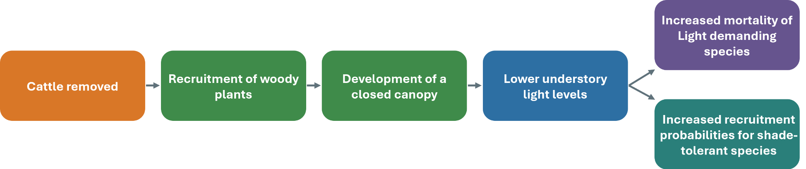
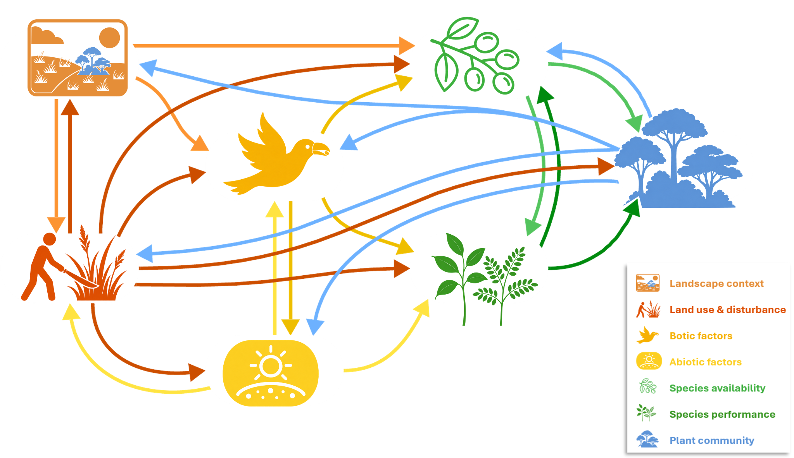
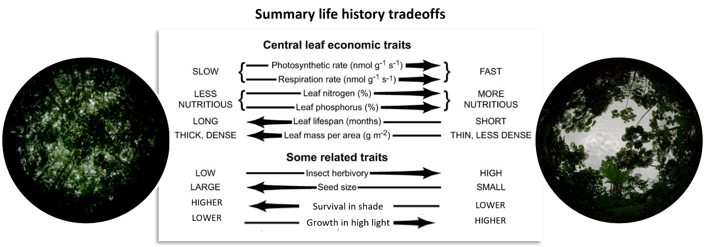
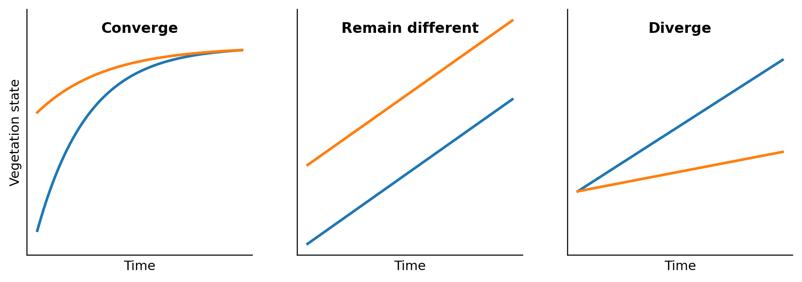

Chapter 1 began from the principle that a strong environmental study needs a working understanding of the study system before instruments or datasets are chosen. Here we make that idea more concrete through ecological succession and natural regeneration. We examine this one system in some depth for a pedagogical reason: returning to the same study system allows you to refine your understanding of it and to see how that understanding shapes decisions throughout a study. The conceptual model developed in this chapter provides a common point of reference in later chapters and returns in most course activities. It is not presented as a universal model for environmental research, but as a sufficiently complex and increasingly familiar system in which we can follow the reasoning from an initial question through to sampling and inference. Suppose two regenerating vegetation patches differ in obvious ways: one has taller woody vegetation, a denser canopy, less grass and more litter, while the other is open and grass dominated. A visit may be enough to describe those differences, but explaining them requires a history that we cannot see directly. The denser patch may have been regenerating for longer, yet those additional years could have included differences in seed arrival, mowing, soil conditions, disturbance, animal activity and chance establishment events. ‘Age’ records the passage of time while bundling together many processes that occurred during that time. Variables such as age, distance from a road, forest cover or land-use category often behave in this way: they may be strongly related to an outcome without identifying the process that produced it. Forest age remains useful, but ‘the older patch has more trees because it is older’ does not yet explain how the difference developed. Before choosing measurements, we need to separate the observed pattern from several plausible processes and ask what observations each process would lead us to expect.

## 2.1 Causal pathways as working explanations

A causal pathway is a proposed sequence in which one change contributes to another. In the regeneration example, cattle removal may allow woody recruitment; woody plants may develop into a closed canopy; the canopy may reduce understory light; and lower light may reduce the performance of light-demanding plants while favouring species that can persist in shade ([Figure 2.1](#fig_2_1)). Each arrow is a proposition about the system rather than an established fact. Cattle removal may not increase recruitment if seeds are absent; canopy development may strongly reduce light at one site and only weakly at another, depending on the canopy species; and the response to shade may differ among species and life stages. Some effects may appear within days, while changes in vegetation composition may take years. A conceptual model places these propositions into a visible structure, often using only a few boxes and arrows. Its purpose here is not to reproduce the system in full or imply that every connection is known, but to identify what the study currently assumes to be important, which links are uncertain and which plausible pathways have been left outside the model. A study may examine only one arrow, use indirect information for another and leave others unmeasured. Making the pathway explicit allows those choices to be examined and the model to be revised when observations do not fit, rather than protected from inconvenient evidence. Because a model is constructed for a purpose, different questions require different representations of the same system. A model for tree recruitment may emphasize seed sources, dispersers, local light and seedling survival, whereas a model for urban heat may emphasize vegetation structure, radiation, evapotranspiration, built surfaces and human exposure. For this course, think of a model as a tool for organising a particular question, not as a universal diagram that must contain every environmental component or be memorised in full.

{width=86% fig-alt="Causal pathway from reduced grazing or mowing through woody recruitment, canopy development and lower understory light to species-specific performance."}

**Figure 2.1.** A simple causal pathway for vegetation regeneration. Each arrow is a proposition that can be evaluated with observations rather than a connection that is assumed to be true.

## 2.2 Succession as a plant-environment feedback system

In the plant-environment feedback framework, vegetation both responds to environmental conditions and changes those conditions. As vegetation develops, it can alter its abiotic and biotic environment, including understory light, soils and interactions with animals and microorganisms. These changes affect which species arrive and how they establish, grow, survive and reproduce; the resulting plant community then changes the environment again (van Breugel et al., 2024). Succession emerges from these coupled changes in vegetation and environment. To organise this complexity, van Breugel et al. (2024) distinguish seven broad components: landscape context, disturbance and land use, biotic conditions, abiotic conditions, species availability, species performance and the plant community (Figure 2.2). These components are prompts for translating a broad system into variables relevant to a particular question. On the NUS regeneration sites, abiotic conditions might include light, soil moisture, compaction and nutrients; biotic conditions might include herbivory, pathogens or seed-dispersing animals; landscape context might include patch size, connectivity and distance to reproductive trees; and disturbance and management might include mowing, trampling or planting. Schmid et al. (2026) used the same framework to examine which components and causal pathways in natural regeneration can be observed directly with remote sensing and geospatial analysis, which can be inferred through models and where field data remain necessary. Within this framework, a **feedback** can amplify change, slow it or stabilize a state. Establishing trees may shade grasses, allowing more tree seedlings to survive and further increasing canopy cover; in another system, dense grass may suppress woody recruitment and help maintain an open state. A feedback is not automatically beneficial, nor does ‘positive’ mean desirable. These terms describe whether an initial change affects processes that subsequently reinforce or counteract it, while the value of the resulting state depends on the ecological and social objective.

Showing that species **respond** differently to their environment establishes only one side of a feedback. We also need observations showing that vegetation changes the conditions experienced by later plants or other organisms. If the proposed pathway is canopy development → lower understory light → differential species performance, observations must connect vegetation structure to the light environment and, ideally, to the demographic responses of plants. An association between vegetation type and a soil process can be informative, but it does not by itself establish that vegetation caused the difference; soil moisture, topography or management may also differ. The causal model identifies which additional measurements or comparisons would help distinguish these explanations.

{width=82% fig-alt="Conceptual feedback framework linking landscape context and disturbance to species availability, environmental conditions, species performance and the developing plant community, with feedbacks from vegetation."}

**Figure 2.2.** A simplified plant–environment feedback framework. Landscape context and disturbance influence species availability and local conditions; together these shape species performance and the developing community, which can in turn alter later environmental conditions and species availability.

## 2.3 Availability, performance and scale

A first distinction is between **species availability** and **species performance**. Availability concerns whether seeds, propagules or organisms reach a location where they could establish. Reproduction by source populations, dispersal, movement of birds or bats, landscape connectivity and distance from reproductive individuals may all influence arrival, so a forest patch with suitable soil and light may still recover slowly because seeds of many species rarely reach it. Performance begins after arrival: does a seed germinate, does a seedling establish, grow and survive, and does the adult eventually reproduce? Light, water, nutrients, temperature, compaction, competition, herbivores and pathogens can affect these transitions. Finding few seedlings of a species does not reveal which stage was limiting because seeds may have failed to arrive, arrived but failed to germinate, or germinated and died before the census. A seedling count records the outcome of several preceding processes. Because availability and performance leave different signatures, they require different information. Seed traps, reproductive-tree surveys, disperser observations and information about connectivity or distance to sources can provide information about availability, whereas measurements of germination, growth, survival and reproduction under different local conditions provide information about performance. Neither kind of observation substitutes for the other: seed rain does not show that arriving seeds can establish, while vigorous growth among established plants does not show that dispersal limitation is unimportant.

These processes also connect **local and landscape scales** within the same causal pathway. Two patches with similar soil and light may receive different species when one borders mature forest and the other is isolated in an urban or agricultural matrix. The reverse is also possible: two patches may receive similar seed rain but show different recruitment because one is compacted, frequently mown or drier. A local study can miss the source of arriving organisms, while a landscape relationship can suggest dispersal limitation without explaining local establishment. Variables measured at different scales should therefore represent different proposed processes, rather than being added to an analysis merely because spatial data are available. The need to connect these scales is illustrated by van Breugel et al. (2019). Using vegetation and soil data from 47 secondary-forest sites in a Panamanian agricultural landscape, they found that dispersal limitation and soil nutrient heterogeneity both contributed to differences in species composition, but that their relative importance changed with spatial scale and topographic position. Their design could reveal this because it connected plot-level soil and vegetation measurements with differences among sites across the landscape.

## 2.4 Species differences, traits and life-history trade-offs

Species move through availability and performance pathways differently, and **functional traits** can help us describe some of those differences. Functional traits are measurable characteristics that influence how organisms **respond** to their environment or **affect** ecosystem processes. Examples include specific leaf area, photosynthetic capacity, wood density, seed size and tissue longevity. Some species produce many small seeds and disperse widely, while others produce fewer, larger seeds. Some grow rapidly when light, water and nutrients are abundant but perform poorly under shade or drought; others grow slowly yet persist under stressful or resource-limited conditions. Such differences help explain why environmental change can alter community composition rather than affecting every species equally. One reason these traits vary together is that life-history trade-offs limit how much a plant can invest simultaneously in rapid growth, prolific reproduction, broad dispersal, durable tissues and stress tolerance. Under standardised high-light conditions, light-saturated photosynthetic capacity can provide information about a plant’s potential for rapid carbon gain. High photosynthetic capacity and high specific leaf area often occur in relatively acquisitive strategies that support rapid growth when resources are abundant, whereas tougher leaves, denser wood and longer-lived tissues are more often associated with conservative strategies that sacrifice rapid growth for persistence under shade, drought or other stresses ([Figure 2.3](#fig_2_3)). A species may consequently be an effective early colonist because it reproduces quickly and disperses widely, yet perform poorly later under a closed canopy; another may reach new patches infrequently yet survive for years once established in a shaded understory. However, take note that these associations are tendencies, not fixed species labels. A single trait is not a direct measurement of ‘successional strategy’, and individuals of the same species can vary with age and environment. Trait evidence becomes stronger when it is connected to demographic performance. Lai et al. (2021), for example, used repeated censuses of 46 woody species in Panamanian secondary forests to show how photosynthetic rate, adult stature and seed mass modified patterns of recruitment and sapling mortality through succession. The study therefore related traits to recruitment and mortality under changing conditions rather than assigning each species a fixed successional type.

{width=82% fig-alt="Two contrasting plant strategies showing stronger contributions to rapid colonisation and resource acquisition versus persistence and stress tolerance across availability, establishment, growth, survival and reproduction."}

**Figure 2.3.** Contrasting life-history strategies can provide advantages at different stages. Traits associated with rapid colonisation and growth need not be the same traits that support persistence under shade, drought or other stresses.

## 2.5 Alternative pathways, variability and history

A change in species composition can be produced by several mechanisms. Early colonists may inhibit later species by creating unfavourable conditions, facilitate them by ameliorating heat, drought or other stresses, or be replaced because later species tolerate conditions that the early species do not. Inhibition, facilitation and tolerance can operate together and at different life stages. For a particular study, we therefore need to ask what observations would differ if one pathway rather than another were important in the system being studied. Successional trajectories also vary substantially among sites ([Figure 2.4](#fig_2_4)). Forests of the same age may differ because of soils, climate, landscape position, previous land use or continuing disturbance. Pastures exposed to grazing and fire, for example, begin recovery with different vegetation, soils and surviving organisms from abandoned cropland. Some variation also arises because dispersal, establishment and mortality contain chance. Two initially similar sites need not receive the same colonists or experience the same sequence of deaths and disturbances. Using long-term records from seven Neotropical sites, Norden et al. (2015) found highly idiosyncratic trajectories even after accounting for prior land use, environmental conditions and initial forest structure. General successional trends were detectable, but plot-specific factors were more important than stand age in explaining individual trajectories. Early differences can be amplified when the first colonists alter later conditions. A species that establishes early may change shade, litter, soil organisms or disperser activity, thereby affecting which species can establish next. These priority effects make later community development partly dependent on the order of earlier events; historical contingency is the broader idea that different histories can lead sites towards different trajectories (Figure 2.4). A study of one trajectory can describe that site in detail without showing the range of trajectories possible across a landscape. Such variability can contain information about differences in processes, histories and feedbacks. If land-use history could change your interpretation, histories must be documented or compared. If dispersal is expected to vary with landscape position, the relevant landscape conditions must be represented, and if demographic changes are slow, a single census cannot reveal the trajectory. Chapter 4 takes up these ideas from the perspective of sampling, distinguishing variability generated by environmental conditions, interactions, stochasticity and history from variability introduced by measurement and sampling.

{width=82% fig-alt="Three pairs of ecological trajectories that converge, remain different, or diverge through time."}

**Figure 2.4.** Alternative ecological trajectories may converge, remain different or diverge through time. Environmental differences, stochastic events and feedbacks can determine which pattern develops.

## 2.6 Why the same system can produce different outcomes

A causal model is sometimes read more deterministically than intended. If light affects seedling survival, or forest age is associated with increasing biomass, it is tempting to imagine that sites with the same light or the same age should have nearly the same outcome. Environmental systems rarely behave that way. A causal pathway describes how one process can contribute to another; it does not imply that a single pathway determines every observation. Several processes operate simultaneously, their relative importance changes across places and times, and many of the events through which those processes act are probabilistic. Variability is therefore generated by the system itself, not only by imperfect measurement or inadequate sampling. Some sources of variation are systematic and potentially measurable. Two secondary forests of the same age can differ in soil fertility, water availability, previous land use, distance from seed sources, surrounding forest cover, continuing disturbance and the species that established early. Those differences alter the opportunities for species to arrive and the conditions under which they grow and survive. If they are relevant to the question, some can be measured and incorporated into the design. Others may be poorly known, difficult to reconstruct, or represented only indirectly. The resulting variation is still ecologically meaningful even when the study does not measure every driver. Past land use provides a particularly clear example. Across Amazonian secondary forests, Jakovac and colleagues found that the intensity and duration of previous land use could leave persistent effects on soils, vegetation structure and successional pathways long after abandonment (Jakovac et al., 2015, 2021). Forest age therefore does not define a single trajectory. Age describes how long recovery has proceeded, while land-use history helps determine the conditions from which that recovery began. A chronosequence that ignores those differences can still reveal an average age pattern, but variation around that pattern may contain information about the histories that produced it.

Even after major measured drivers have been accounted for, outcomes can differ because many ecological events are probabilistic. A seed may or may not arrive at a particular microsite. A seedling may escape herbivory, a branch may fall on one individual rather than another, or a dispersing animal may visit one patch during the period when fruit is available. These events have causes, but knowing the broad environmental conditions does not allow us to predict their exact sequence. Stochasticity in this sense is part of how demographic, dispersal and disturbance processes operate. Feedbacks make these early differences more consequential because the outcome of one event can alter the conditions governing later events. A tree species that happens to establish early may change shade, litter chemistry, soil organisms or the behaviour of seed dispersers. Later arrivals then encounter a different environment from the one they would have experienced if another species had established first. Priority effects describe this dependence on arrival order; historical contingency is the broader idea that present conditions can depend on the particular sequence of earlier events. Feedbacks can therefore preserve or amplify small initial differences rather than allowing sites to converge immediately on one common state (van Breugel et al., 2024). Predictability and variability can therefore coexist. Secondary forests commonly show broad tendencies through succession - increasing woody biomass, changing species composition and shifts in demographic rates - while individual sites follow trajectories that differ substantially around those tendencies. Norden et al. (2015), for example, found general successional regularities across Neotropical secondary forests together with strong idiosyncrasy among sites and plots. A useful model can therefore describe an average tendency without predicting every realization closely. The departures from that tendency may reflect additional drivers, interactions, stochastic events, history or differences in the scale at which processes are operating.

The same logic extends beyond succession. Stream chemistry can follow a strong seasonal pattern while individual storm events differ because rainfall intensity, antecedent moisture and pollutant inputs vary. Urban heat generally responds to vegetation and built surfaces while local exposure also depends on building geometry, wind and human activity. Animal populations can respond to habitat structure while local counts fluctuate because births, deaths, movement and detection are probabilistic. The particular processes differ, but the general study-design problem is the same: observed variation can be part of the phenomenon we want to understand rather than residual noise to be removed from the analysis. Once variability is treated this way, it becomes part of study-system understanding. Before sampling begins, we can ask which sources of variation are expected to be systematic, which processes are likely to be stochastic, whether feedbacks can preserve early differences, and at what spatial or temporal level those processes act. Those expectations do not tell us exactly how many plots or observations to collect. They tell us what the sampling design will eventually need to represent. Chapters 4–7 develop that problem through estimation, replication, space and time.

::: {.try-it-yourself}
**Try it yourself – Two forests of the same age**

Two 20-year-old secondary forests differ strongly in biomass and species composition. Before calling the difference unexplained variation, sketch at least four pathways from the framework in this chapter that could have produced it. Which of those pathways could be reconstructed from present-day measurements, which would require historical information, and which might remain partly contingent even after extensive measurement?

Suggested approach

There is no single correct diagram. Plausible pathways include differences in previous land use or disturbance, local soils or hydrology, propagule availability and landscape connectivity, herbivory or other biotic interactions, and stochastic recruitment or mortality events. Present-day measurements may describe current soils, vegetation and landscape context, but they will often reconstruct past management or disturbance only imperfectly. Some demographic or arrival events may remain partly contingent even after the major environmental differences have been measured. The point is to include variability in the causal explanation before Chapter 4 turns it into a sampling problem.

:::

## 2.7 Disturbance, management and restoration

Disturbance is often presented as the event that begins succession, but in many landscapes disturbance and management continue throughout recovery. Mowing may repeatedly remove woody recruits; grazing, fire or trampling can maintain an open state; planting, weeding, protection or hydrological repair can redirect a trajectory. These processes belong inside the causal model because they alter availability, performance and environmental feedbacks through time. Whether a trajectory is desirable depends on the objective. Preventing woody succession may be necessary to conserve a species-rich grassland, while encouraging tree recruitment may be the aim of an urban rewilding project. Ecology can help anticipate the consequences of different pathways; it does not decide which outcome society should prefer. Practices, institutions, budgets, access, public acceptance, livelihoods and values affect which interventions are feasible and whose objectives are pursued. People are therefore participants in the system, not merely an external source of disturbance. Restoration provides a particularly clear example of why the role of an intervention must be specified. An intervention can **substitute** for an ecological process, **initiate** a process that is absent or blocked, or **enhance** one that is already operating but weakly (Figure 2.5). Repeated planting substitutes for natural recruitment when plants must continually be replaced because the processes needed for self-sustaining recruitment have not returned. Planting may instead initiate recovery when early trees close the canopy, suppress grass, attract dispersers and create conditions for later natural recruitment. Enrichment planting can enhance a young forest that is already recovering but lacks dispersal-limited species, while hydrological repair may initiate natural establishment by restoring conditions that had prevented it. Because these terms describe roles in a causal pathway rather than fixed categories of methods, planting can substitute, initiate or enhance depending on why it is used and what follows. Monitoring should extend beyond the immediate action. Survival of planted trees shows whether the plantings persisted, while increasing seed arrival, natural recruitment, recruit survival, changing species composition and declining dependence on repeated management provide evidence that the intended ecological processes are developing. The appropriate indicators follow from what the intervention was expected to change next.

{width=82% fig-alt="Three restoration actions illustrating different roles of intervention: planting in an open field as substitution, cutting dense grass as initiation, and planting a seedling beneath an existing canopy as enhancement."}

**Figure 2.5.** The same broad type of restoration action can play different roles in a recovery pathway. From left to right: planting can substitute for missing natural recruitment; removing dense grass can initiate recovery by releasing a blocked process; and enrichment planting beneath an existing canopy can enhance a recovery process that is already operating.

## 2.8 From a system model to a focused study

The same regenerating forest patch can support many legitimate studies. A recruitment study may emphasize seed availability, local environmental conditions and demographic performance. A bird-habitat study may focus on vegetation structure, resources, detections and landscape connectivity. A hydrological study may focus on soil structure, infiltration, rainfall and runoff. A restoration evaluation may examine management history, recruitment and whether ecological processes continue when external inputs are reduced. There is no single correct list of variables for ‘studying regeneration’. The relevant variables follow from the particular question and the causal pathways that could produce the focal outcome. A conceptual model should keep the focal outcome, the main pathways that could produce it, the credible alternatives that could change the interpretation, and the observations that would distinguish among them visible at the same time. It need not become complicated. A small model that exposes these decisions can guide a feasible study better than a comprehensive diagram that obscures them.

## Further reading for Chapter 2

van Breugel et al. (2024) develops the feedback framework used in this
chapter and explicitly connects predictable succession with
stochasticity, external drivers, priority effects and historical
contingency.

Jakovac et al. (2015, 2021) are useful for seeing how land-use history
can generate persistent differences among secondary forests and redirect
successional pathways.

Norden et al. (2015) provides a clear empirical demonstration that broad
successional tendencies can coexist with substantial uncertainty and
site-specific trajectories.

Sagarin and Pauchard (2012), Observation and Ecology, is a broader
discussion of observation, complexity and inference in ecological
systems.
