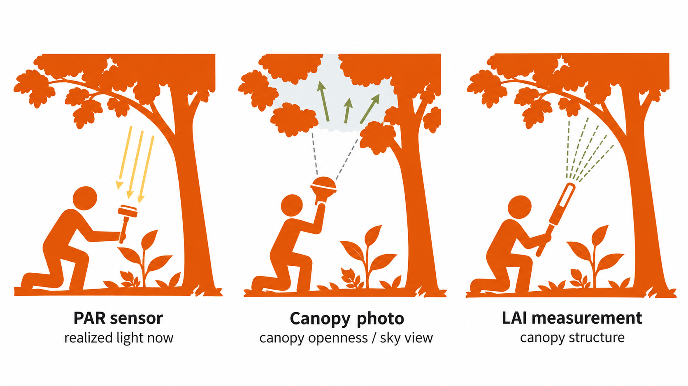
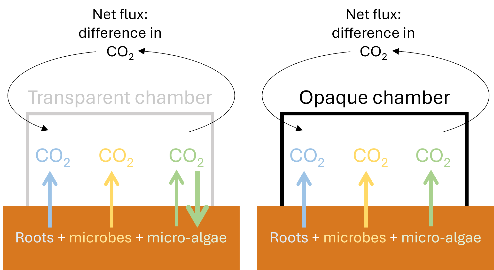
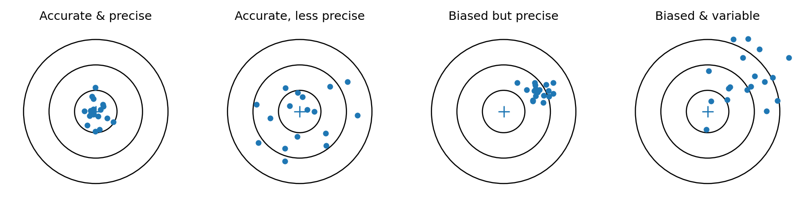

An arrow in a conceptual model is not yet something that can be measured. Consider the proposition that canopy development reduces understory light and thereby changes plant recruitment. Canopy development could be represented by vegetation height, basal area, crown cover or leaf area. Light might mean the photosynthetically active radiation reaching a seedling at one moment, the proportion of open sky above it, or its accumulated light exposure over days or months. Recruitment could refer to newly emerged seedlings, seedlings that survive to the end of a season, or the change in stem number between censuses. Before you enter the field, these broad concepts therefore have to be translated into observable variables, and those variables into measurements made at particular places, times and units. One way to make this translation explicit is: conceptual component → observable variable → measurement method → sampling unit → spatial and temporal design → supported inference ([Figure 3.1](#fig_3_1)). Because decisions made at one step constrain which conclusions the study can support, a method may measure its immediate target accurately while representing the broader concept poorly. A soil-moisture sensor can give an accurate reading at 10:15 on Tuesday, for example, but that reading may say more about Monday night’s rain than about the water conditions experienced by plants during the preceding month. Moving from a concept to a measurement therefore always involves a choice about which part of the concept will be represented and which parts will remain outside the observation.

{width=90% fig-alt="Chain from concept or process to observable variable, measurement method, sampling unit, spatial and temporal design, and supported inference."}

**Figure 3.1.** Translating a concept into field observations. Decisions at each step constrain what the resulting data can represent.

## 3.1 Begin with the question and the explanation

An available instrument can easily become the starting point of a study. A photosynthesis system is brought into the field, measurements are collected, and only afterwards is a question built around them. The resulting data may be technically excellent but still provide weak information about the process of interest. ‘Measure photosynthesis’ is not a research question. Photosynthesis could be measured to examine how a leaf responds to changing light over several minutes, whether leaves acclimate to contrasting light environments, why species differ in their performance, or how canopy development affects vegetation change. The same instrument appears in each case, but its role in the study differs. The relevant accompanying measurements, sampling units, timing and interpretation will differ as well. The question and the proposed explanation should determine what information is needed; the instrument does not determine the conclusion. A useful explanation should also lead to observations that help distinguish it from credible alternatives. Suppose woody seedlings are more abundant beneath isolated trees than in nearby open grass. One explanation concerns availability: birds visit the trees and deposit more seeds beneath them. Another concerns performance: seeds arrive in both environments, but seedlings germinate or survive better beneath trees because the soil is moister, temperatures are lower or grass competition is weaker. A census showing more seedlings beneath trees is consistent with both explanations. Counting those seedlings more precisely would describe the pattern better but would not, by itself, reveal which pathway produced it. The alternatives begin to separate when we ask what else should differ. If availability is important, seed rain should be greater beneath trees. If establishment or survival is responsible, seed arrival may be similar while later demographic transitions differ. Measurements of seed rain, germination and survival would therefore contribute different pieces of information. Those additional measurements will rarely eliminate every alternative explanation, nor must every study measure an entire causal pathway. The practical task is to identify the alternatives that would most seriously change the interpretation and decide which observations could make them more or less plausible. You may legitimately focus a study on seed arrival, seedling survival or photosynthetic performance, provided that the conclusion remains restricted to that part of the pathway.

## 3.2 Operationalising concepts and using proxies

Turning a broad concept into an observable variable is often called **operationalisation**. The canopy example shows why this is a substantive scientific decision rather than a matter of wording. Height represents one aspect of canopy development, crown cover another, and leaf area yet another; they may change together during succession, but not always. A low, dense stand can have high cover, while a tall stand can retain large canopy gaps. Similarly, recruitment measured as newly emerged seedlings describes a different stage from recruitment measured as individuals that survive long enough to enter a larger size class. The operational definition determines which ecological change the data can reveal.

Many environmental concepts cannot be observed directly in their full meaning, so studies use proxies or indicators. Canopy openness may be used to represent longer-term light conditions, distance to mature forest may represent an opportunity for propagule arrival, and basal area may describe part of forest structure and contribute to estimates of biomass. Bird detections may provide evidence that a species was present or using a habitat. Proxies can be highly informative, but their value depends on the connection between the measured quantity and the process that matters for the question. Distance to forest illustrates the assumptions involved. It may be informative when the forest is the main source of seeds and dispersal declines with distance, but becomes less convincing when isolated fruiting trees provide local sources, forest patches differ in species composition, animals move preferentially along corridors, or roads and buildings redirect their movements. Two sites equally distant from forest may then receive very different propagule inputs. Distance is simple to calculate; whether it represents propagule supply is an ecological assumption that must be justified. Whenever you use a proxy, ask what assumptions connect it to the process of interest and under what conditions that connection could fail. Even after a variable has been defined, its role depends on the question. Vegetation structure could be a response when we ask how management affects forest development, a predictor when we ask whether tree cover changes infiltration or soil temperature, or an intermediate step when management changes vegetation and vegetation subsequently changes human heat exposure. The measurement itself has not changed, but its place in the causal pathway has, and that placement determines which other variables and comparisons are needed.

## 3.3 What does a measurement represent?

Canopy and light measurements provide a concrete comparison. A PAR sensor measures photosynthetically active radiation at a particular point and time. That may be exactly the exposure needed when relating leaf gas exchange to the light reaching the leaf during the measurement. It is much less satisfactory as a description of the light environment experienced by a seedling over several months. A hemispherical photograph records canopy geometry and can be used with information about the path of the sun to estimate potential light transmission over longer periods. An LAI instrument provides another measure of canopy structure. Values from these methods may be correlated, but they are not measurements of the same quantity (Figure 3.2). Which method is more appropriate depends on the quantity and time period the study needs to represent. Estimates derived from canopy photographs depend on decisions about image exposure and classification, as well as assumptions about diffuse and direct radiation, cloud conditions and changes in the canopy. They may support robust relative comparisons among locations without providing an exact record of all photons received during a year. Conversely, an instantaneous sensor reading may be the most defensible measurement for a short-term physiological response. Every field measurement has a spatial and temporal footprint. A soil core represents a small volume of soil; a quadrat represents a local neighbourhood of plants; a vegetation plot integrates structure across a larger area; and remote sensing covers still broader areas while usually losing some of the detail available on the ground. If seedling survival responds to wet and dry microsites separated by only a few meters, an average moisture value for an entire management zone may hide the variation that drives establishment. Measuring one small corner of each zone in great detail creates the opposite problem: the local processes may be described well while the zone itself is represented poorly. Light, temperature, tides, animal activity and greenhouse-gas fluxes can change over minutes or hours; soil moisture and water chemistry respond to rainfall events; vegetation structure and soil carbon may change over years. An accurate measurement taken at the wrong spatial or temporal scale can therefore be a poor representation of the conditions relevant to the process.

{width=80% fig-alt="Three related methods applied beneath the same canopy: a PAR sensor records realized light at a particular place and moment, a canopy photograph records canopy openness or sky view, and an LAI measurement characterises canopy structure."}

**Figure 3.2.** Three related methods applied to the same understory setting. A PAR sensor records realized light at a particular place and moment; a canopy photograph records canopy openness or sky view; and an LAI measurement characterises canopy structure. The measurements are related, but they do not represent the same quantity.

::: {.worked-example}
**Worked example 3A – What does one light measurement represent?**

Suppose the causal pathway is canopy development → lower understory light → lower growth of a light-demanding seedling. A PAR sensor reading taken beside a seedling at 11:00 records the radiation reaching that point at that moment. It can be exactly the right measurement if the response is simultaneous leaf gas exchange. It is a much weaker representation of the light environment relevant to growth over several months, because sun angle, clouds, canopy movement and seasonal canopy change alter exposure through time. The design problem is therefore not solved by asking which instrument is most accurate. The question is what period and spatial neighbourhood the variable needs to represent. A logger could record repeated PAR but may limit the number of seedlings that can be monitored. Hemispherical photography or canopy openness can characterise many more locations but represents potential or structural light conditions rather than the realized sequence of irradiance. A defensible choice makes that trade-off explicit and restricts the interpretation to the quantity actually measured. Now imagine that seedlings are nested beneath several trees and several vegetation patches. The measurement decision immediately becomes a sampling decision as well: how many readings are needed through time at one seedling, how many seedlings are needed beneath one tree, and how many trees or patches are needed to represent the environmental variation relevant to the question? Chapter 4 begins once those measurements start to vary.
:::

## 3.4 Measurements may combine several processes

Some methods do not measure a single underlying process but an outcome produced by several processes operating together. A chamber placed over soil measures net CO₂ exchange across the soil-atmosphere boundary. That flux may include respiration by roots and microorganisms and, when light reaches the surface, photosynthetic uptake by algae, mosses or small plants. Temperature, soil moisture, oxygen availability, substrate supply and vegetation can alter these components. The chamber reading is real, but it is not a direct measurement of ‘microbial activity’ or any other single mechanism. Changing the measurement conditions can help separate parts of the combined signal. A transparent chamber allows both respiration and light-dependent uptake, while an opaque chamber removes photosynthesis during the measurement. The contrast provides information about the light-dependent contribution to net exchange. It does not isolate every source of respiration or explain why fluxes differ among locations. Additional measurements of temperature, moisture, vegetation or soil conditions may strengthen the interpretation, but the result remains an emergent outcome of interacting processes. Hydrology provides another example. An infiltration test measures how quickly water enters the soil at one location under the conditions present during the test. Flood regulation across a park or catchment also depends on rainfall intensity, antecedent moisture, topography, storage, drainage and runoff pathways. The local measurement contributes information about one part of that larger process; it is not a direct measure of the entire ecosystem service ([Figure 3.3](#fig_3_3)). Animal observations introduce another layer between the organism and the record: detection. Fewer bird records can mean lower abundance, but they can also reflect lower vocal activity, denser vegetation, observer differences, background noise or a different time of day. Cameras, acoustic recorders, direct observations, tracks and other signs each detect different subsets of animal activity. A recording therefore shows that an animal was detected under specified conditions, not a complete census of every animal present; what a method fails to record may depend on the method as well as on the system.

{width=78% fig-alt="Transparent and opaque soil chambers illustrating upward respiration, light-dependent uptake in a transparent chamber, and the resulting net flux."}

**Figure 3.3.** Net soil–atmosphere gas exchange can combine respiration and light-dependent uptake. Changing measurement conditions can help separate components without turning the net flux into a direct measure of any one mechanism.

## 3.5 Measurement quality, bias and study validity

Several terms describe different ways in which environmental measurements and conclusions can be uncertain, but they are not synonyms ([Figure 3.4](#fig_3_4)). Accuracy concerns how close a measurement is to the true value, although that value is often not known exactly; precision concerns how closely repeated measurements agree with one another. A balance that consistently adds two grams can be precise but inaccurate, just as an uncalibrated sensor may produce stable readings with a systematic error. Repeated measurements can reveal variability and improve precision, but repetition does not remove a systematic measurement error. Bias is broader than instrument error: it occurs when a measurement or selection procedure systematically favours particular values, places, times or respondents. Measuring soil only beside an accessible path may produce precise estimates for path-edge conditions while giving a distorted view of the wider site. Confounding concerns the interpretation of a relationship, because another factor varies with the factor of interest and could plausibly account for the observed difference. Consider three regeneration patches on the NUS campus that differ in vegetation and apparent age. They also differ in location, land-use history, management, soils, drainage and landscape context. Comparing them can generate useful questions and show how methods behave under contrasting conditions, but the patches are not replicated successional stages from which differences can confidently be attributed to age alone. Uncertainty is the broader category. It includes imprecision in a measurement, incomplete knowledge about how well a proxy represents a process, temporal and spatial variation that was not observed, imperfect detection, uncertainty in model estimates and unresolved alternative explanations. Reporting uncertainty does not mean that the study has failed; it means being explicit about which parts of the conclusion are well supported and which depend on assumptions or limited information. A highly accurate instrument can reduce one source of uncertainty without repairing biased site selection, confounding or a mismatch between the measurement and the question. The broader problem of why observations vary, and how that variation becomes uncertainty in an estimate, is developed in [Chapter 4](04-variability-uncertainty.qmd).

::: {.check-understanding}
**Check your understanding**

A temperature sensor has excellent repeatability but reads 0.8 °C too high after an incorrect calibration. You deploy 30 identical sensors at 30 sites. Which problem has the larger number of sites helped with, and which problem remains?

Suggested answer

The larger number of sites can improve spatial coverage and reduce sampling uncertainty in the estimated pattern across sites. It does not remove the systematic +0.8 °C measurement bias. Repeating a biased measurement many times can make an estimate very precise while leaving the absolute values systematically wrong. Calibration and sampling therefore address different problems.

:::

{width=86% fig-alt="Four target diagrams showing accurate and precise, accurate but less precise, biased but precise, and biased and variable measurements."}

**Figure 3.4.** Accuracy and precision describe different properties of measurement. Repetition can reveal random variation but does not correct a systematic bias.

Placing several common field methods beside one another shows that they can represent different positions in a causal system. Leaf gas exchange records a short-term physiological response. Soil CO₂ and CH₄ fluxes integrate several below-ground and surface processes. Soil cores provide physical material from which properties such as bulk density, carbon or nutrients can be estimated. Vegetation inventories describe organisms and structure over a defined area, while canopy and light measurements characterise part of the environment experienced by plants. None of these methods has one fixed scientific meaning. Their value depends on the question and on the pathway in which the resulting variable is used. Before collecting data, it helps to write the chain explicitly: process or concept → variable → operational measurement → spatial and temporal support → sampling unit → assumptions → inference. If one link is weak, adding more observations later cannot repair the mismatch. A proxy that poorly represents the process remains a poor proxy when measured at a hundred locations; an instantaneous measurement does not become a seasonal average because it is replicated widely.

## 3.6 Choosing methods for a feasible study

The **choice of methods** involves deciding which forms of information matter most for the question under conditions in which you can actually carry out the study. Lowering the minimum stem diameter in a tree inventory gives more information about regeneration but increases the number of stems that must be found, identified and measured. Measuring additional soil properties may help distinguish competing explanations but reduce the number of locations that can be processed, while repeated sensor measurements can describe short-term dynamics at the cost of more equipment, maintenance and data management. Each decision adds particular information at a cost elsewhere in the design. Time and access may limit how many locations you can visit, while equipment, taxonomic expertise or laboratory capacity may limit which measurements can be collected reliably. These constraints are part of the design because they determine which observations are feasible and which conclusions the study can support. A defensible design makes the compromises explicit: if only instantaneous light measurements are feasible, the study should not quietly reinterpret them as annual light exposure; if only one hydrological event can be observed, the conclusion should not imply that the measurement represents all rainfall conditions. Sometimes the question must be narrowed, while in other cases a simpler measurement collected across the relevant conditions is more informative than a sophisticated measurement obtained at one convenient location. Operating an instrument correctly is essential, but it is only one part of using the method well. For every method, ask what quantity is recorded directly, which ecological process or outcome it may help represent, and what assumptions connect the two. Then ask where the variable sits in a causal pathway, which alternative explanations would remain, and over what spatial and temporal conditions the observation is informative. A soil core, light measurement, vegetation record or gas-flux observation can contribute to several different questions. Its value comes from a clear connection between the question, the proposed process and the information that the method can actually provide.

## Further reading for Chapter 3

Wheater, Bell and Cook (2020), Practical Field Ecology, provides applied
guidance on turning field questions into feasible measurements and
sampling plans across a range of organisms and habitats.

van Breugel et al. (2011a) is a useful example of a measurement chain in
which tree diameter and wood density are converted through allometric
models into tree and landscape biomass, with uncertainty arising at
several stages.

Schmid et al. (2026) examines how remotely sensed and field observations
can represent different components of natural regeneration and why
process understanding remains necessary when measurements are scaled up.
