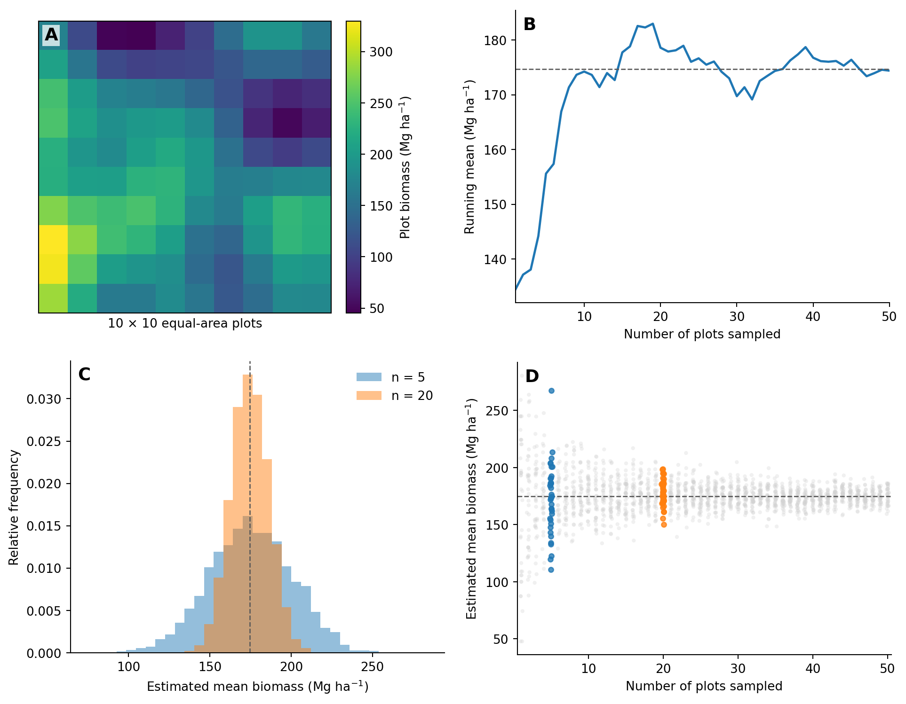
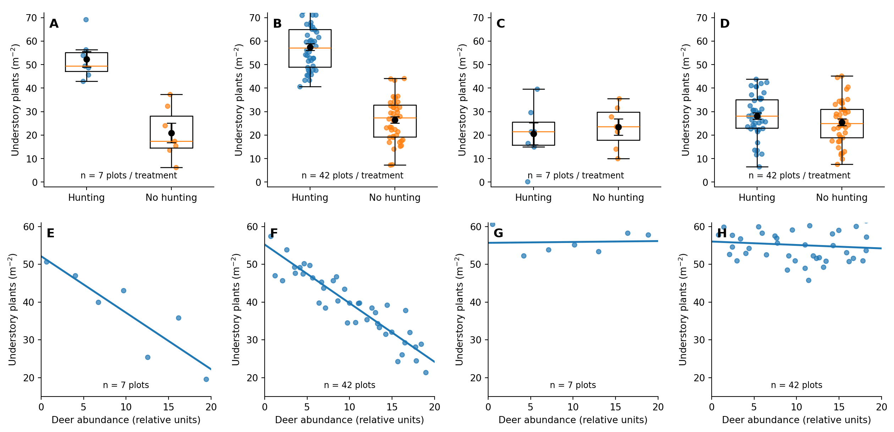
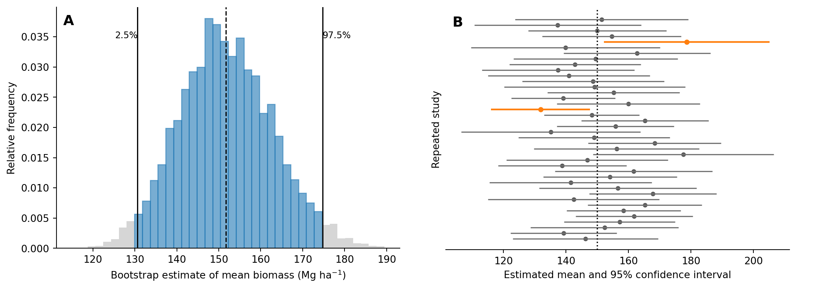
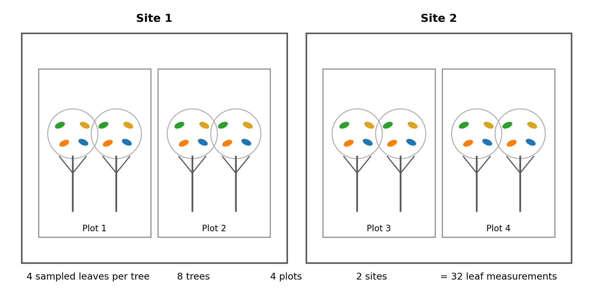

Chapter 2 treated variability as part of environmental systems themselves. Forests of the same age can differ in biomass and species composition because soils, histories, disturbance and species pools differ, while processes such as recruitment and mortality also contain a stochastic component and therefore do not unfold identically everywhere. Chapter 3 discussed another source of variation: the way we observe those systems. Measurements are made at particular places and times, instruments have limited precision, and a proxy may represent the underlying process only imperfectly. This chapter takes the next step. Even if we could measure perfectly, we would rarely observe every tree or bird in a forest, or every point in time relevant to a question. In general, we observe only part of a larger population and use those observations to estimate something about the whole. When that population is variable, the estimate we obtain can vary with the particular observations included in the study; another set of trees, locations or times would usually give a somewhat different result. We will develop this idea slowly using a simple hypothetical forest landscape in which the biomass of every possible plot is known. Using a small 'toy' landscape lets us see something that is normally hidden in field research: what would happen if we could repeat exactly the same sampling procedure many times. We can then move to the situation researchers actually face, where they have only the observations collected in one study, and ask what those data can tell us about estimates we did not observe.

## 4.1 Ecological variability and why different sets of observations give different estimates

Imagine a forest landscape divided into 100 equal-area plots and suppose, for this exercise, that we somehow know the biomass of every plot. Some plots contain much more biomass than others because environmental conditions differ across the landscape, because recruitment, growth and mortality have differed through time, and simply because large trees are not distributed perfectly evenly. We will use **ecological variability** as the broad term for this naturally occurring variation in ecological systems. The related term **environmental variability** is also widely used, especially when the variation of interest concerns environmental conditions such as soil moisture, temperature or inundation; in this book, ecological variability is the broader term and includes variation in both environmental conditions and biological properties such as biomass, growth or species composition. The 100 plots form the **population** for this exercise: the complete set of plot values we want to describe. Real study populations are rarely laid out for us as a neat grid. They might consist of all trees in a defined forest, all households relevant to a planning question, or all locations and times over which we want to generalise. Here the grid is deliberately simple because we know the true population mean and the actual variation among all plots. We can therefore behave as though those values were unknown, randomly select five plots and calculate their mean biomass. Those five selected plots together are the **sample** in the statistical sense, each plot is a **sampling unit**, and the **sample size** is five. We will use those terms when the distinction is important, but in the running text it will often be clearer simply to say 'the five plots we measured' or 'the observed data'. Suppose the five plot values are 40, 60, 70, 220 and 250 Mg ha^-1^. Their mean is 128 Mg ha^-1^, which becomes our estimate of mean biomass across the landscape. We can then put those plots back, randomly select another five and calculate another mean. The second set will probably contain a different combination of low- and high-biomass plots and will therefore give a different estimate. Of course, nothing about the landscape itself has changed; what did change is which part of that variable landscape we happened to observe. If we repeated the procedure over and over again, every set of five plots would give one estimate and those estimates would vary. We call that variation among possible estimates **sampling variability**.

Ecological variability and sampling variability are connected, but they describe variation at different levels. Ecological variability is the variation among the plots themselves; sampling variability is the variation among the estimated means produced by different possible sets of plots. If every plot in the landscape had exactly the same biomass, every possible mean would be identical. As biomass becomes more variable among plots, small sets of plots are more likely to contain an unusually high or unusually low combination of values and their estimated means therefore differ more. The influence of sample size can also be understood without beginning with a formula. Let us start with one randomly selected plot and use its biomass as a provisional estimate of the landscape mean, then add another plot and calculate the mean of the two, continuing one plot at a time. Early in the sequence, one unusually large or small plot can shift the running mean substantially because it makes up a large fraction of the information collected so far. Once twenty or thirty plots have been included, one additional value contributes a much smaller fraction of that information, so the running mean generally changes less. This running-mean exercise shows why an estimate becomes less sensitive to any one observation as more observations are added. A second experiment is needed to see sampling variability directly: if we repeatedly select complete sets of 5, 10, 20 or more plots, the means of those larger sets vary progressively less from one set to another. The landscape itself has not become less heterogeneous. What changes is the variability of the estimated mean.

[Figure 4.1](#fig_4_1) keeps those ideas separate. Panel A shows the 100-plot landscape itself. Panel B follows an accumulating set of observations and shows how the running mean stabilises as more plots contribute information. Panel C compares the distribution of means obtained from many repeated sets of five and twenty plots. Panel D extends that repeated-sampling exercise across sample sizes from 1 to 50, making it possible to see the continuous decline in the variability of the estimated mean as more plots are included.

**Figure 4.1.** Ecological variability and sampling variability in a hypothetical forest landscape. (A) Biomass across 100 plots; colour indicates plot biomass. (B) The running estimate of mean biomass as plots are added. (C) Distributions of estimated means from many repeated sets of five and twenty plots. (D) Variability among estimated means for sample sizes from 1 to 50; the highlighted points show the same sample sizes, 5 and 20, used in panel C. The true population mean is known only because this is a hypothetical exercise.

We can use the same repeated-sampling logic to examine the other part of the problem. Imagine a second landscape with the same mean biomass but much greater spatial heterogeneity and therefore much larger differences among plots. Repeated sets of five plots from this landscape would give a wider range of estimated means than sets of five plots from the more uniform landscape. Increasing the number of plots would again make the estimated means less variable, but more plots would be needed to reach the same level of precision. Even before introducing a formula, we can therefore identify the two main influences on the sampling variability of a mean: how variable the relevant units are and how many of those units are observed.

::: {.worked-example}
**Worked example 4A – One landscape, several possible sets of plots**

Let us work through a small numerical example using three sets of five plots, all randomly selected from the same landscape.

| Set of plots | Plot biomasses (Mg ha^-1^) | Mean |
|:---:|:---:|:---:|
| 1 | 40, 60, 70, 220, 250 | 128 |
| 2 | 80, 100, 120, 150, 170 | 124 |
| 3 | 35, 45, 50, 90, 360 | 116 |

The three estimated means are reasonably similar, but the observations behind them are quite different. The second set contains relatively similar plot values, whereas the third contains one very high-biomass plot together with several low values. Another random selection of five plots would give yet another combination. The example brings forward two related questions that should not be collapsed into one:

- **How variable are biomass values among plots?** This concerns ecological variability among the sampling units.
- **How much would our estimated mean vary if we repeatedly selected different sets of five plots?** This concerns sampling variability of the estimate.

The second depends partly on the first, but they are not the same quantity. If we increased the number of selected plots from five to twenty, the variation among plot values would still be present; what would decline is the variation among the estimated means produced by repeatedly selecting twenty plots.
:::

::: {.check-understanding}
**Check your understanding**

A team measures ten plots in a highly heterogeneous mangrove forest, while another team measures ten plots in a relatively uniform plantation using the same plot size and sampling procedure. Would you expect the two estimates of mean biomass to have the same sampling uncertainty? What else would you want to know before deciding whether ten plots are enough in either system?

Suggested answer

Probably not. With the same number of plots, the more heterogeneous forest is expected to produce more variable estimated means across repeated samples and therefore greater sampling uncertainty. Whether ten plots are 'enough' also depends on how much precision the study needs, the size of any difference or relationship it aims to estimate, how the plots are distributed across the population, and what other parts of the design compete for the same field effort. There is no universal adequate sample size.

:::

## 4.2 From the observations we have to estimates we did not observe

The hypothetical landscape allows us to select new sets of plots repeatedly and directly observe how much their estimated means differ. A field researcher normally cannot do that. If we establish and measure plots at twenty locations across a forest, we still do not know the biomass of all the plots that could have been established at other locations, and we cannot go back and conduct thousands of alternative versions of the same study. We therefore have to use the observations we did collect to estimate how much our result might have changed if another suitable set of locations had been selected. To make that step a little more formal, we can begin with the variation among the observations we actually have. The **standard deviation**, or SD, summarises how widely those values are spread around their mean. For this course it is enough to interpret a larger SD as indicating a more variable set of observations and a smaller SD as indicating a more homogeneous set; the calculation uses squared deviations from the mean for mathematical reasons that we do not need to develop here. If our five measured plots have biomasses of 40, 60, 70, 220 and 250 Mg ha^-1^, their large spread suggests that biomass across the wider landscape may also be highly variable. Using the observed spread in this way already makes an important assumption: the plots we measured give us reasonable information about the variation in the population we want to represent. With only a few plots that assumption is demanding, because a small set may by chance look much more homogeneous, or much more heterogeneous, than the wider landscape really is.

The earlier examples showed what happens next. When plot values are highly variable, different sets of plots tend to produce more variable estimated means; when more plots are included, those estimated means tend to vary less. The **standard error**, or SE, gives a numerical estimate of that sampling variability. For a simple mean,

$$
SE = \frac{SD}{\sqrt{n}}
$$

where `SD` represents the estimated variation among the sampling units and `n` is the number of sampling units contributing to the mean at the level relevant to the question. The formula compresses the two ideas we have already developed. If `n` stays the same, a larger SD gives a larger SE because different sets of observations can capture more of the ecological variation differently. If SD stays the same, increasing `n` reduces the SE because each estimated mean combines information from more sampling units. The square root describes the rate at which that gain occurs. We do not need its mathematical derivation here, but the practical consequence is important: improvements in precision show diminishing returns. If SD remained the same, increasing `n` from 4 to 16 would halve the SE because $\sqrt{4}=2$ and $\sqrt{16}=4$; halving it again would require increasing `n` from 16 to 64. Additional sampling does not suddenly become useless, but each proportional improvement in precision requires progressively more sampling units. Environmental studies also rarely devote all their effort to estimating one mean. They compare treatments or sites, represent gradients, sample several levels of a hierarchy, or follow change through time. Effort spent obtaining an extremely precise estimate at one place or level is therefore unavailable elsewhere in the design. Chapters 5 and 6 develop those allocation decisions in detail. At this stage, it is enough to recognise that the value of an additional observation depends on both the uncertainty it reduces and the information we give up the opportunity to collect somewhere else.

There is one further issue that introductory treatments often pass over quickly: our estimate of uncertainty is itself uncertain. The SD used to calculate an SE is not known from the population; it is estimated from the finite set of observations we happened to collect. Five plots may by chance have very similar values even when the wider landscape is heterogeneous, while another five may span much more of the real variation. With a small number of plots we can therefore obtain both an unusual mean and a misleading impression of how variable the population is. As the number of appropriately selected sampling units increases, the estimate of the mean generally becomes more stable, and so does the estimate of the variability used to quantify its uncertainty. This has a direct consequence for study planning: a very small pilot study can provide a poor basis for deciding how much subsequent sampling is needed because the pilot may itself give a poor estimate of the variability we are trying to plan for.

::: {.worked-example}
**Worked example 4B – What changes when SD or n changes?**

Suppose two forest studies obtain similar mean biomass estimates but differ in the variation among plots. Study A has SD = 40 Mg ha^-1^ with 16 plots, giving

$$SE_A = 40 / \sqrt{16} = 10.$$

Study B also has 16 plots but SD = 80 Mg ha^-1^, so

$$SE_B = 80 / \sqrt{16} = 20.$$

The number of plots is identical, but the second estimate has twice the SE because biomass is much more variable among the observed plots. To see the separate effect of sample size, keep SD at 40. With only four plots, $SE=40/\sqrt{4}=20$; with 64 plots, $SE=40/\sqrt{64}=5$. The ecological spread among plots has not changed. What has changed is the expected variability of the estimated mean across possible samples. In study design these two components are linked: greater ecological variability generally requires more sampling units to obtain the same precision. A sample size that works well in a relatively uniform plantation may therefore be inadequate in a highly heterogeneous forest.
:::

::: {.try-it-yourself}
**Try it yourself**

A pilot survey of 9 plots gives an SD of 60 units. Using $SE=SD/\sqrt{n}$, calculate the approximate SE. Then calculate the SE if the same variability were represented by 36 plots. What changed, and what did not?

Suggested answer

For 9 plots, $SE=60/\sqrt{9}=20$. For 36 plots, $SE=60/\sqrt{36}=10$. Increasing the sample size fourfold halves the SE. The assumed variability among plots, represented by the SD of 60, has not changed; only the expected variability of the estimated mean has become smaller.

:::

## 4.3 Estimating differences and relationships in variable data

Environmental studies usually ask about more than a single mean. We might ask whether soil infiltration differs between two land uses, whether forest biomass increases with stand age, whether seedling survival declines as inundation becomes more frequent, or whether particulate pollution differs between neighbourhoods with different traffic intensity. The same reasoning still applies: the magnitude of the pattern, the variability among individual observations and the uncertainty with which the pattern has been estimated are different properties of the data. Suppose, for example, that two land uses differ in mean infiltration by the same amount in two otherwise comparable landscapes, and assume for the moment that background soil conditions are not themselves systematically associated with land use. If infiltration varies little among locations within each land use, repeated studies using a modest number of locations may give fairly similar estimates of the land-use difference. If infiltration varies strongly among locations, studies of the same size can give much more variable estimates because one set may happen to include unusually high values in one land use or unusually low values in the other. A large observed difference can therefore still be poorly estimated when it comes from a few highly variable sampling units, while a much smaller difference can be estimated quite precisely when variability is modest and many suitable units have been observed.

The same distinction applies to continuous relationships. If forest biomass tends to increase with stand age, individual forests will still lie above or below the general trend because age is only one influence on biomass. Soil conditions, previous land use, disturbance and demographic events all contribute to differences among forests of similar age. The number of sampled forests affects how precisely we estimate the relationship, but their distribution along the age gradient also contributes information. Twenty forests spread from one to thirty years of age can tell us much more about the shape of an age-biomass relationship than twenty forests concentrated between eight and twelve years, even though both datasets contain twenty observations. Chapter 6 develops that design problem in detail; here I mention it as a warning that `n` alone does not tell us how informative a study is.

A comparison can also become more precise when observations on the two sides are meaningfully paired. Consider four locations where two conditions are measured side by side:

| Location | Condition A | Condition B | B - A |
|:---:|:---:|:---:|:---:|
| 1 | 80 | 100 | 20 |
| 2 | 150 | 171 | 21 |
| 3 | 220 | 238 | 18 |
| 4 | 110 | 129 | 19 |

The absolute values vary greatly among locations, but within each location the difference between conditions is remarkably consistent. If the eight observations had instead come from two unrelated random sets of four locations, much of that location-to-location variation would contribute to the uncertainty of the comparison. In the paired design, each location provides its own comparison, so background conditions shared by the two members of a pair are largely held constant and we can focus on the four within-location differences, 20, 21, 18 and 19. Pairing only helps when the pairs have a meaningful basis: two plots do not become informative pairs merely because we give them the same label. The same logic appears later in repeated measurements, matching, blocking and before-after comparisons.

::: {.check-understanding}
**Check your understanding**

Suppose the observations in the table had instead been collected as four unrelated plots from Condition A and four unrelated plots from Condition B. Would the very consistent within-location differences still be visible? Why can pairing improve precision when the two observations in each pair share relevant background conditions?

Suggested answer

No. With two unrelated sets of plots, we would compare the two group means and the large variation among locations would contribute strongly to the uncertainty of that difference. Pairing lets us calculate a difference within each shared location. When the members of a pair experience similar background conditions, much of the variation among locations is common to both observations and does not obscure the contrast to the same degree. Pairing improves precision only when the pairing captures such shared variation.

:::

::: {.worked-example}
**Worked example 4C – Pattern size, ecological variability and sample size**

Imagine two wildlife-management treatments, one in which deer are hunted to keep their population relatively low and another without hunting. Suppose we want to know whether reducing deer abundance changes the understory vegetation. We might measure the density of understory plants, expressed as plants m^-2^, and the number of plant species recorded in a standard vegetation plot. If the true difference in plant density between the two treatments were, say, 20 plants m^-2^ while density varied strongly among plots, a study with only four independent plots per treatment could produce a rather different treatment contrast each time it was repeated because a few unusually high- or low-density plots would have a large influence. With forty plots per treatment, plant density would still vary among plots, but the estimated treatment means and their difference would vary much less across repeated samples.

Now imagine that hunting changes mean plant density by only 5 plants m^-2^, or changes plant diversity by only one or two species per plot. A large enough study can still estimate such a small difference quite precisely. Increasing sample size does not make the ecological effect larger; it makes our estimate of its size more stable. Figure 4.2 puts large and small effects beside low and high sample sizes for both group comparisons and continuous relationships so that the magnitude of the pattern, the spread of the raw observations and the uncertainty around the estimated pattern can be seen separately.
:::

**Figure 4.2.** Pattern magnitude, ecological variability and sample size are different properties. The raw observations have the same underlying spread within each row. Larger samples reduce uncertainty around an estimated group difference or slope, while changing the effect size changes the ecological pattern itself. A small effect can be estimated precisely, and a large effect can be estimated imprecisely.

## 4.4 Resampling and confidence intervals

So far we have imagined repeating a study by selecting genuinely new sets of plots from a population. In a real study we normally have only the observations that were collected once. The wider population is not fully observed (of course, if it were fully observed, we would not need to estimate its mean from a sample!). **Bootstrap resampling** gives us a practical way to approximate the repeated-sampling idea using the data we actually have. The basic move is simple. Suppose the five observed plot biomasses are 40, 60, 70, 220 and 250 Mg ha^-1^. A bootstrap resample also contains five values, but those values are drawn **with replacement** from the observed five. One resample might therefore be 40, 40, 70, 220 and 250, while another might be 60, 70, 70, 70 and 250. Some observed values appear more than once and others are absent, so each resample has a slightly different composition and produces a slightly different mean. Sampling with replacement is what creates that variation; if we simply rearranged the same five observations and used each exactly once, every rearrangement would have the same mean. Repeating the resampling hundreds or thousands of times produces a distribution of bootstrap means. The logic is that, if the observed data provide a reasonable representation of the population from which they were collected, repeatedly resampling those values can approximate some of the variation we would have seen if genuinely new samples from that population had been available.

Once we have a distribution of bootstrap means, an interval can be described directly from that distribution. Most bootstrap means usually lie fairly close to the estimate from the observed data, with fewer estimates extending into the lower and upper tails. If we remove the lowest 2.5% and highest 2.5% of bootstrap estimates, the range that remains contains the middle 95%. This is a **95% bootstrap percentile interval**, one way of constructing a **confidence interval** around an estimate. Other statistical methods construct confidence intervals differently, but the aim is similar: to express how uncertain the estimated quantity is, given the information in the data and the assumptions of the method. Figure 4.3A shows this directly as a distribution of bootstrap means with its central 95% interval. Figure 4.3B then shifts back to the hypothetical situation in which the true population mean is known and the whole study can be repeated. Each repeated study gives a somewhat different mean and interval because it contains a different set of observations. Most of the intervals include the true population mean, while a few miss it because that particular study happened to contain an unusual combination of observations.

**Figure 4.3.** Two related ways of seeing uncertainty around an estimated mean. (A) Repeated bootstrap resampling produces a distribution of estimated means; the central 95% provides a bootstrap percentile interval. (B) If the original study itself could be repeated many times, each study would produce a different estimate and confidence interval. A 95% confidence-interval procedure is designed so that, under its assumptions, about 95% of those intervals contain the true population value over repeated studies; the intervals that miss the true value are shown in orange.

::: {.worked-example}
**A more formal interpretation of a 95% confidence interval**

A 95% confidence-interval method is constructed so that, if the same sampling procedure were repeated many times under the same conditions and a new interval were calculated each time, about 95% of those intervals would contain the true population quantity. We normally conduct the study only once, so we see only one of those intervals. In the strict frequentist interpretation, we therefore do not say that there is a 95% probability that the fixed true value lies inside this particular interval. For practical interpretation, a wider interval indicates greater uncertainty around the estimate and a narrower interval greater precision, provided that the design and assumptions used to construct the interval are appropriate.
:::

Bootstrapping does not create new ecological information. Ten thousand bootstrap resamples constructed from five observations are still built from those same five observations. If the original dataset is extremely small, its observed distribution may be a poor approximation of the population distribution and the resulting bootstrap interval may therefore also be poor. The same limitation applies to population coverage. If every observed plot came from a dry ridge, resampling those plots cannot reveal the biomass distribution of wet valleys. Bootstrap resampling is a way of using the information in an adequate dataset to estimate sampling uncertainty; it is not a way to bootstrap ourselves out of too little or unrepresentative data. Chapter 3 made a related distinction between precision and bias: a narrow interval cannot repair a systematically biased measurement, an inappropriate model, or a design that never observed an important part of the target population.

For readers who want to explore bootstrap distributions and confidence intervals more formally, *ModernDive* (Ismay, Kim & Valdivia, 2025) develops the same ideas through simulation and includes exercises in R.

::: {.check-understanding}
**Check your understanding**

A forest study sampled only dry ridge plots. Could 10,000 bootstrap resamples tell us how biomass varies in wet valleys? Why not?

Suggested answer

No. Every bootstrap resample is constructed from the observations in the original dataset. If wet-valley plots were never observed, there are no wet-valley values available to resample. Increasing the number of bootstrap repetitions cannot add an unsampled habitat to the study.

:::

## 4.5 More measurements do not always mean a larger sample

Suppose a dataset contains 32 leaf measurements. How large is the sample? The obvious answer is 32, and for some questions that number is relevant, but in many ecological studies it is incomplete. Those 32 leaves might have been measured on eight trees, with two trees in each of four plots and two plots in each of two sites. The dataset then contains 32 leaf observations, eight trees, four plots and two sites, and each number describes information at a different level. If the question concerns the mean photosynthetic capacity of individual trees, several leaves per tree are useful because leaves on the same tree differ in age, light exposure and position in the crown. Averaging four leaves can therefore characterise each tree better than measuring one leaf, giving eight tree-level estimates. If the question instead asks whether two sites differ because they experience different hydrological conditions, the many leaves and trees provide increasingly detailed descriptions within each site, but the study still contains only two site-level examples. The ecological reason is straightforward: leaves on one tree share the same individual plant, trees in one plot share much of their local soil and neighbourhood, and plots within one site may share hydrology, disturbance history and landscape context. Observations taken from the same higher-level unit therefore contain some shared information. More observations at one level can still improve a study, but they improve information about that level: more leaves can characterise a tree, more trees can represent variation among trees, more plots can represent more local environments, and more sites can provide additional examples of site-level conditions. Thirty-two measurements can therefore contain a great deal of information without providing 32 independent examples of the comparison we care about.

That hierarchy also creates an allocation problem. Field time spent measuring many leaves on the same few trees can give a very good estimate of within-tree variation while leaving little time to sample additional trees or plots. Measuring many individuals of one species can strengthen a species-level estimate but reduce the effort available for comparing species or representing the plot-level community. Intensive subsampling within a few plots can make each plot estimate more precise while leaving a weak landscape-level estimate because too few plots were included. The trade-off works in both directions: spreading effort across many plots can improve landscape representation while giving less detailed information within each plot. There is no allocation that is always best. The appropriate balance depends on the level at which the question is asked, where the relevant variability occurs and what quantity the study is trying to estimate. Section 4.2 introduced the same problem through diminishing returns; Chapters 5 and 6 develop it more fully through replication, subsampling and spatial coverage.

**Figure 4.4.** The same dataset contains information at several nested levels. Thirty-two leaf measurements can describe within-tree variation, but if those leaves come from eight trees in four plots at two sites, they do not constitute 32 independent site-level observations. Additional sampling at each level adds a different kind of information.

::: {.worked-example}
**Worked example 4D – 32 measurements, but what is n?**

A study measures four leaves on each of eight trees. Two trees occur in each of four plots, and two plots occur in each of two sites. To describe variation among the measured leaves, all 32 observations are relevant, although leaves from the same tree should not automatically be treated as unrelated. To estimate mean photosynthetic capacity for each tree, we can average its four leaves and obtain eight tree-level estimates. Those tree estimates can in turn be used to characterise four plots, and the plot estimates provide information about two sites. If the focal comparison is between the two sites, the 32 leaf measurements make the estimates within those sites more detailed, but they do not create additional site-level examples. The value of `n` is therefore not obtained simply by counting rows in a spreadsheet; it depends on the level of the quantity being estimated and on how lower-level observations are grouped within higher-level units.
:::

::: {.check-understanding}
**Check your understanding**

You have one additional day in the field. Would it be more useful to measure ten more leaves on the same trees, add new trees within the existing plots, establish another plot at each site, or add another site? Give one research question for which each option would be a sensible use of the day.

Suggested answer

There is no single correct choice. More leaves are useful when uncertainty within individual trees is important; more trees help when variation among trees is central; more plots strengthen plot- or site-level estimates by representing additional local environments; and an additional site provides another higher-level example when the question concerns differences among sites or site-level conditions. The appropriate allocation follows from the level of the research question and from where the relevant variability occurs.

:::

## 4.6 Sampling uncertainty is only one part of uncertainty

Suppose our aim is to estimate mean aboveground biomass for a forest landscape. Even that apparently simple number is built through several steps. In each vegetation plot we measure tree diameters and identify species; an allometric equation converts those measurements into estimated biomass for individual trees; tree estimates are combined into plot biomass; and the measured plots are then used to estimate biomass for the wider landscape. Chapter 3 focused mainly on the earlier parts of this chain, including whether measurements are accurate and precise and whether a method or proxy represents the intended quantity. Chapter 4 has added the sampling problem at the landscape level: because we observe only some of the possible plots, another suitable set of plots would usually give a somewhat different landscape estimate. These sources of uncertainty can occur in the same study, but different sources of uncertainty require different solutions. If diameter measurements are inconsistent because buttresses make the point of measurement difficult to reproduce, a clearer field protocol or repeated measurements can help. If the allometric equation is poorly suited to the species or tree sizes in the study, measuring more plots with the same equation does not correct that problem; better calibration data or a more appropriate model are needed. If biomass genuinely varies strongly across the landscape and only a few plots were measured, adding suitably distributed plots can reduce sampling variability in the landscape mean. If important parts of the landscape were never represented, more intensive measurement in the already sampled part will not provide the missing coverage.

van Breugel et al. (2011a) examined this distinction directly for tropical secondary forests by comparing uncertainty associated with the number of forest plots sampled with differences produced by alternative allometric biomass models. With relatively few plots, spatial heterogeneity among plots made the estimated landscape mean unstable because another set of plots could give a noticeably different value; increasing the number of plots reduced that component of uncertainty by representing more of the landscape variation. The allometric-model problem behaved differently. The same measured trees could be converted into different biomass estimates by different equations, so adding more plots did not make those model differences disappear. The practical question is therefore not simply whether an estimate is uncertain, but what kind of additional information would improve it. Too few plots call for more or better distributed plots; noisy diameter measurements call for better or repeated measurements; a biased instrument needs calibration rather than repetition; an unsuitable allometric relationship needs better model information; and incomplete population coverage needs broader coverage. This distinction leads directly into Chapter 5, where the question becomes how limited field effort should be divided among independent sampling units, subsamples and other components of a sampling design.

## Further reading for Chapter 4

Gotelli and Ellison (2013), *A Primer of Ecological Statistics*, develops sampling distributions, standard errors, confidence intervals and resampling methods in an ecological context and provides a more formal treatment of ideas introduced here.

Ismay, Kim and Valdivia (2025), *Statistical Inference via Data Science* (*ModernDive*), uses simulation and resampling to develop sampling distributions, confidence intervals and bootstrap reasoning from repeated-sampling intuition, with practical exercises in R.

van Breugel et al. (2011a) provides an ecological example in which uncertainty associated with spatial sampling is considered alongside uncertainty associated with alternative allometric biomass models. The study illustrates why different sources of uncertainty require different responses.
