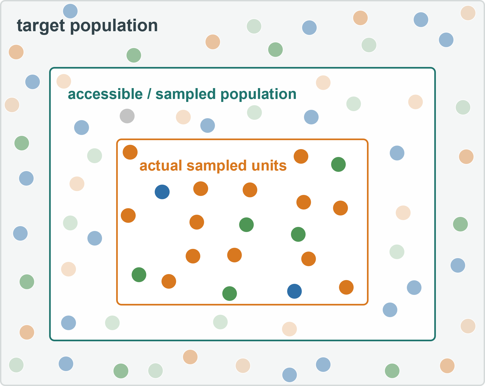

Once we have decided what needs to be measured, we still have to decide which parts of the system will actually be observed. Chapter 4 showed why that decision cannot be reduced to collecting as many measurements as possible. Different sets of observations from the same variable population can give different estimates, and ecological variation commonly occurs at several nested levels at once. Ten soil cores can tell us a great deal about one plot without telling us how plots differ across a landscape; many leaves can characterise one tree well without providing many independent trees. This chapter turns that logic into sampling decisions. It asks what population the study is intended to represent, what counts as an additional unit of information for the question, when repeated measurements are subsamples rather than replicates, and how limited effort should be allocated across the levels of a study. Chapter 6 then takes the next step and asks where those units should be placed in heterogeneous space.

## 5.1 From a target population to the units we can actually sample

Before asking how many units to measure, we need to know what the study is meant to represent. We use **target population** in a broad sense. It may be all trees above a defined size in a forest, all stream reaches in a catchment, all residents whose experiences are relevant to a planning decision, or all possible combinations of location and time over which a water-quality conclusion is intended to apply. The target population is therefore defined by the question, not by whichever units happen to be easiest to reach. In field research, however, the units that could in principle answer the question are often more extensive than the units we can actually access. Some sites may be unsafe, privately owned or physically inaccessible; a list of residents may omit particular groups; fieldwork may cover only part of a season; equipment may fail under some environmental conditions. The **accessible population** is the part of the target population from which units can realistically be selected. The distinction is practical but scientifically important because a study can describe its accessible population very precisely while still representing the wider target poorly. Consider a survey intended to describe the views of people who use an urban park. If interviews are conducted only at lunchtime on weekdays, office workers may be over-represented while families, shift workers or people who visit mainly in the evening are largely absent. The respondents may be sampled perfectly within that lunchtime window, but the window itself covers only part of the intended population. If the question were specifically about lunchtime users, there would be no mismatch; the narrower target population would make the same fieldwork appropriate. The conclusion follows the population that was actually represented.

The same issue appears in ecological studies. Suppose the question compares regeneration among forest patches. Several vegetation plots within one patch can describe that patch in useful detail, but they do not create several independent patches. If the target is variation among patches, the patch is the higher-level unit that has to be represented repeatedly. This is why the statistical terms introduced in Chapter 4 – **sample**, **sampling unit** and **sample size** – need to be interpreted through the study design rather than by counting rows in a dataset. In the running text we will usually use the concrete nouns instead: the trees selected, the plots measured, the residents interviewed or the sites compared. This also avoids confusion with everyday field language, where *sample* may mean a physical soil core, water bottle or tissue specimen rather than a statistical set of selected units. It also helps to distinguish a **sampling unit** from an **observation**. A sampling unit is the unit selected from the population for a particular purpose; an observation is a recorded value. One selected tree can produce several leaf measurements, one plot can contain many tree records, and one respondent can answer many survey questions. Those additional observations may be essential for describing the selected unit, but they do not necessarily increase the number of units selected from the population. This distinction becomes especially important once the design is hierarchical.

::: {.check-understanding}
**Check your understanding**

A study aims to estimate average soil carbon across an entire mangrove island, but boat access is possible only along two large creeks. What is the target population, what is the accessible population, and what problem remains even if hundreds of cores are collected beside those creeks?

Suggested answer

The target population is the mangrove area to which the island-wide estimate is intended to apply. The accessible population is the subset that can be reached from the two creeks under the actual field constraints. Hundreds of cores could make the creek-accessible part very precisely estimated while leaving unsampled interior conditions poorly represented. Increasing the number of cores within the accessible area does not by itself solve the coverage problem.

:::

{width=78% fig-alt="Nested target and accessible populations with selected sampling units circled within the accessible population."}

**Figure 5.1.** The target population is the set we want to describe or generalise to. Field constraints may restrict us to an accessible subset, from which sampling units are then selected.

## 5.2 How many sampling units are enough?

Chapter 4 gives the first part of the answer. When the relevant units are highly variable, estimates based on only a few of them are more sensitive to which particular units happened to be selected. Increasing the number of independently contributing units generally reduces that sampling variability. The amount of effort needed therefore depends partly on how variable those units are and on how precisely the study needs to estimate a mean, difference or relationship. A relatively homogeneous population can often be characterised with fewer units than a highly heterogeneous one, while a small ecological effect generally requires more information to estimate clearly than a large one against the same background variability. There is therefore no universal number that counts as an adequate sample size. Formal power and sample-size calculations make the trade-off more explicit by combining assumptions about variability, effect size, design and the statistical model, but the underlying reasoning is already familiar from Chapter 4. More ecological variability generally requires more independent information for the same precision, and increasing sample size gives diminishing improvements because standard error declines with the square root of `n`. The question is not simply how many measurements can be collected, but how many units contribute new information at the level relevant to the intended estimate or comparison. That qualification is essential. Twenty additional soil cores from the same small plot can substantially improve the estimate of mean soil conditions *within that plot* while adding little information about variation among plots. Fifty additional trees in one forest patch can characterise the patch very well without providing the additional patches needed to compare forest ages, management regimes or landscape contexts. A very large dataset can therefore have a small effective sample for one question and a large one for another. The relevant number follows from what is being estimated and from the level at which the relevant variation occurs.

This is also why a small pilot study can be useful without providing a definitive answer about sample size. A few preliminary units may reveal that variation is much larger than expected, that one measurement is unreliable, or that most of the variation occurs among sites rather than among subsamples within sites. That information can guide the main design. But an SD estimated from five plots is itself uncertain, as Chapter 4 emphasised, so it should not be treated as an exact description of population variability. Pilot data are most useful for checking assumptions and identifying obvious mismatches, not for producing a false sense of numerical certainty about the one correct value of `n`.

::: {.worked-example}
**Worked example 5A – Where should one more day of fieldwork go?**

A forest study contains several sites, several plots within each site, and several soil cores and tree measurements within each plot. The team gains one additional day. It could take more soil cores within existing plots, establish more plots within the existing sites, or travel far enough to add another site. All three choices increase the amount of data, but they strengthen different parts of the study. More cores improve the estimate of conditions within a plot. More plots reveal additional within-site variation and improve the site-level estimate. Another site adds information about variation among sites and strengthens any comparison whose predictor varies at the site level. If the study is already based on many well-characterised plots but only two sites, another site may be far more valuable for a site-level question than another hundred cores. If the question concerns microscale heterogeneity within plots, the opposite allocation may be sensible. The decision depends on where the uncertainty relevant to the question lies.
:::

This allocation problem is one reason that “maximum possible sample size” is not a useful design objective by itself. Environmental studies rarely estimate only one simple mean. They commonly compare treatments or land uses, fit responses along gradients, follow change through time, or combine measurements made at several hierarchical levels. Field time spent intensively improving one part of the design is time not spent representing another part. A large `n` in one place can therefore be obtained at the cost of a weak estimate somewhere else.

## 5.3 Replication, subsampling and pseudoreplication

The word **replication** is often used as though every repeated measurement creates another replicate, but that is not how the idea works. A replicate is a separate unit that provides another example of the focal comparison, treatment or predictor. The relevant unit therefore depends on the question. Repeated measurements within one unit can be valuable because they improve its description, but they do not automatically provide additional independent examples of a higher-level contrast. Suppose we want to compare forest biomass among young, intermediate and old secondary forests. We select three separate forest patches within each age class and establish several vegetation plots within every patch. The plots reveal substantial heterogeneity within a patch – one may contain a canopy gap, another a wetter depression, another several large trees – and averaging across them can give a better estimate of patch biomass than one plot alone. For the comparison among forest ages, however, all plots within the same patch share the age of that patch and much of its broader history. The patch is therefore the replicate for the age comparison, while the plots are **subsamples** nested within it. The lower-level observations help estimate each replicate; they do not multiply the number of independent age-class examples. The same reasoning applies at other scales. Four leaves measured on one tree can reduce uncertainty about that tree's mean photosynthetic capacity. Four trees in one plot can describe variation among trees within that plot. Four plots within one site can describe spatial variation within the site. If inundation regime varies only among sites, however, none of those lower-level repetitions creates another independent inundation regime. A useful habit is therefore to ask: **At what level does the focal predictor, treatment or comparison vary?** The units repeated at that level are the ones that directly replicate the focal contrast.

**Pseudoreplication** occurs when lower-level observations are treated as though they were independent replicates of a higher-level treatment or predictor. Imagine two mangrove creeks, one heavily disturbed and one relatively undisturbed, with 30 plots sampled along each creek. Comparing 30 “disturbed” plots with 30 “undisturbed” plots as though there were 30 independent examples of each disturbance regime would exaggerate the information available about disturbance. All plots within one creek share that creek's disturbance history and many other contextual features. The design has excellent within-creek sampling but only one creek of each disturbance condition. No statistical analysis can manufacture the missing creek-level replication after data collection. This does not mean that observations within the same higher-level unit are useless or that they should simply be averaged away. They tell us about variation at that level and can improve estimates of higher-level units. Modern hierarchical models can retain several levels of variation explicitly, but the sampling structure has to be understood before those models are useful: lower-level observations contain partly shared information because of their common tree, plot, site or time period, and the analysis needs to respect that structure rather than pretend that every row arrived independently from the target population. The same distinction is sometimes described as the difference between **biological replication** and repeated or technical measurements. Repeating a laboratory assay on the same soil extract can reveal analytical variation and improve confidence in that measurement, but the repeated assays do not become new field locations. Measuring several leaves from one tree captures within-tree variation; measuring the same leaf twice may mainly tell us about measurement repeatability. These repetitions are useful precisely because they answer different questions. Problems arise when their number is used to imply replication at a level they do not represent. Independence is also not a magical property that field units either possess or lack completely. Two plots in the same forest may share more history and environmental context than plots in different forests, and two nearby trees may share more conditions than trees far apart. Chapters 6 and 7 develop the spatial and temporal forms of this shared context. For now, the design should preserve which observations belong together and should not claim more independent examples of the focal comparison than were actually sampled.

::: {.check-understanding}
**Check your understanding**

A restoration project has two treated wetlands and two untreated wetlands. Ten vegetation quadrats are measured in every wetland. For the treatment comparison, is the replication `n = 40 quadrats per treatment`, `n = 20 quadrats per treatment`, or `n = 2 wetlands per treatment`? What useful information do the quadrats still provide?

Suggested answer

The treatment was applied at the wetland level, so the treatment comparison has two independently treated and two untreated wetlands. The quadrats are subsamples within those wetlands. They are still valuable because they describe within-wetland heterogeneity and improve each wetland-level estimate, but they do not create additional treatment replicates.

:::

## 5.4 Allocating effort across levels

Once a design contains several levels, sampling becomes an allocation problem. Chapter 4 introduced this with leaves within trees, trees within plots and plots within sites: additional observations within a unit improve our description of that unit, whereas additional higher-level units broaden the information about variation among units. With a fixed field budget, improving one level often comes at the expense of another. Lowering the minimum stem diameter in a forest inventory, for example, provides much richer information about regeneration within every plot but may reduce the number of plots that can be completed. Measuring ten leaves on each of ten trees gives a detailed estimate of within-tree variation, whereas two leaves on each of fifty trees provide much more information about variation among trees. Longer interviews can provide greater depth while reducing the number and diversity of respondents, and repeated measurements through time reveal trajectories for the units already being followed rather than creating new independent units. None of these allocations is automatically preferable because each changes the information available at a different level of the study.

The same trade-off appears when effort is divided among species or among nested field units. If the aim is to estimate a physiological trait precisely for one species, many individuals and several leaves per individual may be appropriate; if the question concerns trait variation among species, the same effort spread across more species may provide stronger information even though each species mean is estimated less precisely. Forty soil cores could likewise be organised as twenty cores in each of two plots, four cores in each of ten plots, or one core in each of forty plots. The first design describes microscale variation within two plots very well, the last represents many more locations but gives each plot only one observation, and the middle design is a compromise. A sensible allocation asks where another unit of effort would add the most new information for the quantity being estimated. Pilot measurements can help reveal whether most variation occurs within or among units, although a small pilot is itself uncertain and should not be treated as providing exact variance components. Chapter 6 adds the explicitly spatial part of the problem: once another plot is the level of information we need, we still have to decide how large that plot should be and where it should be placed across a heterogeneous landscape.

::: {.try-it-yourself}
**Try it yourself – Redesign a fixed-effort study**

You can afford 120 leaf measurements. Compare three designs: 12 leaves on each of 10 trees, 4 leaves on each of 30 trees, or 2 leaves on each of 60 trees. Assume the trees can be distributed among several plots. For each design, identify which kind of variability would be represented best and which higher-level comparison might remain weak. There is no single best answer until the research question is specified.
:::

## 5.5 Preserve the sampling structure in the data

A field database should record not only the measurements but also how those measurements were obtained. In a repeated tree census, one row might represent one measurement of one tree during one census. Separate identifiers such as `Site_ID`, `Plot_ID`, `Tree_ID` and `Census_ID` then show which trees belong to the same plot and which rows are repeated measurements of the same individual. That structure is part of the scientific information in the dataset because it records which observations share context and which units were independently replicated. The same identifiers preserve the level at which predictors or treatments vary. In the forest-age example, age class is a property of the patch. It may appear in every tree row for convenience, but all trees and plots carrying the same `Patch_ID` share that age class. Hundreds of tree rows therefore do not imply hundreds of independent replicates of forest age. Keeping the higher-level identifiers visible allows later analyses to distinguish variation among trees, among plots within patches and among patches within age classes. Identifiers should be explicit and unambiguous rather than inferred from row order, worksheet tabs or filenames. If “Plot 1” occurs in several sites, `Plot_ID = 1` alone is not unique; the site identifier must also be retained or the plot needs a globally unique ID. Repeated measurements, subsamples and laboratory replicates should likewise be distinguishable. Someone unfamiliar with the fieldwork should be able to work out what each row represents, which rows belong to the same sampling unit, which are repeated measurements or subsamples, and at what level each focal predictor or treatment varies. A well-structured database cannot repair a weak sampling design, but it can prevent the original design from being misrepresented during analysis. Losing the hierarchy makes it easy to give some units excessive weight, count subsamples as replicates or treat repeated observations from one individual as though they came from many individuals. Preserving the sampling structure keeps the connection between field design and later inference visible.

## Further reading for Chapter 5

Lohr (2022) and Thompson (2012) provide the formal foundations for sampling populations, sample size, stratification and allocation of effort.

Hurlbert (1984) remains a useful ecological reference for pseudoreplication and the level at which independent treatment or comparison units occur, although the concept is most useful when placed within the broader hierarchical sampling framework used here.

Gotelli and Ellison (2013) provides an accessible ecological bridge between sampling design, variability and statistical analysis.
