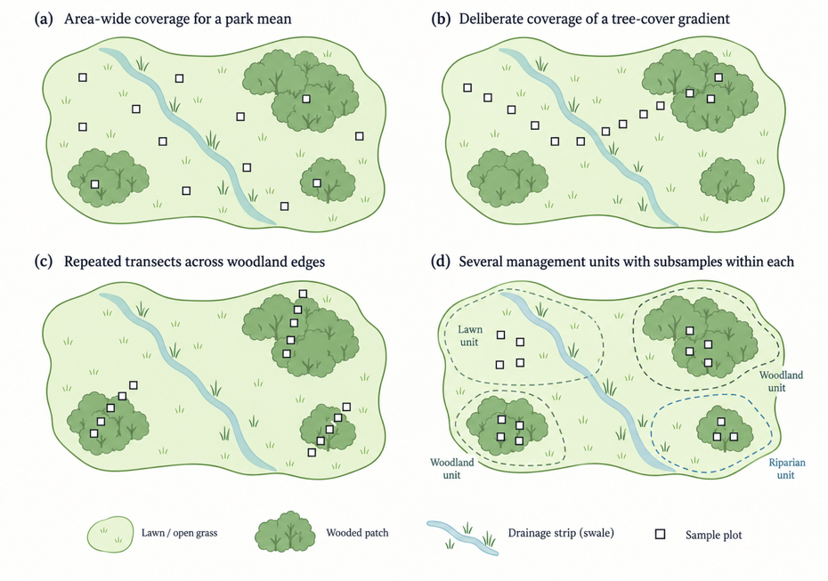
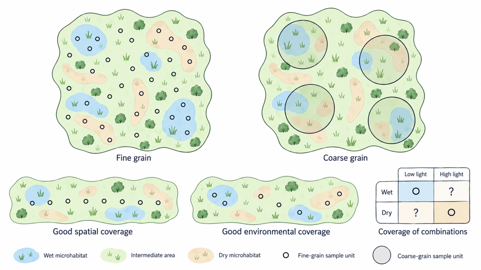
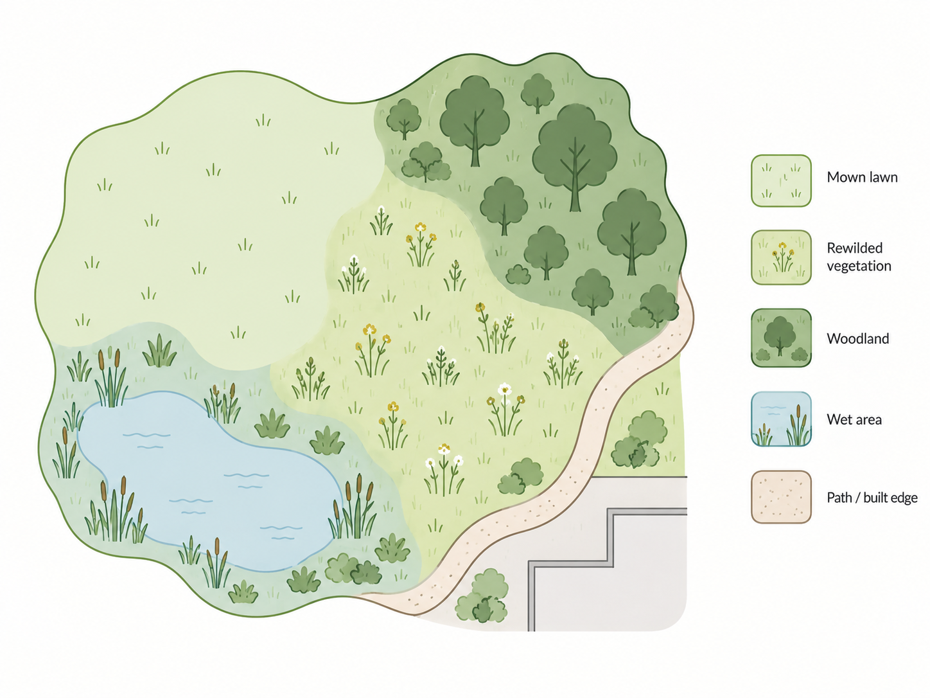

Chapter 5 introduced the target population, sampling units, sample size and replication. Those ideas tell us what the observations are meant to represent and which units provide separate examples for your analysis. Yet a list of sampling units is still not a sampling design. Every selected plot, tree, stream reach or soil core occurs somewhere. Where observations occur determines how well the study captures the spatial variation in the variable of interest within the study area and target population. This is especially important because environmental variation is rarely distributed randomly across space. Soil moisture changes along slopes and around drainage lines. Light varies beneath and between tree canopies. Vegetation changes among management zones. Tidal inundation differs among locations because of elevation and drainage. In general, sites that are close together often share soils, land-use history, hydrology or surrounding species pools. Observations taken a few metres apart may therefore tell us partly similar stories. Once we recognise spatial structure in the study system, the question ‘How many observations should we collect?’ is no longer enough. We also need to decide where those observations should be distributed. Twenty observations spread across a heterogeneous landscape can provide very different information from twenty observations clustered in one corner. Fifty measurements along one environmental gradient may describe that gradient very well while giving little information about whether the same relationship occurs elsewhere. The number of observations matters, but their location determines which variation and comparisons become visible. The mangrove forests of Pulau Ubin make this problem concrete. The same broad set of field measurements could be used in several studies, *but their placement would differ according to the question*. Consider four related but distinct research questions:

1.  If the aim were to estimate average aboveground biomass across the
    mangrove area, sampling would need to represent the area over which
    that average is to be calculated. Common types of mangrove
    environment should contribute substantially to the estimate because
    they occupy much of the target area, while less common environments
    should not disappear from the sample entirely.

2.  If the question instead asks how biomass varies with inundation,
    concentrating most observations where intermediate inundation is
    common may leave too little information about the dry and frequently
    flooded ends of the gradient. The sample now needs useful coverage
    of the predictor, not simply a miniature version of the landscape.

3.  A third question might concern recovery following disturbance. The
    relevant units are now forests or patches with different disturbance
    and recovery histories. A convenient sequence in which young forest
    happens to occur near the sea and old forest farther inland would be
    problematic because forest age would change together with inundation
    and perhaps other environmental conditions.

4.  A fourth question might concern the distribution of a mangrove
    species along the inundation gradient. Recording only locations
    where the species occurs would not tell us whether it is associated
    with a narrow range of inundation because it selects those
    conditions, or simply because those are the conditions that dominate
    the landscape. Even for trees, the spatial sampling has to describe
    both where species occur and which environments were available.

These studies could share measurements of tree diameter, species identity, elevation or inundation, yet the observations would need to be distributed differently because the questions require different forms of spatial information. The terms introduced in this chapter help make those choices explicit, but learning a vocabulary of sampling designs is not the objective. A study does not improve simply because the correct label has been attached to it. The concepts are useful when they help us ask whether observations occur at the right scale, whether the relevant environmental variation is represented, whether the intended comparisons are genuinely replicated, and whether important alternative explanations remain. In your own study designs, those choices can often be explained in ordinary language as long as the logic is clear and the sampling design follows from the question, the causal framework and the structure of the system.

## 6.1 One landscape, different questions

Imagine an urban park with an open lawn covering much of its area, several patches of mature trees, a patch of young woodland and a narrow low-lying strip beside a drainage channel. You have enough time to measure saturated soil hydraulic conductivity at 24 locations. Hydraulic conductivity tells us how rapidly water can enter saturated soil, and you are interested in what this means for how different types of urban greenery handle heavy rainfall. Before deciding where the 24 measurements go, however, you need a question. Suppose the question is: What is the average hydraulic conductivity of soils in this park? The target is an area-wide quantity. If most of the park consists of lawn, lawn soils should contribute substantially to the estimate. A design that deliberately put six measurements in each of four visually distinctive habitat types would make the uncommon wet strip along the drainage channel just as influential in a simple average as the much larger lawn. That may be useful for comparing habitats, but it no longer mirrors their contribution to the area-wide mean. For the park average, we need observations distributed so that the different parts of the park contribute appropriately to the quantity we want to estimate. Now suppose the question is: How does hydraulic conductivity change as tree cover increases? If most of the park has very little tree cover, an area-based sample may contain many similar observations and only a few locations beneath dense tree cover. Yet those less common conditions may be especially informative about the shape of the relationship. You might therefore deliberately allocate observations evenly from open lawn through scattered trees to closed-canopy vegetation. In that case, the resulting sample would no longer contain the different conditions in the proportions in which they occur across the park, but it may reveal the relationship between tree cover and infiltration much more clearly.

**Figure 6.1.** One landscape,
four questions. The same number of sampling points is arranged
differently for a park mean, a tree-cover gradient, woodland edges and
management units.

A third question might be: How rapidly do soil conditions change at the boundary between woodland and lawn? For that question, neither of the previous designs is particularly efficient. We need observations placed in relation to the boundary: perhaps several distances inside the woodland, at the edge and progressively farther into the lawn. It would also be useful to repeat this arrangement at several woodland edges rather than describing one particularly convenient edge in great detail. The edge, which would have been an inconvenient source of heterogeneity in the park-wide estimate, has become the central feature of the study. Finally, imagine that park managers use two mowing regimes and we want to know whether areas that are mown less frequently differ in infiltration from intensively mown areas. Twenty-four measurements inside one intensively mown lawn and one less frequently mown lawn would tell us a great deal about spatial variability within those two pieces of ground, but they would not provide 12 independent examples of each management regime. The management comparison occurs at the level at which mowing regimes vary, so we need several independently managed areas if the conclusion is intended to extend beyond those two particular patches. Each design quantifies different forms of variation. For an area-wide estimate, the frequencies of environmental conditions in the target area are central. For a relationship, coverage of the predictor matters; for an edge effect, observations need to capture change across the boundary; and for a management comparison, the number and distribution of independently managed units is important. A large number of observations can therefore support a very narrow conclusion when all of them come from the same part of the system. Two hundred soil measurements in the open lawn could estimate that lawn very precisely while saying little about the whole park, the tree-cover gradient, woodland edges or variation among management units.

The contrast becomes more complicated in an actual field study. Sloey et al. (2022) investigated how mangrove seedling occurrence and one-year survival on Pulau Ubin were associated with inundation and light. They established transects from the waterward edge through the mangrove forest, with environmental measurements at regular intervals and seedlings recorded along the transects. In a simplified diagram we might draw the mangrove as a smooth slope, with low elevation and frequent inundation near the water and progressively drier conditions inland. The actual forests did not behave so neatly. Local topography, including raised mud-lobster mounds, created drier microsites within wetter parts of the forest, while canopy structure created local differences in light. The field example therefore adds an important complication: the spatial coordinate we can see easily, such as distance from shore, may be only a rough proxy for the environmental variable in the question. A transect can cross a broad gradient while still encountering additional heterogeneity at smaller spatial scales. The Pulau Ubin example therefore reinforces the same principle as the park example: the sampling design has to make visible the variation and comparisons needed for the research question, including spatial heterogeneity that may not follow the most obvious geographical coordinate.

## 6.2 Sampling-unit size, spatial scale, extent and coverage

Environmental variation occurs at many spatial scales, and a sampling design defines which of those scales remain visible in the data. A park may contain lawns, wooded patches and wet ground, while each of those areas also contains smaller-scale variation in moisture, light, soil compaction or vegetation structure. In a mangrove, broad differences in inundation may occur from shore to landward forest, while small differences in elevation caused by depressions, mounds and drainage channels create additional variation over only a few metres. At still larger scales, sites may differ in management history, surrounding land use, topography or hydrological setting. Simply spreading observations across a map therefore does not solve the sampling problem. We need to decide what spatial unit each observation should represent, how far the study should extend, and whether the observations adequately cover both the geographical area and the environmental conditions relevant to the question.

A useful starting point is **grain**, which describes the spatial support of an observation: the area, volume or neighbourhood represented by one value. Changing the grain changes which variation is retained and which is averaged together. To illustrate what that means, imagine a landscape containing small wet depressions, dry raised patches and intermediate ground. With small sampling units, some observations may fall entirely within wet depressions and others entirely on dry patches, so the resulting data preserve the fine-scale spatial heterogeneity. If we instead use much larger plots that each include several wet and dry microsites and calculate one average condition per plot, the fine-scale heterogeneity is partly averaged away and the landscape appears more homogeneous. ***The landscape itself has not changed; what has changed is the scale at which we observe it***. The distinction concerns the ecological quantity represented as well as precision. A fine-grained and a coarse-grained observation can both be accurate while representing different ecological quantities. If seedling survival depends on whether seedlings occur on raised mounds or in adjacent depressions, averaging environmental conditions over a large plot containing both may obscure the relationship because the resulting mean corresponds poorly to the conditions experienced by either group of seedlings. If the question instead concerns variation in stand-level biomass across forests, such fine-scale variation may be irrelevant and averaging across it may be the logical option. *Grain should therefore be chosen in relation to the process and the question: fine enough to retain variation that matters for the inference, but not so fine that most effort is spent describing variation that the study does not need*.

***Measurements can be collected at one grain and summarised at another.*** Ten soil cores may, for example, be collected within a 20 × 20 m vegetation plot because soil varies over short distances, but then averaged to characterise plot-level soil conditions. That means that fine-grained measurements are being used to estimate a coarser-grained property. The same applies to individual trees measured within a forest plot. If the question concerns tree-level processes, such as competition, species differences or responses to local environmental variation, individual trees may remain the observational units, with the plot defining the sampled area. If the comparison is among plots or stands, however, the tree measurements are usually summarised into plot-level properties. These summaries can describe central tendency, such as mean diameter or basal area, but they can also describe variation itself, such as the distribution of tree sizes or variation in species composition. What matters is therefore not only the physical size of the original measurement, but the spatial scale represented by the quantity being compared. Where grain concerns the scale of individual observations, **extent** concerns the overall spatial domain covered by the study. Ten 1 × 1 m quadrats inside one woodland patch and ten quadrats of exactly the same size distributed among parks across a city have the same grain and the same total sampled area, but very different extents. The first design can describe one patch in considerable detail, whereas the second samples a much broader geographical domain, although much less intensively at each location. Extent therefore places an important boundary around what the study can tell us. In statistical and scientific terms, this means that it limits the inference we can make beyond the sampled locations. Adding more observations within one wetland may improve our estimate of conditions within that wetland, but it does not by itself tell us whether the same pattern occurs in other wetlands. Grain and extent can vary independently: for example, a study may use fine-grained measurements across many widely separated sites, or large sampling units concentrated within one local area.

Extent alone, however, tells us little about how observations are distributed within that domain. This is the problem of **spatial coverage**. Suppose twenty observations are collected in a 2-km-long park. If ten are concentrated near one end and ten near the other, the study reaches almost the full 2 km, but much of the space between the two clusters remains unsampled. If the same twenty observations are distributed across the park, the geographical extent is almost unchanged but the spatial coverage is much better. Good spatial coverage can be important for estimating area-wide quantities, describing spatial patterns and avoiding conclusions that depend disproportionately on one local part of the study area. Yet spatial coverage should not be confused with **environmental coverage**, because environmental conditions do not necessarily change smoothly or monotonically across geographical space. Think again about a landscape containing wet depressions, intermediate ground and dry raised patches. If those conditions were arranged as one smooth gradient from wet at one side to dry at the other, evenly spaced sampling locations would provide both good spatial and good environmental coverage. Many landscapes are not organised this neatly. In a mangrove, inundation may depend on small elevation differences and drainage pathways, so nearby locations can experience very different flooding while distant locations at similar elevations experience very similar flooding. In such a landscape, ten sampling points spaced evenly across the map might give excellent spatial coverage but still fall mostly in intermediate inundation conditions. The same ten observations could instead be placed deliberately so that low, intermediate and high inundation conditions are all represented. Their geographical spacing would be less regular, but they would provide much better environmental coverage for a question about how vegetation responds to inundation. Neither layout is inherently better. If the aim is to estimate the average condition of the mangrove, the sample should reflect how common different environments are across the area. If the aim is to estimate a relationship with inundation, deliberately increasing representation of uncommon wet and dry conditions may be much more informative.

Environmental coverage becomes still more important when several predictors matter simultaneously. Suppose plant growth depends on both soil moisture and light. A sample containing many wet, shaded locations and many dry, open locations spans a broad range of moisture and a broad range of light, yet those two variables remain strongly associated in the sample. We would have little information about wet, open locations or dry, shaded locations, making it difficult to distinguish the effects of moisture from those of light. What matters in such cases is not only the range of each variable but also the coverage of combinations of conditions. A simple way to think about this is as a matrix: if both wet and dry sites occur under both low and high light, the two predictors can be compared much more effectively than when wet sites are always shaded and dry sites are always open. This is one reason that mapping and reconnaissance can be important before final site selection. Candidate locations may appear well spread geographically while occupying only a narrow part of environmental space, or repeatedly representing the same combinations of conditions. Environmental conditions relevant to a sampling unit are not always located within the unit itself. When landscape processes are part of the causal framework, the surrounding landscape becomes another attribute of that unit, just as soil type, management history or local hydrology may be. In studies of forest regeneration, for example, local light conditions may influence seedling establishment within a patch, while surrounding vegetation and connectivity influence species availability and dispersal into that patch. These represent different causal pathways operating at different spatial scales. A sampling design therefore needs to represent and measure the landscape contexts that could influence the response, particularly when they might be confounded with the focal predictor.

The spatial structure of environmental variation also means that nearby observations often share context. Two plots close together may experience similar hydrology, soil, canopy conditions, disturbance history or management simply because they occur in the same part of the landscape. This tendency for nearby observations to resemble one another is commonly described as spatial autocorrelation. Whether that similarity is a problem depends on the question. Closely spaced observations are necessary when we want to describe how conditions change over the first 20 m from a woodland edge, because short-distance variation is the process being studied. For a study intended to describe variation among parks across a city, repeatedly adding observations within one small corner of one park contributes relatively little information about the broader system. The value of additional observations therefore depends on the spatial and environmental scale they add to the study.

**Figure 6.2.** Grain, spatial coverage and environmental coverage. The same landscape is sampled at different grain or arranged to cover geographical or environmental variation. The amount of spatial information in a sample also depends on how strongly the sampled units share their surroundings.

Two studies can each contain 20 plots while representing very different amounts of landscape variation. If all 20 plots are clustered in one small part of a park, they may provide a detailed estimate for that local area but tell us little about conditions elsewhere. If the same number of plots is distributed across the major spatial and environmental conditions in the target area, the sample contains more information about variation across the park. Spatial autocorrelation is one statistical description of the shared context that produces this pattern: nearby observations are often more similar than observations farther apart. Statistical models can account for some of that similarity when estimating uncertainty, but the broader environments that were never sampled remain outside the information available to the study. Grain, extent and coverage describe different aspects of the same design challenge. Grain determines what each observation represents and which variation is averaged within it. Extent determines how far the study reaches. Spatial coverage describes how observations are distributed across that extent, while environmental coverage describes how well they span the conditions and combinations of conditions relevant to the question. A strong design does not maximise all of these simultaneously; that is generally not possible. It chooses them so that variation needed to answer the research question remains visible, while variation that is irrelevant to that inference can reasonably be averaged or left outside the study. The term grain is useful shorthand for the spatial support or resolution represented by an observation, but it should not obscure the more concrete decisions underneath it. In a hierarchical field study there may be several relevant spatial units at once: a soil core, a seedling neighbourhood, a vegetation plot, a forest patch and the surrounding landscape. Rather than searching for one correct grain for the whole study, specify what area or neighbourhood each measurement represents and why that scale matches the process being studied.

This also explains why total sampled area is an incomplete description of spatial design. One 1-ha plot, ten 0.1-ha plots and fifty 0.02-ha plots all sum to 1 ha, yet they retain very different information about local structure, among-location variation and environmental coverage. The spatial arrangement is part of the scientific design, not an administrative detail added after deciding the total area to sample.

## 6.3 Choosing where to sample

Once we have identified the spatial variation that fits our question, we can consider how sampling locations will be selected. Terms such as random, systematic, stratified and targeted sampling are useful, but only if we understand what problem each arrangement is trying to address. In practice, well-designed field studies often combine several of these arrangements in a single study. Using the urban park in [Figure 6.1](#fig_6_1), suppose the target population is the whole park and the aim is an area-wide estimate of soil hydraulic conductivity. One option is to place a grid over a map, number all possible sampling locations and randomly select 24 of them. The important feature of random sampling is that the researcher is not deciding in the field which locations look suitably typical. A wet hollow, an awkward corner or a patch of compacted soil can be selected just as an average-looking piece of lawn can. This differs from walking through the park and choosing locations that appear reasonably spread out. Such haphazard sampling may feel random because there is no written rule, but human choices are rarely random. We avoid thorny vegetation, steep slopes and muddy places. We favour locations close to paths. We may unconsciously choose places that fit our expectations of what the habitat should look like. This is probably common across field studies. Random selection reduces the influence of those preferences because the researcher does not decide which eligible locations look most suitable in the field. Random sampling does not, however, guarantee an even pattern. By chance, several of the 24 points may fall close together, while a small habitat may receive none. Whether that outcome is acceptable depends on the study. If missing the small habitat would undermine the intended estimate or comparison, we may need to add structure to the design rather than hoping random placement gives us the coverage we need.

A **systematic design** provides one way of doing this. We could place observations every 50 m along parallel lines, or at every fifth cell of a grid. The resulting coverage is more even, it often makes field navigation simpler, and the design may be particularly useful when we want to describe spatial pattern or cross a broad gradient. A common approach is to choose the starting point randomly and then apply the regular spacing from there. Systematic spacing brings a different risk. Suppose the park was formerly an orchard and old planting rows remain 20 m apart, or drainage ditches occur at regular intervals. Sampling every 20 m could repeatedly land in the same part of that hidden pattern. Before using regular spacing, we therefore need to ask whether any regular landscape feature could coincide with the sampling interval.

Now consider the narrow wet strip in our park. Suppose it occupies only a small fraction of the total area but we suspect that its soils differ substantially from the rest of the park. With only 24 random observations, it is possible that the strip receives one observation or none. We could instead divide the park into several meaningful categories, such as lawn, wooded vegetation and wet ground, and sample separately within each. This is **stratified sampling**. Stratification uses existing information about heterogeneity to ensure that important parts of the target population are represented. Within each stratum, locations can still be selected randomly or systematically. The strata themselves can be **categorical**, such as habitat or management types, but the same logic can also be used to divide a **continuous environmental range** into sections when adequate coverage of that range matters. The logical question is then how much sampling effort each stratum should receive, which has no single answer. The appropriate allocation depends on the objective: if the purpose is an overall park mean, allocating observations roughly in proportion to the area of each stratum is often sensible because the sampling effort then follows their contribution to the target area. If 60% of the park is lawn, observations from lawn should normally have much more influence on the park mean than observations from a wet strip that occupies 5%. But proportional allocation can be inconvenient when a small stratum is scientifically important or we want to include a comparison among strata. One observation from the wet strip provides a very uncertain estimate for that stratum, so we might deliberately take six or eight observations there even though it occupies little area. The design then provides better information about the wet habitat and about differences among habitats. We can still use those observations to estimate a park-wide average, as long as we account for the unequal sampling fractions rather than letting the oversampled wet strip contribute as though it covered one-third of the park.

When we study continuous relationships between predictor and response variables, the distribution of sampling units along the predictor range can be especially important. Imagine that 70% of a mangrove forest experiences moderate inundation, while very dry and very frequently flooded conditions each occupy relatively small areas. An area-proportional sample will therefore contain many observations from the middle of the gradient and relatively few from its extremes. That may be appropriate for estimating average forest conditions, but it can provide little information about the ends of the biomass-inundation relationship. Those relatively uncommon observations can have a strong influence on the estimated shape of the relationship, especially when the relationship is non-linear. If our goal is to understand that relationship rather than to reproduce the environmental frequency distribution of the landscape, a more even allocation of observations across the inundation range may be much more informative. In that case, the sample is deliberately distributed differently from the environment itself. A fourth approach is **targeted**, or purposive, placement. Here locations are selected deliberately because they represent a feature or condition required by the question: the edge of a forest patch, the wettest and driest parts of an inundation gradient, a pollution source, a rare habitat, or a restoration site with a particular history. Targeted sampling is not a defective form of random sampling; it answers a different design need. It is especially useful when the purpose is to examine a mechanism, boundary or uncommon condition that probability sampling might miss. The limitation is equally clear: if sites are chosen because they have particular properties, the resulting observations cannot automatically be treated as though they were an unbiased miniature of the wider landscape. The conclusion has to follow the selection rule. Sampling approaches are often combined. A study might first divide a landscape into management types, randomly select several sites within each type, choose a random starting point inside every site, and then use systematic transects to obtain even local coverage. Another study might randomly select forest patches but deliberately place paired plots near and far from a stream inside each selected patch. Describing either design simply as random or systematic would thus lose most of the information needed to judge what the observations represent.

## 6.4 Dividing fixed effort across space

Chapter 5 considered how effort is divided among hierarchical levels. Spatial sampling adds a closely related choice: how much area should each sampling unit cover, and how widely should the units be distributed? These decisions interact because field effort is limited. A larger plot usually contains more organisms and averages over more local heterogeneity, but it takes longer to establish and measure; using larger plots may therefore mean sampling fewer locations. Smaller plots can be spread across more of the landscape, but each one is more sensitive to local patchiness and may give highly variable estimates when uncommon large individuals or clustered species have a strong influence. Suppose a vegetation team can survey a total of 1 ha. One 1-ha plot, ten 0.1-ha plots and fifty 0.02-ha plots all have the same total sampled area, yet they represent space differently. The single large plot gives a continuous description of one local neighbourhood and can be valuable for studying spatial structure or interactions among neighbours. Ten or fifty smaller plots can span more environmental conditions and more of the study extent. Very small plots, however, may produce unstable estimates of biomass or abundance because one large tree or one dense clump has a disproportionate effect. The scientifically relevant quantity is therefore not simply total area sampled, but how that area is divided and where the resulting units occur. The same logic applies to subsampling within plots. Several soil cores can improve the estimate of mean soil conditions for one plot, but once that local mean is reasonably well characterised, another plot in a different part of the landscape may contribute more information about spatial variation. Chapter 5 provides the hierarchical logic; here the additional question is whether the new unit extends **spatial or environmental coverage**. A new plot 2 m from an existing plot may add less landscape information than one placed in a different topographic position, management zone or part of the predictor range, even though both increase the nominal number of plots by one.

::: {.worked-example}
**Worked example 6A – The same sampled area, different spatial information**

Imagine a heterogeneous forest in which biomass varies with drainage and canopy history. You can measure either one 1-ha plot, ten 0.1-ha plots, or fifty 0.02-ha plots. The single large plot would be strongest if the question concerned local spatial structure within one stand. The distributed designs would usually provide better information about variation across the wider forest, especially if plots can be placed across the major environmental conditions. But making plots very small increases local variability and the chance that a few large trees dominate individual estimates. The useful design depends on the question, the scale of the process and the heterogeneity that needs to remain visible.
:::

## 6.5 Mapping and reconnaissance before fieldwork

Maps are important in guiding the design of field studies, as they help define the study area, identify candidate sampling units and plan access, but they can also reveal spatial differences in vegetation, topography, hydrology, land use or other features that may matter for the question. This information can inform which parts of the study area need to be represented in the sample. For example, before selecting soil-sampling locations in the urban park, a map might show vegetation cover, roads, drainage channels, slopes and management zones. From these layers we may discover that almost all mature woodland occurs on one side of the park, that a drainage channel cuts through several vegetation types, or that areas labelled simply as grass include both intensively managed lawns and wetter unmanaged strips. Those patterns could determine whether we need to stratify the sample and which combinations of conditions are actually available.

**Figure 6.3.** Mapping before fieldwork. Maps can reveal habitat, management, hydrology, access and spatial clustering before reconnaissance checks conditions on the ground.

A map is especially important when the design relies on spatial spread. Imagine selecting six rewilded patches from a list without looking at their positions. You would risk discovering that five are clustered in the same corner of the study area, or that they occur in different parts of the campus but share soil type, surrounding land use and perhaps the same management team. The nominal sample contains six patches, but the broader contexts represented by those patches are much less diverse than the number six suggests. Available maps rarely contain all of the information needed for final site selection, which makes reconnaissance an important part of field-study design. A mapped boundary between two vegetation types may turn out to be gradual rather than sharp, a forest patch may have recently been cut down for development, or a candidate site may be inaccessible. Two sites labelled as the same management category may differ because trees were pruned last month in one location and two years ago in the other. Reconnaissance should therefore look specifically for features of the environment that, according to the conceptual understanding of the system, could affect the response or create alternative explanations. Initial understanding of the study system tells us what spatial information to examine. Maps help identify major patterns, candidate strata, gradients and boundaries, from which a provisional sampling layout can be constructed. Reconnaissance then tests whether those mapped features correspond to conditions on the ground. Depending on the findings, the sampling layout may need to be revised before the principal data collection begins. Often there is no perfect set of sites, but seeing the problem before measurements begin allows the design to respond: by searching for additional sites, changing the sampling layout to obtain better overlap in environmental conditions, measuring the variables that differ among sites, or narrowing the intended conclusion.

Remote sensing and aerial imagery can strengthen this stage without replacing field reconnaissance. They can reveal vegetation structure, canopy cover, surface elevation and landscape configuration over areas that would be difficult to inspect entirely on foot. Their value for field design lies partly in showing where candidate observations sit within a wider context. The field visit then tests what those mapped patterns mean ecologically. A dark patch on an image may indicate dense vegetation, but it does not necessarily tell us its age, management history, soil condition or the mechanism that produced it. Mapping and reconnaissance therefore connect directly to spatial heterogeneity, stratification, shared context and the distinction between the target and accessible populations. They provide the information needed to decide whether the proposed sampling units actually span the variation that the study assumes they need to represent.

## 6.6 A design check before fieldwork

Before finalising a spatial sampling layout, it should be possible to answer the following questions. An incomplete answer does not mean that the project should stop; it identifies assumptions that may need reconnaissance, pilot data or a narrower conclusion. The checklist is not a list of terms that must appear in a methods section. It is a way to test whether the design has addressed the main spatial choices that could affect the inference.

1.  **What is the target population, area or comparison?** State what
    the study is intended to describe or generalise to, rather than
    beginning with the locations that happen to be accessible.

2.  **What does one selected sampling unit represent?** Distinguish
    sites, plots, individuals and subsamples, and identify the level at
    which the focal predictor or comparison varies.

3.  **Which spatial variation must the study make visible?** Is the
    target an area-wide average, an environmental gradient, a boundary,
    a rare condition, a management contrast or a landscape-context
    effect?

4.  **What are the spatial grain, extent and coverage?** Ask both what
    one observation represents and how the complete set of observations
    is distributed across the study area and environmental space.

5.  **Which observations share important context?** Nearby observations
    may share soil, drainage, management, disturbance history or source
    populations. Decide whether that shared context is part of the
    process being studied or limits the amount of new information
    provided by additional nearby observations.

6.  **Why are locations being selected randomly, systematically, within
    strata or deliberately?** The description of the design should
    explain the job performed by each selection method. Combinations are
    often more useful than any one method alone.

7.  **Where should additional effort go?** Decide whether another
    measurement is most useful as a subsample within an existing unit,
    another plot within a site, another independent site, a larger
    observation unit, or better coverage of an environmental condition.

8.  **What information is needed before final site selection?** Maps,
    imagery, management records and reconnaissance should identify
    spatial structure that could change the proposed strata, gradients,
    accessible population or comparison.

9.  **What alternative explanation would remain plausible if the
    expected pattern appeared?** If the design would make two
    explanations produce almost the same observed pattern, additional
    measurements, different placement or a more limited conclusion may
    be needed.

A sampling design will rarely make every source of uncertainty disappear. That is not its purpose. It should make clear which variation has been sampled, which comparisons have genuinely been repeated, and which parts of the system remain outside the information collected. Once those choices are explicit, the limitations of a field study become interpretable rather than hidden.

## Further reading for Chapter 6

Lohr (2022) and Thompson (2012) provide formal treatments of spatially
distributed probability samples, stratification and unequal allocation.

White and Edwards (2000), Conservation Research in the African Rain
Forests, is a practical field handbook that shows how plots, transects,
randomisation and stratification are implemented under real
tropical-field constraints.

van Breugel et al. (2019) is a useful empirical case in which soil
heterogeneity, dispersal limitation, topography and spatial scale
jointly structure forest composition.
