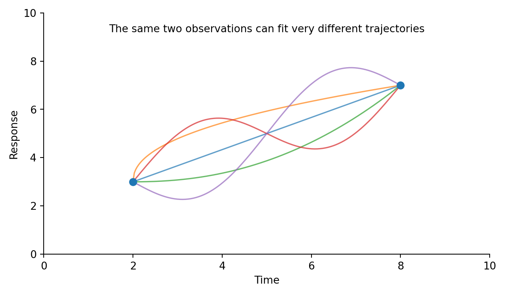
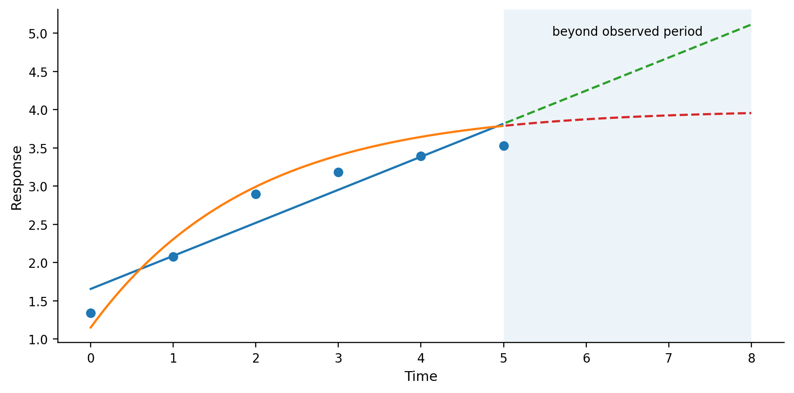
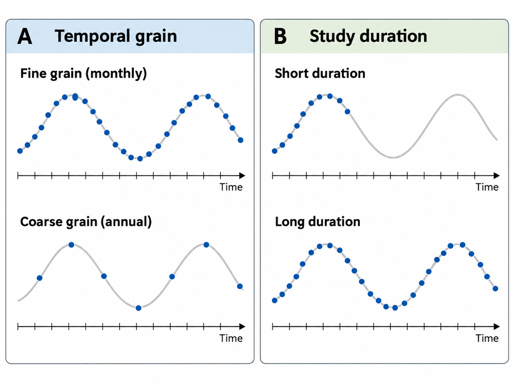
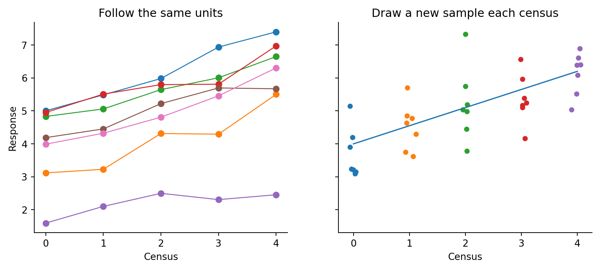
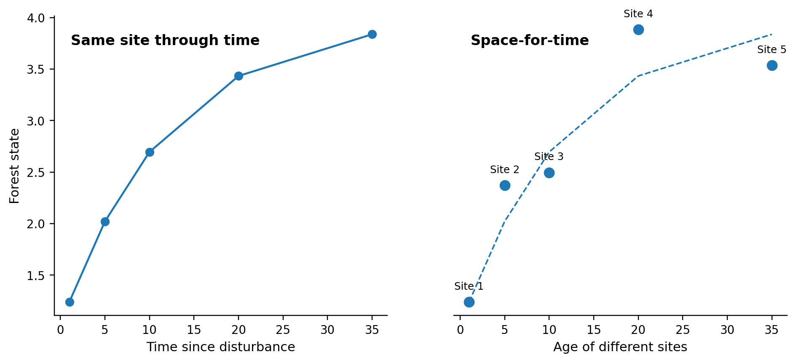

A study of change adds a simple-sounding requirement to the design: observations have to be related to time. That requirement becomes difficult as soon as we ask what the observations mean. Two measurements separated by a year can show that a value differed, but they do not reveal the path between those measurements, whether the difference is part of a long-term trend, whether it reflects a cycle or temporary event, or whether the measurement conditions themselves changed. Studying change therefore requires the same ingredients developed earlier in the course – a question, a working model of the system, appropriate units and sampling – but with time treated as part of the design rather than as a label attached after data collection.

::: {.try-it-yourself}
**Try it yourself – What happened between two censuses?**

A forest plot contains 65 Mg ha^-1^ of above-ground biomass in 2026 and 82 Mg ha^-1^ in 2031. Those measurements establish a difference between two dates, but they do not show whether biomass increased steadily, rose rapidly and then levelled off, declined after a storm and recovered, or fluctuated around a slower trend. Before choosing the next census date, sketch several trajectories that are consistent with the two observations and decide which additional observations would distinguish the patterns that matter for the ecological question.
:::

The same problem appears at much shorter timescales. A stream can transport much of its annual sediment during brief storm peaks, while vegetation structure may require years to change detectably. Sampling frequency and study duration therefore have to be matched to the processes in the causal pathway rather than chosen from a generic monitoring schedule.

## 7.1 Two observations do not define a trajectory

Imagine measuring vegetation biomass at one site in 2026 and again in 2031. The second value is higher. Before we interpret that difference, we need to know what kind of change the question is about and what processes could plausibly generate it. A forest recovering after disturbance might increase rapidly at first and then slow as canopy closure and competition intensify. A seasonal wetland might move through a regular annual cycle. A population affected by a temporary disturbance could rise and fall around a longer-term average. The same pair of observations can therefore be consistent with a linear increase, an accelerating or saturating response, a temporary peak, or one phase of a repeating cycle. Our model of the system provides expectations against which the observations can be interpreted. Process understanding should guide which temporal patterns are considered plausible and what additional observations would distinguish them. If biomass accumulation is limited by available growing space, a saturating trajectory may be plausible; if the response is driven by seasonal rainfall, a repeating pattern may be expected; if a management intervention occurred between censuses, an abrupt change may be possible. A specific question and a model of the process therefore come before conclusions about the shape of change.

{width=72% fig-alt="Two observations at different times connected by several different plausible trajectories."}

**Figure 7.1.** The same two observations can be part of very different
temporal trajectories, including steady change, a temporary event or a
recurring cycle.

## 7.2 More observations constrain the pattern, but duration still matters

Additional observations reveal more of what happened during the period we actually observed. Six censuses can show reversals or short-term fluctuations that would be invisible in a before-and-after comparison, and closely spaced measurements can reveal peaks that annual sampling would miss. Yet even a detailed five-year record does not tell us automatically what will happen over the next fifty years. A trend can continue, level off, reverse after a threshold is crossed or prove to be one phase of a longer cycle. This creates two related but distinct problems. Within the observed time span, we interpolate between measurements when we describe what probably happened during intervals we did not observe continuously. Beyond the observed span, we extrapolate. Extrapolation depends more strongly on the assumed process because the data no longer constrain the trajectory directly. A saturating and a linear model may fit the observed years almost equally well but imply very different futures. The safest interpretation therefore distinguishes what was observed, what was interpolated within the observed period, and what is projected beyond it.

{width=78% fig-alt="Observed points through time with two fitted trajectories that are similar within the observed period but diverge when extrapolated beyond it."}

**Figure 7.2.** More observations constrain plausible temporal trajectories, but different models can still imply different patterns within and beyond the observed time span.

## 7.3 Measurement interval, frequency and duration

How often we sample and how long we continue the study determine which temporal variation remains visible. Soil moisture can change within minutes during a storm and over days as water drains or evaporates. Flowering may have a seasonal peak lasting only weeks. Forest biomass can accumulate over decades while still fluctuating from year to year because of droughts, storms or mortality. A sampling interval appropriate for one process may be nearly useless for another. Measuring soil moisture once each year could completely miss event responses; measuring forest biomass every hour would add cost without revealing meaningful biological change. Temporal grain is closely analogous to spatial grain. When observations are far apart in time, short-lived peaks and dips disappear from the record and the resulting data describe a coarser temporal pattern. Fine timing retains more short-term variation. Neither is automatically better. If the question concerns a multi-decadal change in forest carbon, some short-term fluctuations can reasonably be averaged over. If the question concerns the hydrological response to intense rainfall, the same fluctuations may be the process of interest. Duration creates a different limitation. Twenty-four monthly observations over two years can resolve seasonality well but reveal little about decadal direction. Twenty-four annual observations provide much less within-year information but extend across twenty-four years. Monitoring uses repeated observations for a defined purpose. Its frequency and duration should be chosen for the changes the programme is intended to detect and for the decisions the monitoring is expected to inform.

{width=82% fig-alt="Two comparisons separating temporal grain from study duration: fine and coarse observation intervals over the same total period, and the same frequent observation interval continued for short versus long periods."}

**Figure 7.3.** Temporal grain describes how often observations are made, whereas study duration describes how long observations continue. Fine and coarse temporal grain can cover the same total period, while the same observation frequency can be maintained for a short or a long study.

## 7.4 Why observations through time do not lie exactly on a line

A fitted temporal trend rarely passes through every observation, and it should not be expected to. [Chapter 4](04-variability-uncertainty.qmd) distinguished several sources of variation around an underlying pattern. Measurement variation can move a point away from the value that would have been obtained under perfectly repeatable observation. Real short-term variation can alter the system itself between censuses, as rainfall, temperature, tides or animal activity change. Other variables can also change through time: canopy development, management, disturbance or surrounding land use may shift while the focal process is unfolding. A model fitted through the observations estimates a general relationship with time while the remaining deviations contain these other sources of variation. For these reasons, comparable timing and methods are important. If the first vegetation census uses one minimum stem size and the second uses another, the apparent increase can partly reflect the changed protocol. If soil flux is measured in the dry season at one census and immediately after heavy rain at the next, the difference combines longer-term change with short-term hydrological conditions. Standardising methods and sampling comparable temporal windows can reduce some of these complications, while recording the context allows remaining variation to be interpreted rather than hidden.

::: {.worked-example}
**Worked example 7A – A trend is an expected pattern, not a line through every point**

In a simple regression of response on time, the fitted line estimates the expected response E(Y | time) under the model. Each observation can be written conceptually as fitted value + residual. The residual is the part of the observation not described by the fitted temporal pattern. Residual variation can include real differences among units, short-term environmental variation, omitted predictors, interactions and measurement variation. The statistical model summarizes the average pattern, while uncertainty around the fitted line reflects how much that estimated pattern would vary under repeated sampling.
:::

## 7.5 Following the same units and resampling new units

There are two fundamentally different ways to obtain repeated information about a population. We can return to the same plots, trees, households or monitoring stations at each census, or we can draw a new sample from the target population every time. Both designs can describe change, but they preserve different information. When the same units are followed, each unit has a trajectory. A forest plot may start with high biomass and remain high while another starts lower but increases more rapidly. Those stable differences among plots are useful information rather than noise to be erased before analysis. Following the units allows us to ask whether plots differ in rates or shapes of change, whether initial conditions predict later change and whether a disturbance affects some units more strongly than others. Repeated measurements increase temporal information for the plots already in the study; they do not create new independent plots. This is the temporal counterpart of the paired comparisons introduced in Chapter 4: comparing each unit with itself can remove much of the stable between-unit variation from the contrast, but only because the same unit is genuinely being followed through time. When a new sample is drawn at each census, there are no individual trajectories to follow. Each census instead estimates the state of the population at that time. The trend is inferred from how the distribution or mean of those repeated population samples changes. This design may be appropriate when individual units cannot be relocated, when turnover is so high that following individuals is not meaningful, or when the principal question concerns the changing population rather than the history of particular units.

::: {.worked-example}
**Worked example 7B – Estimating a temporal trend under two designs**

For repeated units, the intuition is to estimate change within each unit and then ask what those trajectories have in common. This does not usually mean fitting a separate line to every plot and literally averaging the slopes. Repeated-measures or mixed-effects models estimate an overall temporal pattern while retaining unit-specific differences in starting values and, when supported by the data, differences in slopes or other aspects of the trajectory. For a new sample at each census, the model estimates how the population-level response changes with time, conceptually E(Y | time). The individual points at one census are not connected to points at later censuses. A regression through all observations, or a model through census means with appropriate weighting, estimates the population trend while the spread among units contributes to uncertainty about that trend. The two designs can produce similar-looking mean lines while supporting different questions. Repeated units allow statements about within-unit change; repeated cross-sections allow statements about changes in the population distribution.
:::

{width=84% fig-alt="Comparison of following the same sampling units through several censuses with drawing new units at every census."}

**Figure 7.4.** Following the same units preserves individual trajectories, whereas drawing a new sample at each census estimates the changing population state without individual histories.

## 7.6 Chronosequences: using space as a substitute for time

Many environmental processes unfold more slowly than a study can wait. A forest may take a century to recover after disturbance, a soil profile millennia to develop, or a restoration project decades to reach its intended structure. A chronosequence uses sites of different known ages to infer a temporal trajectory from spatial differences. The advantage is immediate temporal extent. The cost is an additional assumption: the older sites must provide a reasonable indication of how the younger sites would develop if they were followed through time. Walker et al. (2010) describe the conditions under which chronosequences provide a stronger basis for space-for-time inference. The sites should represent stages that can reasonably be linked along a common trajectory, and the trajectory should be sufficiently predictable that age is informative about development. Interpretation becomes more difficult when sites diverge onto different pathways, when disturbance repeatedly redirects succession, or when site history and environment vary systematically with age. The suitability of a chronosequence therefore depends on the process being studied, the time scale represented and how well these assumptions are supported by information about the sites.

{width=80% fig-alt="A longitudinal trajectory following one site through time contrasted with a chronosequence that uses different sites of different ages to infer a trajectory."}

**Figure 7.5.** Chronosequences use differences among sites of different ages to infer change through time. Their main vulnerability is that site differences can be mistaken for temporal change when the sites do not lie on a comparable developmental pathway.

::: {.worked-example}
**Worked example 7C – When can space stand in for time?**

When ecological change takes years, decades or centuries, following the same site for the full trajectory is often not practical. Chronosequences provide one way of studying longer-term change by comparing sites that differ in time since a known starting event and using those spatial differences to infer a temporal trajectory. This space-for-time substitution depends on the sites being comparable in more than age. Their starting conditions, disturbance and land-use histories, local abiotic conditions, and landscape settings should either be broadly similar or measured well enough to account for important differences. For succession, this includes conditions affecting both species performance and species availability. Local soil, moisture, light and other abiotic conditions influence establishment and growth, while surrounding vegetation, connectivity and the abundance and behaviour of animal dispersers influence which species can reach a site. These factors are often difficult to hold constant because landscapes themselves change through time as land use, surrounding vegetation and animal populations change. A 30-year-old forest developing today may therefore not experience the same landscape context as a site that was 30 years old several decades ago. Foster and Tilman (2000) tested chronosequence predictions by returning to 19 old fields that had formed part of a chronosequence in 1983 and resampling them fourteen years later. The original chronosequence correctly predicted several features of actual within-field change, including declining rates of compositional change with field age and many changes in species abundance, but it predicted changes in species richness poorly. Some characteristics therefore changed through time broadly as expected from the spatial age pattern, whereas others did not.

Mora et al. (2015) made a similar comparison in tropical dry forest. Across the chronosequence, forest age was strongly related to the state of the forests at one point in time: age explained 60–97% of the differences among sites in six forest attributes. When the same sites were then followed through time, age was a weaker predictor of how rapidly those attributes actually changed, explaining only 32–57% of the differences in observed rates of change among sites. The chronosequence significantly overestimated changes in basal area and mean height, while species richness and composition were predicted more successfully. Management history also helped explain the observed dynamics. A strong relationship between forest age and current forest condition therefore did not necessarily describe the rate at which individual forests subsequently changed. Binkley (2026) reviews several examples in which this distinction becomes especially clear. In one long chronosequence of spruce-fir forests in Colorado, stem biomass appeared broadly constant across forests ranging from about 175 to more than 700 years old. The same conclusion emerged when the sites were resampled three decades later as another cross-sectional chronosequence. Yet seven of the eight monitored forests had experienced substantial bark-beetle mortality during those three decades, and biomass within the individual plots had actually declined strongly. In another example from lowland rainforest in Costa Rica, two chronosequence surveys suggested that tree-species diversity increased at about 1.7 species per year, while direct within-plot change was less than half that rate. Binkley also highlights cases in which small initial differences among sites were amplified through positive feedbacks and others in which hurricanes or insect outbreaks abruptly altered trajectories. These examples show why site history and contingent events can matter even when a broad age pattern appears clear.

Carrington et al. (2026) provide a contrasting tropical dry-forest example in which resampling after about twenty years broadly supported the chronosequence interpretation. Changes within individual sites in species composition and community-weighted functional traits generally moved in the direction predicted by the original age sequence. The repeated observations also revealed something that the original cross-sectional pattern could not show as clearly: species composition became more similar among older sites, while functional traits became more divergent. Longitudinal monitoring therefore supported the broad successional pattern while also revealing differences in how particular dimensions of the community changed. These studies suggest several practical considerations when constructing or interpreting a chronosequence. Replication across sites is important because individual sites can follow idiosyncratic trajectories. Environmental conditions, land-use history and landscape context should be documented when they could change systematically with site age. The expected predictability of the process also affects the design. Some attributes may be driven mainly by cumulative processes that change relatively smoothly with time, while others may respond strongly to dispersal, disturbance, weather, species interactions or historical events and therefore show much greater variation among sites of similar age. Where possible, chronosequence plots can be converted into permanent monitoring plots and revisited later.

Combining a chronosequence with repeated monitoring provides more than a test of whether the original space-for-time interpretation was correct. The chronosequence provides information across a long span of successional age, while monitoring shows how particular sites change over shorter periods. Variation among sites and variation in their rates or directions of change can then be used to examine why trajectories differ. For example, long-term monitoring across a replicated secondary-forest chronosequence in Panama has been used to examine how recruitment changes with forest development while comparing plots that differ in topographic position and proximity to streamside forest. This design makes it possible to separate broad successional trends from persistent differences associated with local environmental conditions and landscape-scale species availability, and to ask whether those differences themselves change through succession (van Breugel et al. 2025).
:::

Chronosequences and longitudinal monitoring provide different kinds of temporal information. A chronosequence can span a century immediately because the ages are distributed across sites. Monitoring directly observes how particular sites change, but the temporal extent initially grows only as the study itself ages. Combining them is powerful because the chronosequence provides a long-range hypothesis and the monitoring data test whether sites actually move in the predicted direction and at the predicted rate. This comparison also makes clear why a temporal pattern cannot be separated completely from space. Sites in a chronosequence occupy different locations and therefore different soils, landscape contexts and disturbance histories. Those surrounding conditions can themselves change over calendar time. A forest that was isolated when abandoned thirty years ago may now be embedded in a more forested landscape; a newly abandoned site in the same region experiences a different contemporary species pool and climate. The substitution of space for time therefore assumes not only comparable sites but sufficiently comparable historical context.

## 7.7 Processes unfold at different spatial and temporal scales

Processes included in the same study can operate at different spatial and temporal scales, so the raw measurements do not always have the same grain. What has to be made explicit is the unit and time interval at which they are compared. Van Breugel et al. (2025) provide an example from secondary forests in Panama. Recruitment was recorded annually for eight years in paired plots at 45 sites, with one plot adjoining a streamside forest strip and the other farther uphill. Recruitment responses were summarised for each plot and census interval. Local stand basal area and measured soil and topographic conditions could then be associated with those same plots, while proximity to the streamside forest represented a plot-level landscape context and forest age described successional development. Bringing these variables to a common plot-by-census structure allowed the analysis to compare local forest development, landscape context and recruitment without pretending that the underlying processes operated at identical scales. Other environmental studies make similar choices. In catchment hydrology, rainfall recorded every few minutes can be summed over individual storm events and compared with event runoff, while land cover is represented as a catchment-level attribute that changes much more slowly. In an urban heat study, temperature may be logged every few minutes but summarised as a daytime mean or maximum for each site-day before being related to canopy cover or built-surface characteristics around the same monitoring location. The original fine-grained observations can still be retained, but any comparison among processes should state clearly how measurements collected at different scales were summarised to a common analytical unit. Long-term monitoring can also create the setting for a later field experiment. Once repeated observations establish baseline trajectories and reveal plausible drivers, a subset of plots, stream reaches or management units can sometimes receive a manipulation while others continue as comparisons. The earlier monitoring record then shows whether the units already differed, how variable their trajectories were before treatment, and whether an apparent treatment response exceeds the background changes occurring elsewhere. Chapter 9 develops this use of experiments as a complement to observation rather than as a separate laboratory approach.

## 7.8 A design check for studying change

Before beginning a study of change, it should be possible to explain in ordinary language what kind of temporal pattern the study is intended to reveal. The questions below are a check on that reasoning rather than a list of terms to reproduce in a methods section.

1. What exactly is changing: a population state, an individual
trajectory, a rate, a seasonal pattern, a response to an event, or a
longer-term recovery process?  
2. Over what time span can the process change, and how long must the
study run to distinguish a persistent trend from short-term
fluctuation?  
3. How frequently must observations be made to retain the temporal
variation relevant to the question?  
4. Are the same units followed, or is a new sample drawn from the
population at each census? What information is lost or gained by that
choice?  
5. Are methods, observers and measurement conditions sufficiently
comparable through time, and which contextual variables should be
recorded?  
6. If a chronosequence is used, why should sites of different ages be
treated as parts of a comparable trajectory, and can that assumption be
tested by later resampling?  
7. At what spatial and temporal scales do the proposed causal pathways
operate, and how will measurements made at different scales be compared?

## Further reading for Chapter 7

Lindenmayer and Likens (2018), Effective Ecological Monitoring, is a
concise treatment of question-driven monitoring, adaptive monitoring
design and common reasons long-term programs fail.

Walker et al. (2010) and Johnson and Miyanishi (2008) review the
assumptions and uses of chronosequences in succession studies.

Foster and Tilman (2000), Mora et al. (2015) and the examples
synthesized by Binkley (2026) show how later resampling can compare
space-for-time expectations with actual within-site change.

van Breugel et al. (2025a) provides a hierarchical repeated-census
example linking forest succession, local conditions and landscape
context to recruitment dynamics.
