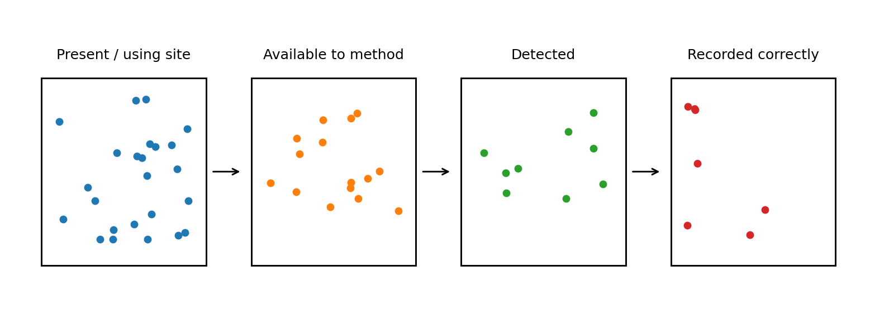
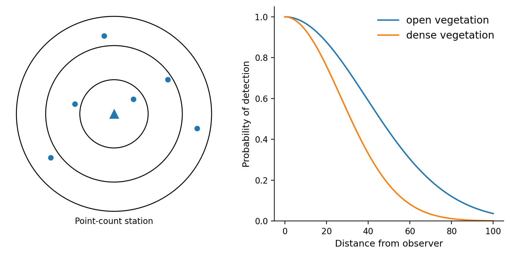
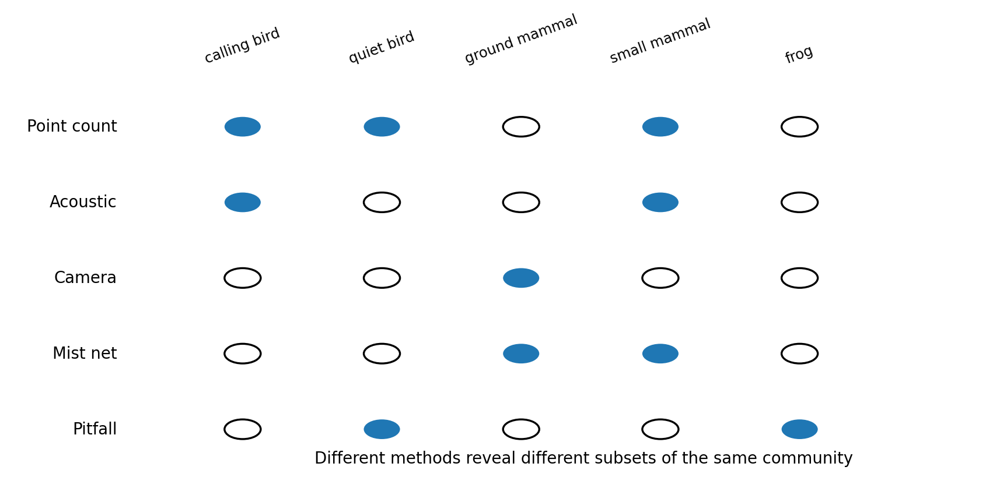
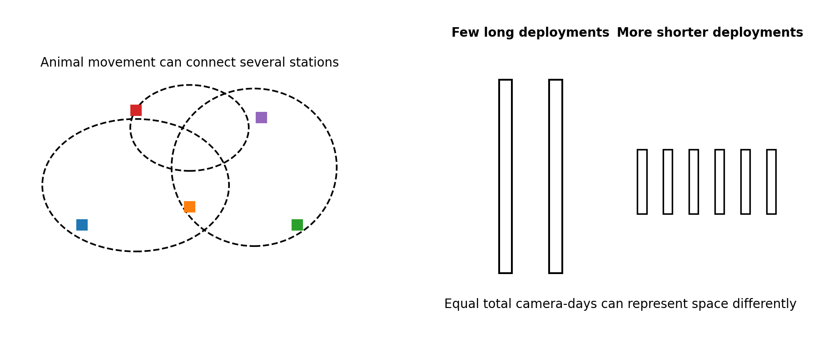
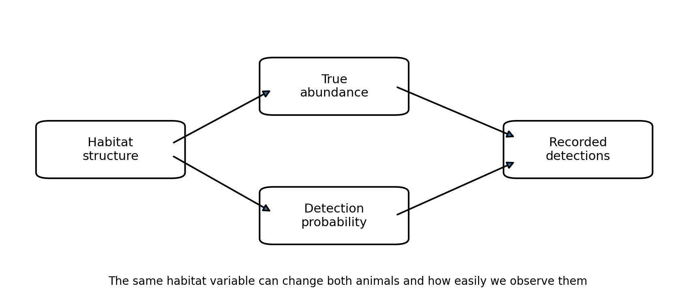
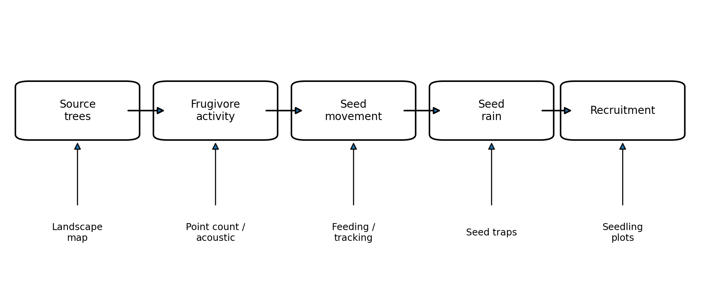

A tree in a vegetation plot is rooted in one place. If the plot is searched carefully, its presence, diameter and identity can usually be treated as properties of that sampling unit at the time of measurement. Animals create a different observation problem. A bird may live in or regularly use a forest patch without being present near an observer during a ten-minute count. A frog may remain silent during a dry evening. A mammal may pass behind a camera without entering its detection zone. A fish can occupy a stream reach but avoid a net. What appears in the dataset therefore depends on the animals themselves, on where and when they move or produce cues, and on the observation method used to detect them. Animals often appear in the causal models developed in Chapter 2, so this observation problem affects many kinds of environmental study. Pollinators, seed dispersers, herbivores, predators and prey can influence vegetation dynamics; animals may also be responses to habitat structure, disturbance or restoration. If a study uses bird detections as a proxy for frugivore activity, or camera detections as an index of mammal abundance, the interpretation depends on how detections are generated. A lower count can reflect fewer animals, lower activity, lower cue production, poorer visibility, a smaller detection range, or several of these processes together. The measurement process can therefore create patterns that resemble ecological differences. The observation process is easiest to understand by following the animal toward the dataset: an animal must be present or use the sampled area, become available to the method, enter its effective detection space or produce a detectable cue, and then be correctly recorded. From there we can ask what ecological quantity the observations can support – occurrence, occupancy, encounter or activity rates, relative abundance, density or total abundance. Distance, time, movement and method all affect that connection. The statistical models used to estimate detectability can become complex, but the underlying reasoning does not require advanced mathematics; the worked examples introduce only the formal detail needed to make the design logic clear.

## 8.1 From animals present to animals detected

Imagine two regenerating forest patches that contain the same number of insect-eating birds. An observer stands for ten minutes in each patch and records six birds in the first patch and three in the second. The counts differ, but several processes lie between the birds that are present and the birds that are recorded. Some individuals may be outside the effective listening or viewing area during the count. Of those within range, only some may sing, call or move visibly. Vegetation and background noise affect whether those cues reach the observer. The observer must then notice the cue, identify the species correctly and record it. Each stage can differ between the two patches even when the underlying abundance is identical. McCallum (2005) separates two components that are especially useful for understanding count-based surveys. An animal must first be available for detection. A territorial bird that is present but silent during a short point count is not available through its song. A nocturnal mammal is largely unavailable to a daytime visual survey even when it uses the site every night. Once a cue is available, the observer or device must detect it. A call can be masked by traffic noise; a bird can be hidden by foliage; a camera may fail to trigger when a small animal moves through the edge of its sensor field. In practice, studies often combine these components into an overall probability of detection, but keeping the sequence visible helps identify why detection differs. Movement adds another layer because the animal can move into and out of the area sampled by the method. For a camera trap, Burton et al. (2015) distinguish the broader ecological process that brings an animal into the vicinity of a camera from the local process by which the camera detects an animal that passes through its sensor zone. Both affect the number of photographs. A high camera detection rate can therefore arise because many animals are present, because the same animals move frequently past the camera, because a trail funnels movement toward the device, or because the sensor and placement make detection particularly efficient. The observation is real, but it combines abundance, movement and detection.

Chapter 4 separated ecological variability from variation introduced by measurement and sampling. Animal surveys often contain both at once. The number of detections can change because animals genuinely differ in abundance, activity or habitat use, and it can also change because the probability of observing them differs. A study can reduce this ambiguity by recording or controlling conditions that affect detection, so that ecological differences and differences in observability are not silently combined.

{width=84% fig-alt="Progressive observation filter from animals present or using a site, to animals available to the method, detected, and recorded correctly."}

**Figure 8.1.** Animal observations are filtered through several stages between ecological presence and the final record. Fewer records can therefore reflect ecological differences, observation differences, or both.

The same reasoning applies when the response is presence rather than a count. A site at which a species is detected is known to have been used by that species during the survey period. A site with no detection is ambiguous: the species may have been absent, or present but missed. Bailey and Adams (2005) use repeated detection/non-detection surveys to make this distinction visible. If a species is detected on one of several visits, its presence is established even if it was missed on the others. Across many sites and repeated visits, the pattern of detections and non-detections contains information about how often a present species is detected.

::: {.worked-example}
**Worked example 8A – Repeated visits and imperfect detection**

Suppose a frog species is present at a pond and has a 0.5 probability of being detected during one standardised night survey. One visit still has a 50% chance of missing it. If three visits can reasonably be treated as separate detection opportunities with the same detection probability, the chance of missing the species every time is 0.5 × 0.5 × 0.5 = 0.125. The chance of detecting it at least once is therefore 0.875. Occupancy models extend this intuition across many sites. They separate two quantities: whether a site is occupied or used during the study period, and the probability of detection during a survey when the species is present. A detection history such as 0-1-0 proves that the species was present during the period even though two visits missed it. A history of 0-0-0 remains ambiguous. Patterns across sites and visits allow the two processes to be estimated together (Bailey & Adams, 2005). The assumptions matter. Repeated visits should represent the same ecological state closely enough for the occupancy question being asked, and detection can vary with weather, observer, habitat, season and survey method. More visits help only if the repeated observations add information about detection rather than repeatedly sampling the same narrow conditions.
:::

## 8.2 What quantity is the study trying to estimate?

A field method does not determine the ecological quantity by itself. The same camera trap can be used to document that a species occurs in an area, compare detection rates among habitats, estimate the proportion of sites used by a species, describe daily activity patterns, or contribute to an estimate of density. The design and analysis required for those purposes are different. Before choosing the method, the study therefore needs to state what quantity is intended to represent the biological process in the conceptual model. At the simplest level, a detection establishes that an animal, species or cue was recorded at a particular place and time. Repeated detections can be summarised as encounter rate, capture rate, calls per recording hour, detections per camera-night, or catch per unit effort. These are often useful indices, especially for standardised monitoring, but their connection to abundance depends on detection being sufficiently comparable among the places or times being contrasted. If dense vegetation both supports more birds and reduces visual detection, equal counts do not imply equal abundance. If mammals use roads more often in one habitat than another, cameras placed on roads may compare movement along roads more directly than population size. Occurrence and occupancy shift attention from the number of detections to the distribution of sites. The observed proportion of sampled sites with at least one detection is sometimes called naive occupancy. It describes the survey outcome directly. Estimated occupancy uses repeated observations or related designs to account for the possibility that occupied sites were missed. Occupancy can be ecologically informative when the question concerns distribution, habitat use or range change, but it is not a direct estimate of the number of individuals at occupied sites.

Abundance refers to the number of individuals in a defined population or area; density expresses abundance per unit area. A complete census can provide abundance directly when every individual can genuinely be counted, but this is unusual for mobile animals. More often, absolute estimates require additional information about unseen animals. Distance sampling uses the decline in detection with distance from a line or point. Capture-mark-recapture uses repeated capture or resighting of identifiable individuals. Other approaches estimate abundance from repeated counts while modelling detection, but these methods quickly become statistically demanding and are beyond the main scope of this course. The design logic remains the same: observed animals are linked to the animals not observed through explicit assumptions about detection.

| **Quantity**                 | **What the field data record most directly**                                                    | **What can usually be concluded**                                  | **Main extra assumption or information needed**                              |
|------------------------------|-------------------------------------------------------------------------------------------------|--------------------------------------------------------------------|------------------------------------------------------------------------------|
| Detection / record           | An individual, cue, track, image or capture at a place and time                                 | The species or individual was detected there during the survey     | Correct identification and reliable recording                                |
| Observed occurrence          | Sites with at least one detection                                                               | Where the species was recorded within the sampled sites and period | Non-detection is not treated as proof of absence                             |
| Occupancy / site use         | Repeated detection/non-detection at sites                                                       | Proportion of sites occupied or used during the study period       | A model or design that estimates imperfect detection                         |
| Encounter or activity index  | Detections, calls, captures or photographs per unit effort                                      | Relative survey activity under a defined protocol                  | Detection and movement must be comparable for abundance interpretation       |
| Relative abundance index     | Standardised counts or capture rates                                                            | Relative differences if the index tracks abundance consistently    | Approximately constant or known relationship between abundance and detection |
| Density / absolute abundance | Counts plus distances, individual identities, repeated captures or other correction information | Individuals per area or total number in the target area            | A design that estimates the animals missed and defines the sampled area      |
| Observed species richness    | Number of species detected                                                                      | Minimum number of species known from the sampled effort            | Additional effort or coverage methods are needed to estimate unseen species  |

Species richness deserves the same caution. The number of species detected is a property of the community and the survey process together. Longer effort, more survey occasions, more methods and broader habitat coverage usually increase the number recorded, especially when rare or difficult-to-detect species remain. Biodiversity surveys therefore often report species accumulation or sample-coverage information instead of treating the observed list as complete. The Chencharu EIA used in the group appraisal provides a practical example: different animal groups had different estimated sampling coverage, so the confidence attached to an apparent absence or to observed richness should differ among groups.

::: {.worked-example}
**Worked example 8B – Capture-mark-recapture in brief**

Suppose 40 small mammals are captured, individually marked and released. On a second trapping occasion, 50 animals are captured, of which 10 carry marks from the first occasion. If marked animals have mixed back into the population and have approximately the same chance of capture as unmarked animals, then the marked fraction in the second catch (10/50) should resemble the marked fraction in the population (40/N). This gives the simple estimator N approximately equal to 40 × 50 / 10 = 200 animals. Real capture-recapture studies use more occasions and models that allow capture probability, survival and movement to vary. The simple example makes the observation problem explicit: repeated encounters with identifiable individuals provide information about how many animals were present but never captured. The estimate depends strongly on assumptions about marks, movement, population closure and capture probability. Traps can also influence behaviour: some animals become trap-shy, others trap-happy, and species differ in attraction to bait or willingness to enter.
:::

## 8.3 Detection changes with distance, time and the observation environment

Stand at the centre of a forest point count and imagine a calling bird five metres away. If the same bird were fifty metres away, the observer would generally be less likely to detect and identify it. Sound attenuates with distance, vegetation absorbs and scatters sound, visual cues become obscured, and other sounds can mask the call. This decline in detection with distance is one of the most general features of animal surveys. The exact shape differs among species, habitats, weather conditions, observers and equipment. Distance sampling turns that familiar field pattern into an estimate of density. In a line transect, observers record animals and the perpendicular distance of each detection from the transect line; in a point transect they record distance from the observation point. If transects or points represent the target area appropriately, the distribution of detection distances contains information about the animals that were probably missed farther from the observer. Thomas et al. (2010) describe the standard logic: detection is assumed to be highest close to the line or point and declines with distance, allowing an effective surveyed area to be estimated rather than pretending that every animal within a fixed radius was found.

{width=78% fig-alt="Concentric distance rings around a point-count station paired with detection curves that decline with distance and more rapidly in dense vegetation."}

**Figure 8.2.** Detection probability commonly declines with distance and can differ among observation environments. The same number of animals can therefore produce different numbers of records under different survey conditions.

The same distance problem appears with automated sound recorders. A recorder can sample for many hours without an observer, but it still has an effective acoustic detection space rather than an unlimited radius. Microphone quality, recorder height, call frequency and amplitude, vegetation, wind, rain and background noise all affect how far calls can be detected and identified. Darras et al. (2018) compared paired bird point counts and autonomous recordings across 28 studies. When the effective detection ranges were standardised, the two approaches produced similar estimates of species richness; microphone signal-to-noise ratio, height and number influenced recorder performance by changing the area from which calls could be detected. Longer recording increases temporal coverage, while the effective detection radius can still remain small or vary among habitats. Camera traps have a more sharply bounded local detection zone, but the principle is related. The infrared sensor and camera field of view sample only a small volume around the device. Body size, speed, temperature contrast, vegetation in front of the sensor, trigger speed, height and orientation all influence whether an animal passing nearby produces a usable record. Burton et al. (2015) emphasize that camera detections therefore link two spatial scales: movement through the landscape determines whether an animal enters the vicinity of the camera, and equipment plus placement determine whether the local encounter becomes a detection. Traps and nets also have effective detection spaces, although they are created by animal movement rather than by sight or sound. A mist net samples birds that fly through a thin plane at a particular height. A pitfall trap samples ground-active animals that encounter its opening, often with drift fences used to redirect movement. A baited mammal trap samples animals willing and able to enter it. A hoop net or minnow trap samples aquatic animals whose movements and body sizes make them susceptible to that gear. For all of these methods, the number captured is a combination of local abundance and the probability of encountering and entering the device.

::: {.worked-example}
**Worked example 8C – What distance sampling adds**

A fixed-radius count treats the sampled area as if every animal inside the radius had the same chance of being detected, or it accepts the resulting count as an index. Distance sampling instead uses how detections decline with distance to estimate a detection function. The area actually searched can then be expressed as an effective strip width for line transects or an effective radius for point counts. Reliable distance-sampling estimates still depend on the field design. Standard analyses assume, among other things, that transects or points are positioned with respect to the target area in a way that supports the intended inference, that animals at zero distance are detected, and that distances are measured accurately enough. Movement before detection and strong species differences can also complicate interpretation (Thomas et al., 2010). Graphically, the observed decline in detections with distance contains information about missed animals. The formal model estimates the area that was effectively surveyed rather than assuming the nominal area was completely observed.
:::

## 8.4 Different methods sample different parts of the same animal community

Method-specific detectability becomes especially clear when we survey the same community in more than one way. Wang and Finch (2002) compared mist-netting and point counts for migrating landbirds in riparian habitats along the Rio Grande. Across their study, 197 species were detected by the two methods combined. Point counts detected 82% of those species and mist nets 74%. The missing species were not a random subset. Birds recorded by point counts but not nets tended to include larger species and aerial foragers, whereas net-only records included many small birds such as warblers, sparrows and wrens. Habitat structure also changed the relationship between the two methods. The two datasets therefore described overlapping but different views of the same bird assemblage. The comparison shows why method performance has to be interpreted in relation to the question. A point count samples visual and acoustic cues over an area whose radius depends on observer, habitat and species. Mist nets directly capture individual birds, which permits identification, measurement and marking, but the net only intercepts birds moving through a small vertical plane. A species that stays in the canopy can be common and rarely enter an understory net. A quiet understorey bird may be hard to identify at a point count but frequently captured. The appropriate method depends on whether the question concerns species occurrence, relative use of habitat, demographic measurements on individuals, movement, or another quantity. The same pattern appears in herpetofaunal surveys. McKnight et al. (2015) used seven approaches in a diverse reptile and amphibian community, including pitfall traps, funnel traps associated with drift fences or logs, aquatic turtle traps, artificial cover objects, automated recording systems and incidental encounters. Different methods detected different taxa, and some methods produced species that no other method found. Combining methods increased community coverage because the methods intercepted different behaviours, body sizes, activity periods and microhabitats. It also produced a more complicated sampling design: effort has to be defined separately for each method, and capture rates from different gears cannot be pooled as if they were equivalent measurements.

Automated methods redistribute survey effort and can extend coverage substantially, while their own observation constraints remain. Passive acoustic monitoring can extend temporal coverage dramatically and leaves a permanent recording that can be checked later. It samples animals that vocalize within the recorder's acoustic space, and subsequent identification may be done by people or algorithms. Camera traps similarly extend temporal coverage and provide verifiable images or videos, but they favour species and behaviours that move through the detection zone. Human observers can integrate visual, acoustic and contextual information in real time, yet observer skill and fatigue become part of the measurement process. Capture methods provide physical animals for measurements and marking but are invasive, labour-intensive and strongly selective for animals that encounter and enter the gear.

| **Method family**                                | **What must happen for detection**                                                                              | **Useful outputs**                                                                     | **Common sources of unequal detectability**                                                             |
|--------------------------------------------------|-----------------------------------------------------------------------------------------------------------------|----------------------------------------------------------------------------------------|---------------------------------------------------------------------------------------------------------|
| Visual / auditory point counts and transects     | Animal is within effective range and produces a visible or audible cue that the observer notices and identifies | Occurrence, counts, behaviour; density if distance or other correction is used         | Distance, vegetation, noise, observer skill, cue rate, time of day, weather                             |
| Passive acoustic recorders                       | Animal vocalizes within the acoustic detection space and the signal is recorded and identified                  | Occurrence, vocal activity, timing, community composition; sometimes occupancy         | Call rate, frequency, microphone quality/height, masking noise, vegetation, classifier performance      |
| Camera traps                                     | Animal moves through the local sensor/camera zone and triggers a usable image or video                          | Occurrence, activity, behaviour, detections; occupancy or density with suitable design | Movement rate, trail use, body size, temperature contrast, camera model/settings, placement             |
| Mist nets / aerial nets                          | Animal flies or moves through the net at the sampled height and is retained                                     | Capture rate, species, morphology, age/sex, marked individuals                         | Flight height, movement, net visibility, weather, habitat structure, species behaviour                  |
| Live traps for mammals                           | Animal encounters, enters and triggers the trap                                                                 | Capture rate, individual identity, morphology; capture-recapture abundance             | Bait response, trap shyness/happiness, movement range, trap spacing, weather, saturation                |
| Pitfall, funnel and drift-fence arrays           | Ground-active animal encounters the array and can be retained by the gear                                       | Occurrence, capture rate, community composition                                        | Body size, climbing/jumping ability, activity, substrate, fence placement, rainfall                     |
| Invertebrate nets and traps                      | Animal flies, crawls or is attracted into the sampling gear                                                     | Occurrence, capture rate, community composition; sometimes activity indices            | Flight height, attraction to light/colour/bait, weather, diel activity, trap position and duration      |
| Aquatic nets and traps                           | Animal overlaps the gear in depth/habitat and is caught or enters the trap                                      | Occurrence, catch per effort, size structure; sometimes abundance indices              | Flow, depth, substrate, mesh size, bait, swimming behaviour, gear saturation                            |
| Signs, tracks, dung, nests and environmental DNA | Animal leaves a persistent trace or DNA that is sampled and correctly attributed                                | Occurrence and distribution; sometimes relative activity                               | Trace production and persistence, transport, substrate, degradation, identification or laboratory error |

{width=80% fig-alt="A matrix showing that point counts, acoustic recorders, cameras, mist nets and pitfall traps detect different subsets of the same animal community."}

**Figure 8.3.** Different survey methods act as different observation filters. Each method detects only part of the community, depending on animal behaviour, movement and the way the method works.

## 8.5 Movement changes the meaning of sampling units and replication

Earlier chapters treated sampling units as the elements selected by the study design. With mobile animals, the observation can move among units. A camera station can therefore be a spatial sampling unit even though the animals photographed are not confined to it. A point-count location samples cues from animals moving through a surrounding detection area. A trap line samples animals whose home ranges overlap the line. The same individual can contribute observations at several locations or on many survey occasions. For sample size, the distinction is immediate. Three thousand photographs from five camera stations are not three thousand spatial replicates. The large number of images can describe activity at those stations in great temporal detail, while the spatial comparison is still based on five locations. Similarly, checking one trap every night for a month provides repeated detection opportunities at one location; placing thirty traps across a landscape provides information about spatial variation. The allocation of effort between more locations and longer sampling at each location is therefore the same nested-design problem introduced in Chapter 5, with movement and imperfect detection added. Spacing also needs to be interpreted in relation to animal movement. If adjacent camera stations lie within the home range of one macaque group, detections at both cameras do not necessarily represent different groups. The stations can still provide separate information about site use or activity at two locations. Interpretation becomes problematic when station-level detections are treated as independent animals or as independent examples of a higher-level ecological condition. The relevant unit depends on the response being analysed and the ecological quantity the study claims to estimate.

{width=82% fig-alt="Animal home ranges overlapping several stations and a comparison of equal total camera effort concentrated in few long deployments versus spread across more shorter deployments."}

**Figure 8.4.** Movement can connect several sampling stations, while equal total survey effort can be distributed very differently through space and time. Both affect what repeated detections represent.

Where stations are placed is also part of the observation model. A camera aimed along a trail may increase detections of species that use trails and make efficient use of limited equipment. If the target quantity is general habitat use or density, trail placement can distort comparisons when trail use differs among species or habitats. Chapter 6 showed that targeted placement can be appropriate when the interpretation matches the purpose. A study of road crossings should target roads. A landscape-wide estimate of mammal occurrence needs a placement design that represents the landscape, with the consequences of any deliberate targeting made explicit. Time creates a parallel problem. Birds may be easiest to detect around dawn, amphibians after rain, bats and many mammals at night, and migratory species only during part of the year. Standardizing all surveys to one time can improve comparability while representing only that time window. Repeated surveys across seasons can broaden temporal coverage, but they may also sample genuinely different ecological states rather than repeated chances to detect one fixed state. Chapter 7's distinctions among temporal grain, frequency and duration therefore apply directly to animal surveys. Weather can affect both the animal and the method. Rain can increase amphibian calling while reducing the performance of some acoustic surveys; wind can suppress bird song, move vegetation in front of camera sensors and increase background noise. Dense vegetation can support a different animal community and simultaneously reduce visual and acoustic detection distance. When the same environmental variable influences both abundance and detection, an observed habitat relationship can be weaker, stronger or even opposite to the underlying ecological relationship. Detectability then belongs in the causal reasoning from the start and cannot be treated only as a technical correction after sampling.

{width=76% fig-alt="Causal diagram in which habitat structure affects both true animal abundance and detection probability, which together determine recorded detections."}

**Figure 8.5.** A habitat variable can influence both the animals and the observation process. Recorded detections may therefore combine ecological variation with variation in detectability.

## 8.6 Linking detections back to the ecological question

How animal detections should be interpreted is best decided in the conceptual model before data collection begins. Consider a study of tree recruitment in regenerating tropical forest. Chapter 2 treated species availability as one pathway controlling which species can establish locally. Frugivorous birds and mammals may contribute to that pathway by moving seeds from source trees or older forest into young patches. A study might therefore ask whether variation in frugivore activity helps explain variation in seed rain or seedling recruitment among patches. A bird point count or acoustic recorder can provide information about whether frugivorous bird species are present and active near a patch. Those observations do not directly measure seed dispersal. A camera at a fruiting tree may record feeding visits, which is closer to the process but still does not establish where seeds are deposited. Seed traps measure seed arrival but do not identify every disperser. Landscape mapping describes distances and barriers to potential sources. Combining these observations can test several links in the pathway, provided their spatial and temporal scales are aligned. A high bird detection rate in January cannot explain seed arrival measured six months later if the relevant plants fruit in another season. Biotic interactions make this connection especially important. If predator occurrence is used to explain prey behaviour, or herbivore abundance is used to explain seedling damage, the predictor itself is measured with error and imperfect detection. A zero camera count for a predator does not establish predator absence. A low pitfall capture rate for an insect may reflect dry conditions that reduced movement rather than a smaller population. Treating biotic variables as if they were measured without an observation process can introduce the same kinds of uncertainty and bias discussed for environmental proxies in Chapter 3.

{width=84% fig-alt="Seed dispersal pathway from source trees through frugivore activity and seed movement to seed rain and recruitment, with different observation methods aligned to each link."}

**Figure 8.6.** Animal observations become most informative when they are tied to a specific ecological pathway. Different methods provide information about different links from source populations and animal activity to seed arrival and recruitment.

Method combinations add most when they contribute information about different links or different observation biases. Darras et al. (2018) show that recorders and human point counts can sample bird communities similarly when their effective detection ranges are considered, while Wang and Finch (2002) show that point counts and mist nets can emphasize different parts of a bird assemblage. McKnight et al. (2015) found complementary detection across herpetofaunal methods. In each case, each method contributes a different observation process. Their combined value depends on understanding which animals and behaviours each method can detect and how that relates to the ecological question.

::: {.worked-example}
**Worked example 8D – Designing a study of mobile animals from the causal pathway**

Suppose the question is whether landscape isolation reduces tree recruitment because fewer animal-dispersed seeds arrive in young forest patches. The study needs information at several levels. Landscape maps quantify distance or barriers to seed sources. Bird or mammal surveys describe potential disperser occurrence or activity. Seed traps measure actual seed arrival. Seedling plots measure recruitment. Fruit availability and vegetation structure may affect both disperser behaviour and detectability and should therefore be considered in the design. A plausible animal component might use repeated point counts or acoustic recordings at each patch during the main fruiting season, with enough spatially distributed patches to represent the landscape-isolation gradient. Repeated visits help distinguish non-detection from consistent absence or low activity; distance information or fixed detection radii can improve comparability among sites; recording vegetation density and background noise can reveal conditions that alter detection. The patch, rather than each bird detection, is the main sampling unit for testing the landscape-level relationship. The resulting bird metric should be named according to what it actually represents. Detections per standardised survey are an encounter or activity index unless the design supports stronger inference. If the analysis estimates occupancy while accounting for detection, it represents site use or occurrence. If density is estimated with distance sampling, it represents animals per area under the method's assumptions. The ecological argument then asks whether that quantity predicts seed rain and recruitment at matching spatial and temporal scales.
:::

### A design check for mobile-organism studies {.unnumbered}

Start with the biological quantity the question targets: presence, distribution, site use, activity, relative abundance, density, total abundance, behaviour or a particular interaction. Then describe the observation process that connects that quantity to the data. What must the animal do to become available to the method? What is the effective detection space? Which species, behaviours or life stages are favoured or missed? Next identify the sampling unit and the level of replication. A photograph, call or capture may be an observation within a camera station, recorder site, point count or trap line rather than a new spatial replicate. Ask how movement among sampling locations affects interpretation, and whether the placement of stations represents the target population or intentionally targets a particular feature such as a trail, pond edge or corridor. Finally, match the temporal design to the organism. Consider activity cycles, weather, breeding, migration and seasonality; decide whether repeated visits are repeated chances to detect the same state or observations of ecological change. State which assumptions are needed to interpret detections as occurrence, relative abundance or absolute abundance, and identify the conclusions that remain unsupported by the observation process.

## 8.7 Methods in brief: choosing a field approach

A methods handbook can provide detailed protocols for setting mist nets, checking live traps or programming recorders. The purpose here is narrower: to connect common animal-survey methods to the sampling and inference issues developed in earlier chapters. Point counts and line transects are flexible for birds and other conspicuous or vocal animals, and distance information can support density estimation. Visual encounter surveys are common for reptiles, amphibians and invertebrates when individuals can be searched for directly. Acoustic recorders extend surveys through time and are particularly useful for vocal birds, bats, frogs and insects. Camera traps are valuable for medium and large terrestrial animals and for activity patterns. Capture methods become important when individuals must be handled, measured or marked, or when cryptic species are otherwise difficult to identify. Netting and trapping methods differ in the movement pathway they intercept. Mist nets capture flying animals at particular heights. Sherman or Elliott-type live traps sample small mammals that encounter and enter baited boxes. Pitfall and funnel traps, often combined with drift fences, redirect or intercept ground-active amphibians, reptiles and arthropods. Invertebrate surveys may also use sweep nets, Malaise traps, light traps, pan traps or baited traps, each selecting strongly for particular flight heights, activity periods, sensory cues or behaviours. Aquatic surveys can use seine nets, dip nets, electrofishing, minnow traps, fyke or hoop nets, with the choice of method constrained by depth, flow, substrate, target body size and ethics. Signs such as tracks, dung, nests and feeding marks extend detection beyond the moment when the animal itself is present; environmental DNA can detect genetic traces in water, soil or other substrates. These indirect methods have their own persistence, transport and identification processes, so they also require a clear link between detection and the ecological quantity of interest.

Combining methods is often sensible when no single method provides adequate coverage. The combination should still be designed rather than assembled opportunistically. A bird community survey that combines point counts with mist nets needs separate effort measures for counts and netting. A mammal survey that combines cameras and live traps needs to recognise that the two methods sample different body sizes and behaviours. A herpetofaunal inventory may deliberately combine visual searches, acoustic surveys and trap arrays because each targets a different component of the community. When the aim is comparison among sites or times, consistency in equipment, placement, duration, observer training and environmental conditions becomes especially important, while any unavoidable differences should be recorded so that they can be considered during analysis. The methods also differ in cost, labour, expertise, disturbance and data-processing burden. Automated recorders can collect far more audio than a team can listen to manually; cameras can produce thousands of images; live trapping requires frequent checks and animal-handling competence; mist nets and some traps require permits and careful welfare procedures. These constraints belong in study design because they determine the number of locations, duration and temporal coverage that can realistically be achieved. As in Chapters 5–7, distributing effort across more sampling units can provide different information from intensively observing a small number of units. Studies of mobile organisms use the same sampling logic as the earlier chapters, but an additional observation process lies between the ecological state and the data. A detection tells us that an animal or cue was recorded under particular conditions; a non-detection may mean absence or simply that a present animal was unavailable or missed. The ecological quantity therefore has to be named before the method is interpreted, and repeated visits, distance information, marked individuals or complementary methods are useful when they add information about that observation process. Detections still occur within sampling units, repeated observations from one station do not create new spatial replicates, spatial placement determines which habitats or landscape contexts are represented, and temporal design must match activity, migration and seasonality. Understanding the organism and the observation method together is what allows the detections to be connected back to the causal question.

## Suggested short readings

Bailey & Adams (2005) is a concise introduction to why repeated surveys
are needed when species can be present but undetected. McCallum (2005)
provides a conceptual treatment of detection probability in point
counts, especially the distinction between an animal being available to
produce a cue and the observer detecting that cue. Thomas et al. (2010)
gives an accessible overview of the logic of distance sampling. Burton
et al. (2015) is longer but particularly useful for understanding why
camera detections combine abundance, movement and local detection.
