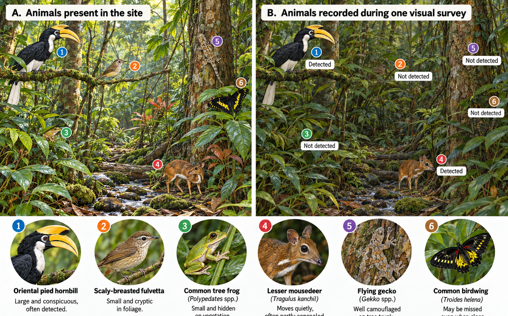
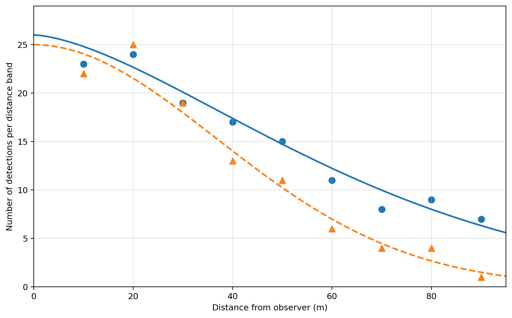
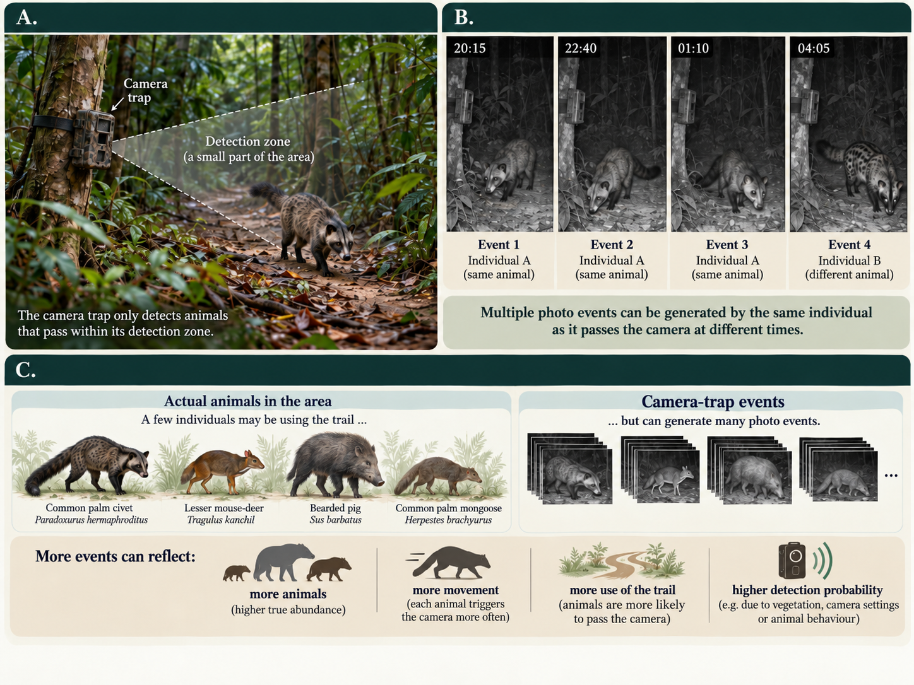
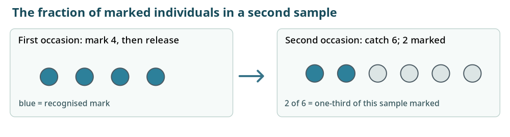
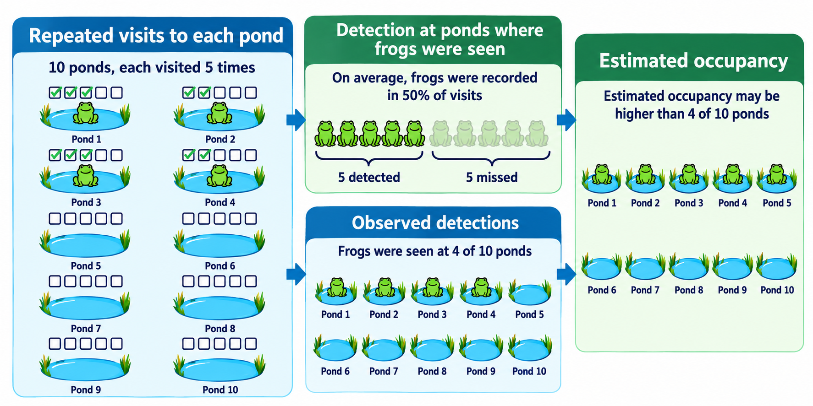
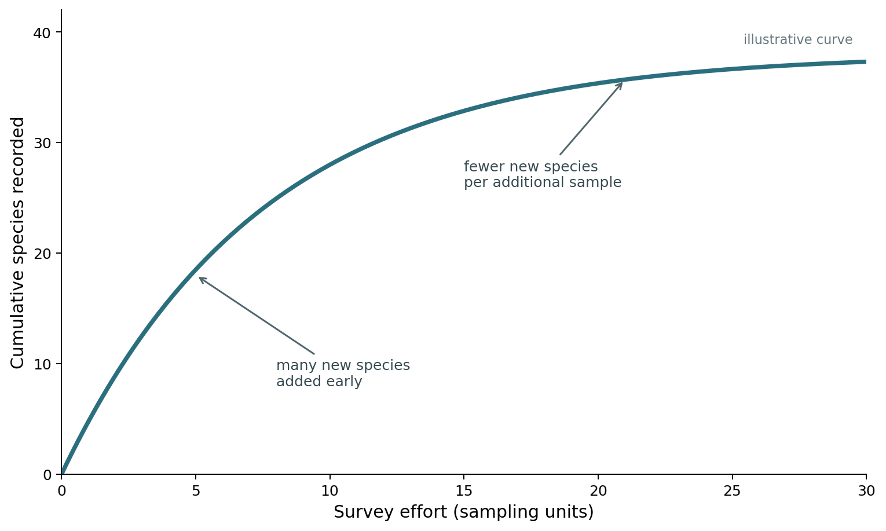
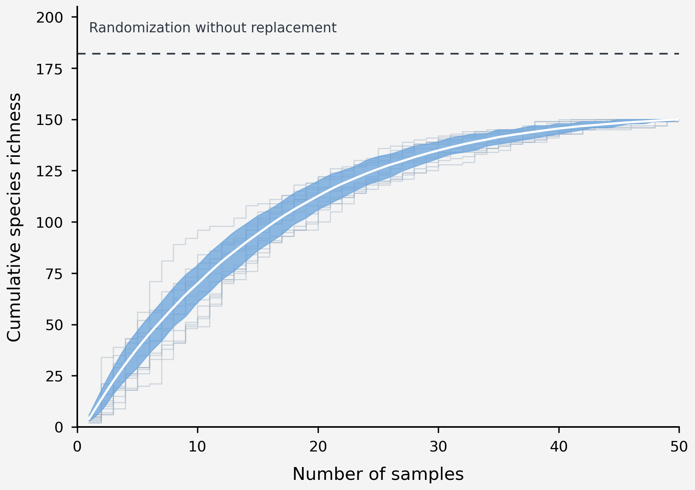
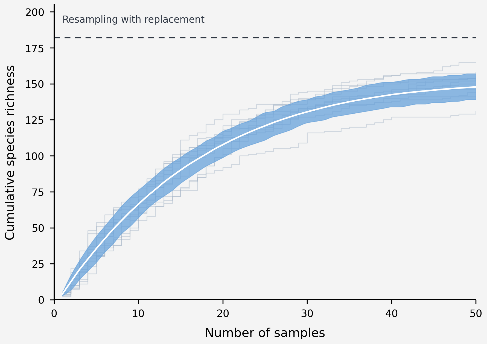

::: {.env2301-update}

Imagine we want to compare the bird communities of two regenerating forest patches. We could establish observation points, spend ten minutes at each and record every bird we see or hear. But if one patch produces fewer records, would that mean it contains fewer birds or fewer species? If we were surveying trees, we could establish plots and measure the individuals rooted within their boundaries. A bird may use a patch regularly without being near us during a ten-minute count, and even a nearby bird may remain silent or concealed. Its movement and behaviour influence both the ecological patterns we want to investigate and the observations available to us. How, then, can we use the animals we encounter to learn about those we miss?

We will develop this question through the same sequence used in earlier chapters: understand the ecological system, define the quantity we want to learn about, examine what a measurement actually records, then organise sampling across the relevant places and times. With animals, three connected processes need to stay visible throughout. The <em>ecological process</em> is where animals are, how many there are and how they move or behave. The <em>observation process</em> is how a field method turns some of those animals, or the cues they leave, into records. The <em>estimation process</em> uses those records, the sampling design and explicit assumptions to infer an ecological quantity that we could not observe completely. Different animal groups and questions require different methods because they change the observation process and the information available for inference. The main narrative follows a small number of worked study problems. Optional technical boxes work through estimation logic slowly, beginning with the ecological problem before introducing notation. The <a href="#ch8-explorer">Animal Field Methods Explorer</a> provides broader, expandable method guides with field-design illustrations and links to published applications without interrupting the main narrative.

:::

## 8.1 · Animal ecology determines how we can observe a population {#ch8-s81}

::: {.env2301-update}
<section>
Our first decisions in the bird study are already ecological. Many species are active and vocal around dawn, so an early-morning survey will probably produce more records than an otherwise comparable survey at midday. Some birds are usually detected through calls, while others are more readily seen moving through vegetation. We need to know enough about the community to establish sensible observation times and locations before deciding whether point counts, line transects or acoustic recorders are most appropriate. Even within one bird assemblage, canopy position, vocal activity, territorial behaviour and movement differ among species. One observation method can therefore provide good coverage of some species and systematically underrepresent others, with consequences for any comparison of the communities we reconstruct from the records. Now suppose we shift our question to nocturnal terrestrial mammals in the same forest patches. A daytime point count cannot simply be adapted by recording mammals instead of birds: the animals may be largely unavailable to an observer at that time. Camera traps are a plausible alternative because they operate in the absence of a person and can record animals travelling through a sensor zone at night. But camera trapping introduces a different relationship between the animals and our records. A mammal may live in the surrounding forest and never walk directly in front of our camera; another may pass it repeatedly while travelling between feeding areas. The number of records is therefore influenced by movement and local routes as well as by how many animals are present. A method chosen because it matches the organism's activity pattern also needs to be evaluated in relation to the particular ecological quantity we want to estimate.

Movement affects the spatial meaning of observations even with species that we can see readily. A territorial bird may remain within a relatively restricted area during the breeding season, while a wide-ranging frugivore could be recorded at several survey locations in one day. Detecting it at three points establishes use of three observation areas, but does not automatically establish three individuals. Availability also varies across longer periods. For an amphibian that calls mainly during wet conditions, differences in rainfall between survey days can produce very different records from the same pond. If one forest is always visited after rain and the other during dry weather, what appears to be a community difference may partly be a sampling-condition difference. When we develop the design, activity patterns, life stages, movements and likely sources of disturbance belong alongside the usual considerations about study area and effort. A final choice concerns which component of the population or community we intend our method to represent. Pitfall trapping with drift fences can be useful for ground-active amphibians that move across the forest floor, but it is unlikely to sample arboreal species adequately. If we want an inventory of the wider amphibian assemblage, complementary visual or acoustic searches may be needed; if we specifically want to investigate ground-active species, a correctly designed pitfall survey can be entirely appropriate. Method specificity is acceptable when the inference remains bounded to the component actually sampled. Problems arise when the conclusion silently broadens from that component to a larger community the method did not represent. The Explorer provides analogous ecological considerations for birds, mammals, reptiles, odonates, other invertebrates and aquatic groups.
</section>
:::

## 8.2 · From animals using a site to animals in our dataset {#ch8-s82}

::: {.env2301-update}
<section>
Suppose our forest patches contain the same number of individuals of one insect-eating bird species. We conduct one ten-minute point count in each and record six birds in the first patch and three in the second. The difference is genuine as a difference in observations, but we do not yet know whether the underlying populations differ. Some birds using each patch may not be close enough to the point during the count to be observable, and others may be nearby but silent or hidden. Calls or movements that become available may still be missed because of vegetation, background noise or differences in identification. It helps to distinguish the ecological state, the <em>availability</em> of animals or cues to our chosen method, and the final <em>detection and recording</em> process [@mccallum2005]. Each link creates a possibility that a present animal will be absent from our dataset. In practice we may combine these links into an overall detection probability, but distinguishing them explains why the same population can yield different records under different field conditions.

<figure id="ch8-fig1"><svg aria-label="Flow from animals using the study area through availability and detection to field records" height="160" role="img" viewbox="0 0 680 160" width="680"><defs><marker id="arrow8" markerheight="8" markerwidth="8" orient="auto" refx="7" refy="4"><path d="M0,0L8,4L0,8Z" fill="#487686"></path></marker></defs><g fill="#214557" font-family="Arial,sans-serif" font-size="13"><rect fill="#e5f0f1" height="70" rx="3" stroke="#8baab2" width="133" x="8" y="55"></rect><text text-anchor="middle" x="74" y="83">Animals using</text><text text-anchor="middle" x="74" y="101">the study area</text><rect fill="#e5f0f1" height="70" rx="3" stroke="#8baab2" width="133" x="185" y="55"></rect><text text-anchor="middle" x="251" y="83">Available</text><text text-anchor="middle" x="251" y="101">to the method</text><rect fill="#e5f0f1" height="70" rx="3" stroke="#8baab2" width="133" x="362" y="55"></rect><text text-anchor="middle" x="428" y="83">Detected and</text><text text-anchor="middle" x="428" y="101">identified</text><rect fill="#e5f0f1" height="70" rx="3" stroke="#8baab2" width="133" x="539" y="55"></rect><text text-anchor="middle" x="605" y="83">Recorded</text><text text-anchor="middle" x="605" y="101">observations</text></g><g marker-end="url(#arrow8)" stroke="#487686" stroke-width="1.8"><path d="M142 90H178"></path><path d="M319 90H355"></path><path d="M496 90H532"></path></g><g fill="#61777f" font-family="Arial,sans-serif" font-size="11" text-anchor="middle"><text x="162" y="24">activity,</text><text x="162" y="41">location</text><text x="339" y="24">cue / sensor</text><text x="339" y="41">probability</text><text x="516" y="24">recording and</text><text x="516" y="41">classification</text></g></svg><figcaption>Figure 8.1. The number of animals present or using a site is filtered before becoming a field record. An animal can be within the ecological population yet unavailable when the survey occurs (for example, a silent bird during an acoustic count). Even an available animal or cue can be missed because of distance, foliage, weather or observer performance, and detections must still be identified correctly. These stages can change among habitats and times; fewer records need not mean fewer animals.</figcaption></figure>
<figure id="ch8-fig2"><figcaption>Figure 8.2. Animals present and animals recorded in one hypothetical visual survey. The same six rainforest animals occur in both panels. In the second, conspicuous animals are recorded but four others remain small, cryptic or partly concealed and go undetected. The scenario illustrates how species identity, behaviour, vegetation and observer conditions affect what a survey records; the detected/not-detected labels are one possible outcome, not numerical estimates of detection probability.</figcaption></figure>

The problem becomes especially clear when the response variable is simply whether or not a species was detected. Imagine visiting twenty ponds and recording a frog species at twelve of them. We can state that the species was detected at 60% of surveyed ponds (assuming correct identification), but we cannot conclude that it is absent from the other eight: frogs may not have called or surfaced during those visits, and observers can miss available animals. Repeated visits help investigate the ambiguity. A detection history of 0–1–0 at a pond demonstrates that the species was present or used the pond during our survey period but went undetected on two of the visits. Similar histories collected across multiple ponds provide information about how frequently occupied ponds yield a detection and can support estimation of occupancy under appropriate assumptions [@mackenzie2002]. @bailey2004 applied occupancy models to terrestrial salamanders and found that detection probability varied among species and sampling methods, illustrating why a single unadjusted species list can be difficult to compare across field conditions.

We must also consider whether a record can incorrectly indicate presence. A call may be assigned to the wrong bird, or a camera image may be misidentified. Many of the introductory models discussed later assume that a recorded identification is correct; when false positives are plausible, the survey needs a verification procedure or an observation model that allows for them. Increasing the number of sites does not automatically repair either false-positive errors or systematic non-detection. If one forest's vegetation makes birds harder to hear than another's, additional point counts could make our estimate of the recorded difference more precise without establishing whether the underlying bird populations differ.

To make inferences beyond the recorded observations, we need to keep these three processes connected without collapsing them into one another. A model is not a statistical correction that repairs the data after fieldwork. It is an explicit description of how we think observations were generated from an ecological state. Distance sampling uses the distances of detections to learn about how detectability changes away from an observer; occupancy uses repeated detection histories to learn about the possibility of missing a species that uses a site; capture–mark–recapture uses re-encounters of identifiable animals to learn about individuals that were never captured. Each therefore requires different information from the field. Their estimates also depend on biological and sampling assumptions. A precise model estimate can still be wrong if animals respond to the observer, if sites were selected unrepresentatively, or if the ecological state changed in a way the model did not allow.

<figure id="ch8-process-figure">

  
<strong>Ecological process</strong>
Where animals are, how many there are, how they move and behave, and how these properties vary across space and time.

  
<strong>Observation and sampling process</strong>
When animals or their cues are available, how the method detects them, and where and when observation opportunities are created.

  
<strong>Estimation and inference process</strong>
How records, sampling design and assumptions are combined to estimate occurrence, abundance, density, demography or community properties.

<figcaption>Figure 8.3. <strong>Three linked processes in animal field studies.</strong> The ecological process defines the state or process we want to learn about; the observation and sampling process determines which animals or cues become records; and the estimation and inference process uses those records, the sampling design and explicit assumptions to estimate ecological quantities. These components need to be designed together because information not created by the observation and sampling process cannot simply be recovered later by a more elaborate model.</figcaption></figure>

This architecture explains why animal monitoring has so many methods without implying that each taxon needs a completely different logic. Animal groups differ in ecology and observability, while questions about occurrence, abundance, community composition or demographic change require different evidence. What connects the methods is the task of making defensible inferences about animals from incomplete observations.

Technical box 8A · Why repeated visits help: an ordinary pond survey, step by step

Imagine we survey a pond for a particular frog. We hear no calls. Has the species failed to use that pond, or was it simply silent or inaudible while we were there? With one visit, those two situations lead to the same record: zero. This is the reason to consider more than one visit when absence or occupancy is central to the ecological question.

Start with one known occupied pond. For an illustration, suppose that under our standardised night-survey protocol a frog present at that pond has probability <em>p = 0.5</em> of being detected on a visit. It therefore also has a 0.5 chance of being missed. This is an assumed value for the example, not a general detection probability for frogs.

Now revisit. If visits represent independent detection opportunities with the same probability and the occupancy state remains unchanged, the probability of missing a present frog on all three occasions is 0.5 × 0.5 × 0.5 = 0.125. We therefore have a 1 − 0.125 = <strong>0.875</strong>, or 87.5%, chance of detecting that present species at least once. More generally, with K such visits and per-visit detection probability p, the chance of one or more detections is <strong>1 − (1 − p)K</strong>.

<table><thead><tr><th>Visits (K)</th><th>Chance of at least one detection if the species is present (p = 0.5)</th></tr></thead><tbody><tr><td>1</td><td>50%</td></tr><tr><td>2</td><td>75%</td></tr><tr><td>3</td><td>87.5%</td></tr><tr><td>4</td><td>93.75%</td></tr></tbody></table>

What does this not establish? It does not tell us how many frogs live at the pond, and it does not prove absence if four visits all yield zero. Rainfall, calling behaviour, observer, seasonal timing and equipment can change p. Repeated visits spread across a long breeding season may also violate the assumption that occupancy remains unchanged. We have used a simple probability calculation to understand the observation problem, not to prescribe a universal number of visits. Occupancy modelling in Box 8E develops how repeated histories across <em>many sites</em> can help estimate detection probability rather than assuming it in advance. See @pellet2005 for a field application of repeated amphibian call surveys.

</section>
:::

## 8.3 · Deciding what we want to estimate {#ch8-s83}

::: {.env2301-update}
<section>
We began by asking whether the bird communities in our two forest patches differ, but that question still leaves several possible quantities. We might want to know which species use each patch, the number of species present, the abundance of a particular species, or the density of birds per hectare. Each target needs a different connection between field records and ecological inference. A confirmed detection is evidence that a species was present or used an observation area at a particular time. An <em>observed detection proportion</em> reports how many sampling units yielded at least one record. <em>Occupancy</em> estimates the proportion or probability of defined sites occupied, often with repeated visits to account for imperfect detection; for mobile animals and small sampling units, <em>site use</em> may be a more appropriate ecological interpretation than continuous residence. <em>Abundance</em> concerns numbers of individuals, while <em>density</em> relates that number to area. An encounter or activity index instead describes observations per specified sampling effort without necessarily estimating individuals missed.

Suppose we operate ten cameras in each forest for thirty nights, giving 300 functioning camera-nights per forest. We separate image sequences using a consistent event rule and obtain sixty detection events in Forest A and thirty in Forest B, equivalent to twenty and ten events per 100 camera-nights. Our focal species is recorded at eight camera stations in A and six in B. The events are useful data about activity at the camera locations under those operating conditions. They do not establish that A contains twice as many mammals: individuals could move more frequently, follow trails near cameras or be detected more reliably there. Even the stations with records do not directly give us the proportion of occupied stations, since use can occur without a detection. The label we attach to the response variable has consequences for every conclusion we subsequently draw.

<table id="tbl-ch8-camera"><caption>Table 8.1. Illustrative camera records from two forest patches. The record summaries are not density or individual counts.</caption><thead><tr><th>Record / summary</th><th>Forest A</th><th>Forest B</th></tr></thead><tbody><tr><td>Camera stations</td><td>10</td><td>10</td></tr><tr><td>Functioning survey effort</td><td>300 camera-nights</td><td>300 camera-nights</td></tr><tr><td>Detection events after the stated separation rule</td><td>60</td><td>30</td></tr><tr><td>Detection events per 100 camera-nights</td><td>20</td><td>10</td></tr><tr><td>Stations with at least one detection</td><td>8</td><td>6</td></tr></tbody></table>

At the community level we face a parallel distinction. If a series of point counts produces 35 bird species in one forest and 28 in the other, those are numbers of <em>species detected</em> under the chosen sampling effort. Some species present in either forest may still be missing, particularly those that are rare, quiet or active outside our survey hours. Richness and composition comparisons therefore depend on how fully the observation method has sampled the relevant assemblages. We will return to completeness in Section 8.10. If the restoration question is whether a forest-dependent species has begun using recovering habitat, site use may be enough; if the management question is whether the population itself is increasing, the design must support an abundance or density estimate. The target quantity, rather than a preference for a more complex model, determines what information the field method has to supply.

</section>
:::

::: {#box-ch8-01 .callout-tip collapse="false"}
### Check your understanding 8A: what does a detection mean?

A frog is detected calling at three ponds on one wet night and is not detected at seven other ponds. Give three different ecological quantities that these observations might be used to estimate or describe. For each one, state what additional observations or assumptions would be needed. In particular, distinguish a statement about observed occurrence from a statement about true site <abbr title="Proportion of defined sampling sites occupied or used by a species during a specified period, usually estimated while accounting for imperfect detection.">occupancy</abbr> or population abundance.
:::

## 8.4 · Direct observation: seeing, hearing and counting animals {#ch8-s84}

::: {.env2301-update}
<section>
Suppose we decide to use bird point counts to compare our forest patches. We establish observation points, spend ten minutes at each and record all species seen or heard. This is practical for many bird assemblages because vocal species can be detected even when vegetation hides them, and an observer can visit multiple locations within a limited field period. Yet the ecological and sampling decisions begin before the first bird is counted. We need to decide where points will be placed, how far apart they should be, when they will be visited and what to do when an animal moves during the count. Closely spaced points may record the same individual, while locations selected only along accessible trails may emphasise particular vegetation and topographic conditions. Morning activity and vocalisation can change over the season, and observers differ in hearing and identification. The sample of observation points must represent the patch, just as the plant plots in earlier chapters must represent the vegetation population about which we intend to generalise.

Standardising count duration does not mean that every point samples an identical area. A bird calling five metres from an observer is generally easier to hear than the same bird fifty metres away, especially in dense vegetation or near running water. A count of six individuals in a relatively open patch and three in a dense patch could therefore reflect abundance, the effective area over which birds could be detected, or both. If density is our target, distance can provide information about this observation process. We do not walk away from the survey having measured a detection probability at 10, 20 or 50 metres. We record the distances of animals that <em>were detected</em>, then fit a detection function to the distribution of those records. Figure 8.4 shows a simplified line-transect example in which detections are grouped into equal-width distance bands. The points are observed counts in those bands; the smooth curves are fitted models. A steep decline might arise for a quiet or cryptic species, in dense vegetation, or under noisy conditions, while a shallower decline might arise for a conspicuous species or in more open habitat. The fitted relationship can then be used to estimate an effective surveyed area and, with the required assumptions, density [@buckland2001; @thomas2010].

<figure id="ch8-fig3"><figcaption>Figure 8.4. A simplified line-transect example. Animals detected in equal-width distance bands produce the observed points; the smooth lines are fitted detection functions, not measured detection probabilities. Random variation means adjacent distance bands need not decline perfectly, even when the underlying detection function does. The steeper fitted curve could reflect denser vegetation or a less conspicuous species, while the shallower curve could reflect more open habitat or a louder or more visible species.</figcaption></figure>

The field procedure matters as much as the fitted curve. In a line transect we normally record the <em>perpendicular distance from the animal's initial position to the line</em>, not simply the distance from the observer after the animal has moved. That can be difficult for birds first detected by sound, and distance estimates may be rounded or heaped at convenient values. Nearby animals may become silent or move away before detection, violating the conventional assumption that animals on the line are detected with certainty at their initial location. Very distant detections are often truncated because they contribute little information and can be especially error-prone. Point counts use the same broad idea but different geometry: successive rings around a point contain increasing area, so the number of detections in a ring cannot be interpreted without accounting for that increase. Habitat, observer, weather and species can also alter detectability, and more advanced models can incorporate some of these effects. None of this makes distance sampling unusable. It means that the information needed by the model has to be produced by a field protocol designed for it.

Direct surveys can serve less demanding questions too. If we want to compare visually encountered amphibians along equivalent stream sections, a standardised timed or area-based search may provide an informative measure of observed occurrence or encounter frequency without estimating every missed animal. Such a survey still needs a defined sampling unit, effort, conditions and scope of inference. Walking a familiar trail may be convenient but can oversample its particular microhabitats; searching only at midday may poorly represent nocturnal or rain-active species. We do not have to estimate density in every study, but we do need to know which animals our field procedure made available and what ecological statement the resulting records can support.

Technical box 8B · From animals missed to effective surveyed area: the reasoning behind distance sampling

We do not need to perform numerical integration to follow the distance-sampling argument. We need to understand how a count that misses animals can still support an estimate of density, provided the survey records information about the observation process. Distance sampling assumes a suitable relationship between detection and distance, and uses the distances of detected animals to estimate that relationship. The three steps below move from an artificial example in which detection probability is already known to a model in which it is estimated from field data. The numerical examples are constructed to explain the logic; they are not estimates from Figure 8.4.

Step 1. Suppose detection probability is 50% across the entire area. Imagine a 1 km² area in which each focal animal has a 0.5 probability of being recorded once during a survey, irrespective of location. If we count 30 animals, we would estimate that approximately twice as many were present: 30 ÷ 0.5 = <strong>60 animals</strong>, or <strong>60 individuals/km²</strong>. This is a simplified expectation, not a claim that any one survey detects exactly half the individuals. We can express the same calculation as an effective area. Recording half of the animals distributed across 1 km² gives the same expected count as recording all individuals in 0.5 km² at the same density. The smaller area is a mathematical equivalence, not a physical boundary around animals that were seen.

Step 2. Let detection differ between a near and a far distance band. Suppose we walk a total transect length of 2.5 km and consider animals up to 200 m perpendicular to the line on each side. The nominal area is 2 × 2.5 km × 0.2 km = <strong>1 km²</strong>. Divide this into two equal-width bands, 0–100 m and 100–200 m on either side. Each occupies 0.5 km². For this illustration, assume mean detection is 50% in the near band but only 10% in the far band:

<table><thead><tr><th>Perpendicular distance from the line</th><th>Nominal area</th><th>Assumed mean detection probability</th><th>Equivalent area with complete detection</th></tr></thead><tbody><tr><td>0–100 m, both sides</td><td>0.50 km²</td><td>0.50</td><td>0.25 km²</td></tr><tr><td>100–200 m, both sides</td><td>0.50 km²</td><td>0.10</td><td>0.05 km²</td></tr><tr><th>Total</th><th>1.00 km²</th><th>Area-weighted mean: 0.30</th><th>0.30 km²</th></tr></tbody></table>

The imperfectly observed 1 km² strip now provides the expected number of records that a completely observed area of <strong>0.30 km²</strong> would provide at the same density. If we count 30 different individuals, our illustrative estimate becomes 30 ÷ 0.30 = <strong>100 individuals/km²</strong>. The band-specific probabilities have been supplied to us here rather than estimated.

<figure class="box-figure" id="ch8-effective-strip"><svg viewBox="0 0 660 320" xmlns="http://www.w3.org/2000/svg" role="img" aria-label="Plan view of a line transect showing the nominal area as a pale-blue strip 200 metres each side of the central transect and the narrower equivalent effective strip as dark blue 60 metres each side. The darker strip is an equivalent complete-detection area, not a physical boundary."><rect width="660" height="320" fill="white"/><text x="330" y="24" font-size="17" fill="#274b5d" font-weight="600" text-anchor="middle">Plan view: an equivalent fully observed strip</text><rect x="150" y="52" width="360" height="195" fill="#d8ecf7" stroke="#5e93ac" stroke-width="2" stroke-dasharray="6 4"/><rect x="276" y="52" width="108" height="195" fill="#6ba4c3" fill-opacity="0.85"/><path d="M330 52 V247" stroke="#223c4b" stroke-width="3" stroke-dasharray="7 4"/><text x="330" y="43" font-size="12" text-anchor="middle" fill="#274b5d">Transect (total length L = 2.5 km)</text><text x="181" y="108" font-size="12" text-anchor="middle" fill="#274b5d">Nominal</text><text x="181" y="125" font-size="12" text-anchor="middle" fill="#274b5d">surveyed</text><text x="181" y="142" font-size="12" text-anchor="middle" fill="#274b5d">strip</text><path d="M390 141 L382 141" stroke="#113c4c" stroke-width="1.5"/><text x="441" y="112" font-size="12" text-anchor="middle" fill="#113c4c" font-weight="600">Equivalent</text><text x="441" y="128" font-size="12" text-anchor="middle" fill="#113c4c" font-weight="600">effective</text><text x="441" y="144" font-size="12" text-anchor="middle" fill="#113c4c" font-weight="600">strip</text><line x1="150" y1="260" x2="330" y2="260" stroke="#5e93ac"/><line x1="330" y1="260" x2="510" y2="260" stroke="#5e93ac"/><text x="240" y="278" font-size="13" fill="#274b5d" text-anchor="middle">w = 200 m</text><text x="420" y="278" font-size="13" fill="#274b5d" text-anchor="middle">w = 200 m</text><text x="330" y="305" font-size="13" fill="#274b5d" text-anchor="middle">Effective half-width μ = 60 m on either side</text></svg><figcaption><strong>Box 8B figure.</strong> The pale strip covers the nominal survey width of 200 m on each side of the line. The darker strip is the hypothetical area in which complete detection would yield the same expected count. Animals outside the darker strip can still be detected. The geometry represents equivalence of expected counts, not an actual detection boundary.</figcaption></figure>

Step 3. Estimate a continuous detection relationship instead of assuming two probabilities. Actual detectability rarely changes suddenly at arbitrary band boundaries. For conventional line-transect distance sampling, we record the perpendicular distance <em>x</em> from the line to each animal at its initial position. A suitable detection function, <em>g(x)</em>, is then fitted to the distribution of recorded distances. Rather than adding the contributions of two wide bands, the model effectively adds the contributions of continuously narrower bands. The integral is shorthand for that addition:

μ = ∫0w g(x) dx

The result μ has units of length and is the <strong>effective strip half-width</strong>, not the graphical area under a curve in landscape units. Suppose, in a separate hypothetical analysis with nominal width <em>w</em> = 200 m, the fitted curve gives μ = <strong>60 m = 0.06 km</strong>. Across 2.5 km of transects, the effective surveyed area is <strong>2 × L × μ = 2 × 2.5 × 0.06 = 0.30 km²</strong>. Thirty recorded individuals then give the same illustrative estimate as Step 2: <strong>100 individuals/km²</strong>. The equivalent average detection probability over the nominal strip is μ/w = 60/200 = 0.30.

Where could the estimate go wrong? Conventional distance sampling commonly assumes that animals on the line are detected, written as <em>g(0) = 1</em>, that recorded distances refer to animals' initial positions before responsive movement, and that distances are measured accurately enough for the fitted pattern to be meaningful. All three can be difficult in the field. A nearby bird may become silent or move away from an observer; acoustic detections can be hard to localise; observers may round distances to preferred values; the same calling individual may be recorded more than once. Truncating very distant detections is common because they are often sparse and error-prone, but the truncation rule must be defined rather than chosen to create a convenient curve. Detection may also differ with vegetation, weather, observer or species. Some extensions allow covariates, double observers, mark–recapture distance sampling or time-to-detection information, but those approaches require field data appropriate to the model. Transects must still represent the landscape whose density we seek. A sophisticated detection function cannot repair omitted habitats, biased route placement or an ecological assumption that is implausible for the animals. Point-transect sampling uses the same general detection principle but different geometry because successive rings around a point contain increasing area. For methods and assumptions, see @buckland2001 and @thomas2010.

</section>
:::

## 8.5 · Passive and unattended methods extend coverage but shift the observation process {#ch8-s85}

::: {.env2301-update}
<section>
We can now return to the nocturnal mammals in our two forest patches. Camera traps help because they keep sampling when an observer is absent, potentially collecting records over many days and nights. A camera is usually triggered when an animal moves through a sensor zone and produces a usable photograph or video. It can therefore record species, location and time without requiring a person to be present at each encounter. But the camera is not continuously surveying every animal in the surrounding patch. It samples a relatively small zone whose effective coverage depends on sensor characteristics, camera height and angle, vegetation immediately in front of the unit, temperature, body size and movement. Camera trapping shifts the observation opportunity from the observer's presence to the animal's passage through the sensor zone; it does not remove the dependence of records on ecology and detectability [@burton2015]. If half our cameras are placed on frequently used trails and the remainder at locations selected independently of trail access, the trail cameras may return many more photographs even when the surrounding areas contain similar numbers of animals. That is useful if trail use is the question, but potentially misleading if we intend the event totals to represent the entire patch. We must also define what counts as an event. One passing animal can trigger twenty photographs in a minute and return later the same night. A standard event-separation rule makes summaries reproducible, but it does not turn events into unique individuals.

<figure id="ch8-camera-figure"><figcaption>Figure 8.5. <strong>How camera-trap records arise from animal movement and detection.</strong> A camera records animals only when they pass through its sensor zone. Several time-stamped records can therefore represent repeated visits by one individual, while more events can result from more animals, more movement, greater use of the route where the camera was placed, or a higher probability of triggering and recording an animal. Event rates describe encounters under specified sampling conditions, not direct counts of distinct individuals.</figcaption></figure>

Autonomous acoustic recorders create a different unattended observation process. They can sample birds, frogs, bats or other vocal animals at scheduled times across days or seasons, and recordings can be replayed and checked later. Their effective acoustic sampling space depends on microphone quality and placement, call amplitude, vegetation and background noise. Recording for longer improves temporal coverage of animals that vocalise intermittently, but it does not make a quiet species audible or extend the microphone beyond its effective range. @darras2018 synthesised 28 studies in which bird point counts and sound recordings were paired at the same sites. Once the comparisons were restricted to similar effective detection ranges, the two methods produced broadly similar estimates of local and pooled species richness. The raw methods had not been sampling identical spaces, so a simple comparison of their species totals would have mixed method performance with sampled area. Recorder quality, height and number of microphones also affected performance. This is a useful example of why two methods can differ before we have learned anything about ecological differences among sites.

Unattended sampling can greatly increase coverage, but it usually shifts work rather than removing it. Camera deployments can generate thousands or millions of images; acoustic recorders can generate hundreds of hours of sound; pitfall or Malaise traps can produce large numbers of specimens that still need sorting and identification. Installation, maintenance and retrieval also remain field tasks. Automated image and sound classifiers can reduce the processing burden, and they are becoming increasingly useful, but classification errors can vary among species and recording conditions. A reproducible workflow therefore keeps the original files, records how classifications were produced and validates uncertain or ecologically important records. The same principle applies to specimen-based methods: the observation device may be unattended, but the resulting dataset is still produced through a chain of collection, processing and identification decisions.

Worked comparison · A recorder is not simply a human observer left in the forest

Suppose a recorder and an observer each survey the same forest point for ten minutes. If the recorder's effective detection radius is 50 m while an experienced observer routinely hears loud species to 100 m, the observer samples a much larger acoustic area. Finding more species in the point count would not by itself show that a person is a better detector. We would first need to make the sampled areas more comparable. Conversely, a recorder deployed at the same location for repeated periods can cover more times of day than a human observer can realistically visit, and stored audio can be replayed or reclassified.

@darras2018 addressed this problem across paired bird-survey studies by estimating or using reported detection ranges and restricting comparisons to similar sampling areas where possible. After that standardisation, recorder and point-count richness were broadly similar overall, although individual studies still varied. Human observers and recorders need not detect the same species on every visit. Human observers can add visual detections; recorders can preserve rare vocalisations for repeated inspection. Observer-to-observer variation remains part of human surveys, while microphones, placement and subsequent classification create analogous sources of variation in recorder surveys. Method performance therefore has to be interpreted as a comparison between observation processes with different effective spaces and information, in relation to the ecological question.

Worked camera-processing example · How 92 photographs become field evidence

A camera operating for 30 functioning nights produces 92 photographs of the target mammal. Fourteen of them were triggered within seconds by a single animal walking through the sensor zone. A spreadsheet that treats each image as a separate animal would badly misrepresent the ecological information. The device has created files; we must still define the observational units for the question.

Step 1: Preserve original timestamps, species identification confidence, operating effort, location and camera failures. Step 2: Apply a predefined rule for separating records into events, and document exceptions for individually recognisable animals. Suppose this produces 12 events from the 92 images. Step 3: Decide whether the analysis requires event rate (12 events / 30 nights = 40 events per 100 camera-nights), a night-by-night detection history, or the times of records for an activity analysis.

These are three valid summaries of the same files, but none proves that twelve individuals live in the camera's surroundings. Repeated passes by one animal, sensor range and route use all affect the event total. If abundance or density is required, the sampling design must supply additional information and justify an estimator.

</section>
:::

## 8.6 · Capture, trapping and recognising individuals {#ch8-s86}

::: {.env2301-update}
<section>
Capture methods change the observation process in a particularly visible way. Instead of asking whether an observer sees or hears an animal, we create a device that the animal has to encounter, enter or respond to. Different traps therefore sample different behaviours and parts of a community. A pitfall trap mainly records ground-active animals that cross the surface near the trap. A Malaise or flight-intercept trap records insects moving through sampled airspace. A light trap adds attraction to light, while a baited trap adds a response to a resource cue. For these methods, catch is influenced by <em>abundance × activity × attraction or avoidance × trap performance</em>. This is a conceptual relationship rather than a literal equation with four independently known numbers. It reminds us why a larger catch can reflect more animals, greater movement, stronger attraction, better interception, or some combination of them.

<table><thead><tr><th>Example capture method</th><th>Which part of the observation process is especially important?</th></tr></thead><tbody>
<tr><td>Pitfall trap</td><td>The animal must be active at ground level and cross the trap or drift structure.</td></tr>
<tr><td>Malaise / flight-intercept trap</td><td>The insect must move through the sampled flight path; flight height and direction matter.</td></tr>
<tr><td>Light trap</td><td>The animal must be active during deployment and respond to the light source.</td></tr>
<tr><td>Baited trap</td><td>The animal must encounter the trap and respond to the bait or resource cue.</td></tr>
</tbody></table>

@lamarre2012 provide a useful tropical-forest example. They compared Malaise and windowpane flight-interception traps across lowland forests in French Guiana. Windowpane traps collected more Coleoptera and Blattaria, whereas Malaise traps were more effective for Diptera, Hymenoptera and Hemiptera; Orthoptera and Lepidoptera were poorly represented by either method. The two devices interacted differently with insect movement and behaviour and therefore reconstructed different parts of the arthropod assemblage. For a broad community inventory, complementary methods may therefore be more informative than simply increasing the number of one highly selective trap. For a narrower question about a defined activity stratum, that same selectivity can be appropriate.

Some capture studies go further because individual animals can be recognised. Suppose we want to compare the demographic condition of small mammals in our two forest patches. With an appropriately designed live-trapping study we could identify species, measure body size and mass, examine reproductive condition and release animals according to an approved protocol. If individuals can be marked or reliably recognised, subsequent sampling can tell us which animals return. Re-encounters provide information about animals that were never observed at all. When many animals in a second capture occasion already carry marks, the marked fraction of the population is probably relatively high; when few are marked, the population may be larger than the number initially caught. This is the intuition behind capture–mark–recapture. Fish tags, bird bands and reliable natural markings in photographs use related reasoning. The number captured is still not an exhaustive count, because animals can differ in movement, attraction to bait and response to previous capture, and some may enter or leave the sampled area between occasions.

<figure id="ch8-cmr-figure"><figcaption>Figure 8.6. <strong>The fraction of marked individuals in a second sample contains information about animals we did not catch.</strong> Four individuals are marked and released. On the later occasion, two of six captured animals are marked, so marks make up one-third of that sample. Under the simple closed-population assumptions used in Box 8C, the original four marked animals would then represent roughly one-third of the population, giving an illustrative estimate of about 12 individuals. The icons explain the logic; they are not a real population estimate.</figcaption></figure>

Capture also has consequences that observational methods may not. Traps must be placed and checked with animal welfare in mind, particularly where flooding, heat, predation or confinement create risk. Handling, tagging and marking can affect later movement or recapture probability, which is both an ethical and an inferential concern. Appropriate permits, expertise and approved protocols must precede field deployment. The reason to choose an intrusive method should be the information it provides beyond less intrusive alternatives, not simply that an animal in hand yields more measurements.

Technical box 8C · Capture–mark–recapture: why the fraction marked tells us about animals we missed

Suppose our traps catch some small mammals in a defined study area. We cannot see the animals that avoided capture, but we can mark those we caught, release them and later examine what fraction of another capture consists of already marked individuals. Marked animals should be relatively common in a small population and relatively uncommon in a large population, if marking and subsequent capture are sufficiently representative.

First occasion: We capture and safely mark 40 individuals, then release them. Call this number M. Second occasion: We capture 50 animals (C), including 10 carrying the earlier marks (R). Thus 10/50 = 20% of the second sample is marked. If that sample represents the population reasonably, the original 40 marked animals should be about 20% of the population. Forty divided by 0.2 gives an estimated 200 animals.

The simplest two-occasion expression is <strong>N̂ = M × C / R</strong>. Here, 40 × 50 / 10 = <strong>200</strong>. A small-sample adjustment, the Chapman estimator, is <strong>N̂ = ((M + 1)(C + 1)/(R + 1)) − 1</strong>, yielding about <strong>189</strong>. Figure 8.6 shows the same fraction-of-marks reasoning with smaller numbers.

Why the result is sensitive. If only five of the second sample were marked, keeping the other totals at 40 and 50, the basic estimate would rise to 400. Low numbers of recaptures can therefore create imprecise estimates. The arithmetic also cannot establish the assumptions: marked individuals must retain recognisable marks, remain available through the occasions, mix suitably with unmarked animals and have appropriate recapture probabilities; the population must be sufficiently closed to births, deaths, immigration and emigration for this simple closed estimate. Animals that learn to avoid traps or become trap-happy can bias the fraction. More occasions, individual capture histories and explicit spatial encounter data support more elaborate models, including spatial capture–recapture and open-population models.

</section>
:::

## 8.7 · Indirect records: evidence that persists or moves {#ch8-s87}

::: {.env2301-update}
<section>
Some animals are rarely encountered, yet their activity leaves evidence that can be easier to sample than the animals themselves. Suppose we want to know whether a forest-dependent mammal uses a corridor linking two habitat patches. We might search systematically for tracks or dung alongside operating camera traps. A correctly identified sign provides evidence that the species used the area during a period compatible with the sign's persistence, including when no individual passed directly in front of a camera. But the sign is generated by a process separate from our observation: the animal has to produce it, it has to remain recognisable until we arrive, and we have to find and identify it. Tracks form readily in soft sediment and may be erased by the next rainfall; on a dry, hard forest floor they may barely form at all. Counting more tracks at a muddy stream margin than in adjacent forest does not therefore establish higher abundance at the stream. The substrate has changed the probability that use will leave a visible record.

Environmental DNA (eDNA) extends indirect sampling to genetic material organisms release through cells, waste, mucus and other material. Imagine sampling water from several freshwater streams to assess fish species occurrence. Traditional capture gear may select certain fish sizes, microhabitats or behaviours; water samples can provide complementary evidence for species that are rarely caught, subject to adequate field collection and laboratory analysis. Yet the DNA can be transported downstream, diluted and degraded, and it can be introduced through contamination. A positive water sample does not necessarily locate a living fish at that exact point at that exact moment, while a negative sample does not prove that no fish occur in the contributing stream network. We therefore need to ask how the species' biology, flow conditions and laboratory detection process connect the water sample to the ecological quantity of interest [@thomsen2015]. For a catchment-scale species inventory, DNA transported from upstream may still be useful evidence about the assemblage. If our aim is to locate a breeding site or estimate local abundance, the same movement of material becomes a limitation demanding a much more detailed design or complementary observations. The general problem is similar for tracks, nests, dung and feeding signs: the ecological event and the evidence it leaves can differ in their location, duration and detectability. An indirect record is valuable when we interpret it at the spatial and temporal scale that its production and persistence support.
</section>
:::

## 8.8 · Designing a survey across space, time and sampling levels {#ch8-s88}

::: {.env2301-update}
<section>
Suppose our regenerating forest patches form part of a restoration landscape and we want to investigate whether forest-dependent terrestrial mammals are using recovering habitat. Camera trapping is plausible for our nocturnal focal species, but choosing the equipment resolves only one part of the study. We must specify the area and period about which we want to draw conclusions, decide what constitutes a sampling unit and select locations that represent relevant variation in the habitat. Placing every camera close to convenient access paths might generate many photographs yet sample a restricted and possibly unusual part of the forest. We could instead place stations using a spatially balanced layout, or distribute them across defined habitat strata if forest structure and restoration history differ substantially within patches. Camera spacing should be considered in relation to movement: a wide-ranging mammal can visit several stations, so records from neighbouring cameras are not automatically independent individuals or independent local populations. This does not make such records useless; it determines how we should use them.

There is also a choice between temporal effort and spatial coverage. Ten cameras operating for 30 nights and thirty cameras operating for ten nights both provide 300 functioning camera-nights, but sample different combinations of space and time. Longer deployments at fewer stations may increase our chance of detecting a rarely encountered species at a particular location; more stations may represent variation across a heterogeneous landscape better. The answer depends on the ecological question and on how the species moves and becomes detectable. We also need to decide what counts as a repeated occasion if we intend to model occupancy. Repeated camera nights or blocks are repeated observations at an existing station, not replacements for additional sampling units across the forest. Seasonal timing, rainfall, changes in sensor visibility and equipment downtime can change detections independently of restoration. Recording these circumstances during deployment is more useful than discovering after fieldwork that they might have explained the contrast between patches.

Finally, the observations are hierarchical. Photographs are nested within events, events within stations, stations within forest patches, and patches within the restoration landscape. Our two original patches can support a detailed comparison of those two patches, but they are not replicated examples of restored forest in general. If a broader restoration comparison is the aim, we need more independently selected patches representing the relevant conditions, and should consider reference sites, previous differences and other plausible drivers of animal use. This is the same issue of sampling unit, replication and inference developed in <a href="04-variability-uncertainty.html#ch4-s45">Chapter 4</a> and Chapters 5–7. A well-distributed camera survey might support occurrence or activity comparisons without supporting density estimation. That is an appropriate scientific outcome if those quantities answer the question. What it cannot do is retroactively recover missing spatial coverage, individual identities or replicate patches through a complicated analysis.

Worked design 8D · Building a feasible restoration monitoring comparison

Imagine that our management question is whether several regenerating patches are being used by forest-dependent mammals similarly to reference patches. We have access to four regenerating patches and four reference patches in a landscape, and can deploy eight cameras in each for thirty functioning nights. This gives at most 8 × 8 × 30 = <strong>1,920 camera-nights</strong>, minus actual equipment downtime. That number describes operating effort, but it does not mean we have 1,920 independent pieces of evidence about restoration.

We first define the <em>patch</em> as the higher-level unit of the restoration comparison and the <em>camera station</em> as a spatial observation unit nested within a patch. Place stations under the same explicit habitat-coverage rule and use comparable camera settings. Record date, habitat, orientation, vegetation immediately in front of the sensor and failures; divide operating nights into predefined repeated occasions to support detection histories for focal species. We can then calculate observed site-use summaries and standardised encounter rates, and assess whether a detection-adjusted site-use model is plausible.

The four regenerating and four reference patches provide the higher-level examples for comparing patch types; the 64 cameras describe variation <em>within</em> those patches. Because patch type was not experimentally randomised, an apparent contrast could also reflect soils, location, age, past disturbance or landscape context. The appropriate conclusion may be a carefully bounded comparison of site use, not proof that restoration caused a population increase. This design illustrates the trade-offs: more time per camera can improve opportunities for infrequently detected species, whereas more camera locations can improve spatial coverage if habitat variation is the main concern.

</section>
:::

## 8.9 · Using the observation process to estimate ecological quantities {#ch8-s89}

::: {.env2301-update}
<section>
The estimators introduced in this chapter use different kinds of information about the observation process to infer an ecological quantity that was not observed completely. Repeated visits, for example, create information about how often we fail to record a species that is using a site. Suppose we survey ten ponds five times each. Frogs are detected at four ponds, so the naïve observed occupancy is 4/10 = 0.40. At those four ponds the frogs are not recorded on every visit. That repeated pattern tells us something that a single visit could not: detection is imperfect even at places where we know frogs were present at least once. The six ponds with all-zero histories are therefore ambiguous. Some may truly be unused; others may have been used but missed on every visit. Occupancy models formalise this distinction by estimating an ecological component, usually written ψ, and a conditional detection probability p from the collection of detection histories across sites [@mackenzie2002]. For a wide-ranging animal passing through a small camera zone, ψ is often better interpreted as site use during the survey period than as permanent residence.

<figure id="ch8-occ-figure"><figcaption>Figure 8.7. <strong>Repeated visits separate two questions that one visit cannot.</strong> Frogs were detected at four of ten ponds, but even at those ponds they were recorded on only some visits. Repeated detection histories therefore contain information about detection as well as site use. The extra occupied pond drawn in the final panel is illustrative only: an occupancy model estimates the proportion of sites occupied or used; it does not normally identify which particular all-zero pond was secretly occupied.</figcaption></figure>

The repeated visits only help if the design makes their interpretation plausible. We need defined sites and survey occasions, and the occupancy state should be sufficiently stable over the period being modelled. Detection may change with rainfall, vegetation, observer, date or equipment. Those changes can sometimes be included as covariates, but they must first be measured. False-positive identification creates a different problem because a 1 can then arise when the species was not actually present; that requires verification or a model that allows false positives. The model and the field design are therefore parts of the same inferential problem.

Abundance and density require different information. Distance sampling uses the distribution of detection distances to estimate effective sampled area. Capture–mark–recapture uses repeated encounters of identifiable animals to estimate the unseen fraction of a population, while spatial capture–recapture additionally uses encounter locations to estimate density. Approaches for unmarked animals also exist, including models that relate animal movement to camera encounters [@rowcliffe2008], but they require additional information and assumptions about movement and the detection zone. These methods are not interchangeable. Individual recognition supplies information that anonymous camera events do not contain; a density model requiring distances cannot recover them if no distances were recorded.

We may instead choose to analyse counts or encounter indices without estimating every animal missed. A standardised event rate or catch per unit effort can be useful for a defined comparison, provided we consider whether activity, placement, gear, observer and environmental conditions differ systematically. Ten fish per net-night, for example, depends on fish abundance and on the gear's catchability. A higher catch rate may indicate higher abundance but can also arise when fish are more active or more vulnerable to the gear. Count models that explicitly incorporate detection, such as N-mixture models [@royle2004], require repeated count data and assumptions that allow abundance and detection to be distinguished; estimates can be sensitive to heterogeneity and model specification. Statistical machinery should follow the study question and the information the design actually contains. A defensible detection or activity comparison is preferable to an unreliable density estimate merely because density sounds more informative. Whatever level of estimation we choose, we should preserve the distinction between a field record, a summary of sampled units, an estimate for a defined population and a claim about a wider landscape. A model can use information in the data to address a known observation problem; it cannot compensate for unrepresentative site selection, an absent comparison level or implausible biology.

Technical box 8E · Occupancy: from the toy pond calculation to the full model

The ten-pond example can be used for an intentionally simplified calculation before we introduce the full occupancy model. Suppose the four ponds where frogs were detected produced a total of 10 detections across 20 visits. If, for teaching purposes, we estimate per-visit detection as 10/20 = <strong>0.50</strong>, then the probability of detecting an occupied pond at least once across five independent visits would be:

1 − (1 − p)5 = 1 − 0.55 = 0.96875

The observed proportion of ponds with at least one detection was 0.40. Dividing 0.40 by 0.96875 gives about <strong>0.413</strong>. This small correction is useful for intuition: if repeated visits make detection almost certain, observed and estimated occupancy should be quite similar. If p were much lower, the correction could be much larger.

<strong>This is not how a full occupancy model is fitted.</strong> We estimated p only from ponds where frogs were detected, even though some all-zero ponds may also have been occupied. Real occupancy models estimate ψ and p jointly from the complete set of site detection histories. The toy arithmetic is therefore a bridge to the model, not a substitute for it.

Why 000 is ambiguous. Let ψ describe the probability that a defined site is occupied or used during the survey period, and p the probability of recording the species on one visit when the site is occupied. With three visits, an all-zero history can arise in two ways: the site is unoccupied, probability 1 − ψ; or it is occupied but missed three times, probability ψ(1 − p)³. Thus:

P(000) = (1 − ψ) + ψ(1 − p)3

Histories such as 010, 110 and 101 demonstrate that detection can fail at sites where the species was detected at least once. Across many independently sampled sites, the frequencies of different histories provide information about ψ and p together. The equation does not reveal which individual 000 sites were occupied. Closure, suitable site definition, independent or appropriately modelled observation occasions, variable detection and false positives all need consideration. Occupancy is also distinct from abundance: two occupied ponds can contain very different numbers of frogs.

Technical box 8F · Encounter indices, CPUE and what standardising effort actually achieves

Suppose a forest yields sixty camera-trap events over 300 functioning camera-nights. Its rate is 60 / 300 × 100 = <strong>20 events per 100 camera-nights</strong>. The denominator is operating effort, not the area inhabited by twenty animals; the numerator is a set of recorded encounters, not necessarily unique individuals. Standardising effort is valuable because sixty records collected in thirty nights are not directly comparable with sixty records collected in three hundred nights. But equal effort does not make two habitats equally detectable.

Imagine that Forest A and Forest B contain the same number of mammals, but animals in A regularly follow a trail where our camera is installed. Animals in B disperse their movements through dense vegetation. A could produce more events without containing more individuals. Camera orientation, trigger settings, body size and changing vegetation can similarly affect the rate. For this reason an encounter index may be appropriate for comparing recorded activity at standardised detectors, but its interpretation as relative abundance requires further justification.

Catch per unit effort (<strong>CPUE</strong>) from aquatic nets or terrestrial traps has a related limitation. Ten fish per net-night depends on fish abundance <em>and</em> on the probability of the gear encountering and retaining fish of the relevant species and size. Changes in temperature, flow, bait, gear or animal movement may change CPUE even if abundance is stable. When monitoring through time, record conditions that influence catchability and, where necessary, design a calibration or detection model. The standardised index is not invalid; the error is claiming a biological quantity it was not designed to estimate.

Technical box 8G · Further abundance and demographic estimators: what extra data do they require?

Several approaches extend the principles already developed, but they do not provide interchangeable shortcuts to 'number of animals'. Their use depends on what we recorded and the assumptions that connect those records to animals that were missed.

<strong>Removal or depletion sampling:</strong> Imagine repeated fishing passes through a sufficiently closed stream reach. We might expect fewer fish to remain after every effective removal pass. The decline in catches can help estimate the population initially available to capture, but only if changes in capture efficiency, immigration, refuges and the capture process are accounted for.

<strong>N-mixture models:</strong> Repeated site counts can be analysed as observations of an unobserved local abundance, filtered through imperfect detection. This is attractive when animals cannot be individually identified, but abundance and detection can be difficult to distinguish from the same repeated counts; heterogeneity and distributional assumptions may strongly influence estimates.

<strong>Spatial capture–recapture:</strong> If we recognise individuals photographed or captured at multiple detectors, encounter locations provide information about where individuals are centred and how detection falls away with distance. Coupled with a defined detector array and suitable spatial assumptions, this can support density estimation.

<strong>Open-population capture–recapture:</strong> Across longer monitoring periods, some marked animals survive and remain in the sampling population, while others die or leave and new animals enter. Repeated identification histories can support estimation of apparent survival and entry or recruitment. Apparent survival may combine survival and permanent emigration.

These approaches are included to connect field data to possible levels of inference. Their full mathematics is beyond the core chapter and should be consulted in @williams2002 or @kery2016 before designing a study around them.

</section>
:::

## 8.10 · Surveying communities: richness, composition and completeness {#ch8-s810}

::: {.env2301-update}
<section>
Our original question concerned bird diversity in two forest patches, not only one focal population. Imagine that after several point-count visits we have recorded 35 species in Forest A and 28 in Forest B. We can state that at least these numbers of species were detected under our methods and sampled conditions, assuming correct identification. We do not yet know that all species were detected. Common or conspicuous species tend to enter a list early, whereas rare, quiet or locally restricted species may require much more effort. If Forest B has denser vegetation or a different mixture of vocal and quiet species, equal survey time can still produce lists with different completeness. Raw observed richness is therefore a property of both the community and the observation process.

One way to examine this is to follow the accumulation of species as survey effort increases. Early sampling units often add many species that have not yet been recorded, so cumulative richness rises quickly. Later units tend to add fewer new species because common and readily detected species are already on the list. A curve that begins to flatten therefore suggests increasing completeness for the defined method, sampling units and field conditions. It does not by itself reveal the true number of species in the ecological community. Equal survey effort can also yield different completeness when communities differ in the abundance of rare species or when habitat and behaviour change detectability. Figure 8.8 shows this basic interpretation; Technical Box 8H develops how randomising sample order and resampling change the curve and its uncertainty.

<figure id="ch8-richness-figure"><figcaption>Figure 8.8. <strong>What a species-accumulation curve can show.</strong> As survey effort increases, cumulative recorded richness rises rapidly while many species are still being added, then more slowly as new detections become less frequent. A flattening curve suggests that the defined survey is becoming more complete under its method and conditions; it does not prove that every species in the ecological community has been found or reveal the true species pool by itself.</figcaption></figure>

A useful empirical example comes from @tobler2008, who used camera traps to inventory large and medium-sized terrestrial mammals in a Peruvian rainforest site. Their target pool was unusually well known independently of the camera survey: 28 large- and medium-sized terrestrial mammal species. With 1,440 camera-days in 2005, cameras detected 21 of those 28 species (75%); with 2,340 camera-days in 2006, they detected 24 of 28 (about 86%). Completeness can be calculated directly in this example because the denominator was defined independently of the camera records. Most community surveys are harder because the true species pool is unknown. Accumulation curves, richness estimators and sample-coverage approaches are then used to ask how much unseen diversity may remain and how comparable two samples are [@gotelli2001; @chao2012]. @tobler2008 also showed why additional effort often yields diminishing returns: the species still missing after substantial effort tend to be among the least readily detected.

Composition is another part of diversity that richness alone does not express. Two patches can contain the same observed number of species but very different communities. In restoration monitoring, an increase in widespread generalists may raise richness without restoring the forest-dependent assemblage that motivated the project. We might therefore compare community composition, the occurrence of particular functional guilds or the use of restored and reference habitats alongside richness. The relevant life stage also matters. An adult dragonfly observed at a pond demonstrates that the adult visited the site; an exuvia left at emergence provides evidence that an individual completed aquatic development there. @raebel2010 found that adult surveys and larval or exuvial surveys at farmland ponds did not give interchangeable pictures of odonate occurrence. @bried2012 subsequently emphasised that exuviae are themselves imperfectly detected. Adult and exuvial records answer different ecological questions, and both remain imperfect observation processes. The ecological question determines what kind of 'presence' we need evidence for and therefore which life stage and observation method need to be sampled.

Technical box 8H · Why randomised accumulation curves converge, and what changes with replacement

<strong>Without replacement.</strong> In ordinary sample-based randomised accumulation, we take the observed sampling units and permute their order. Each unit appears once in every complete randomisation. Early in the sequence, different orders can produce quite different cumulative richness because some samples contain more new species than others. As more units are included, the set of samples left out becomes smaller, so the trajectories tend to converge. At the final sample count, every permutation contains exactly the same complete dataset and therefore has exactly the same observed richness. The uncertainty band must collapse at that endpoint.

<strong>With replacement.</strong> Bootstrap-style resampling asks a different question. At each draw, a sampling unit can be selected again, while another observed unit may not be selected at all. Even after the number of draws equals the original number of samples, different resamples can therefore contain different subsets of the information. The trajectories need not converge on the full observed richness, the mean can remain below it, and uncertainty can remain wider. This is why a with-replacement graph should not be drawn as though all resampled paths are forced toward the same endpoint.

<figure><figcaption><strong>Without replacement.</strong> Different orders of the same samples converge because every sample is eventually included once.</figcaption></figure>
<figure><figcaption><strong>With replacement.</strong> Repeated draws can duplicate some samples and omit others, so paths need not converge on the observed richness after the same number of draws.</figcaption></figure>

Neither graph by itself reveals the true ecological species pool. The dashed asymptote represents an estimator or hypothetical larger pool. Its reliability depends on the data, the richness estimator and the abundance or incidence of rare species. This is one reason completeness should be discussed together with the observation method and the sampling units that generated the species list.

Worked problem 8I · Three claims from the same community survey

Point counts in Forest A yielded 35 detected bird species and those in Forest B yielded 28. The simplest defensible claim is that under our stated method and effort <strong>we detected seven more species in A</strong>. If the accumulation curve in A is still climbing rapidly while that in B has nearly flattened, we should not automatically infer that their complete species pools differ by seven because their sampling completeness differs.

A stronger claim, <strong>Forest A contains seven more bird species in total</strong>, requires us to consider species missed by the method and whether the forests were sampled comparably. A stronger claim still, <strong>restoration increased richness by seven species</strong>, introduces causal attribution. We would additionally need a study design that addresses prior differences, landscape context, other habitat drivers and change through time. None of these additional questions is answered by subtracting 28 from 35, even though the subtraction itself is correct.

</section>
:::

::: {#box-ch8-02 .callout-tip collapse="false"}
### Check your understanding 8B: separate ecology from observation

Two forest patches produce different camera-trap encounter rates for a mammal. List at least three reasons the difference could arise even if true abundance were identical. Then identify one design change or additional measurement that would help distinguish an abundance difference from an observation-process difference.
:::

## Animal Field Methods Explorer {#ch8-explorer}

::: {.env2301-update}
<section class="explorer">
This reference table can be entered through an animal group, ecological question or environment. A method appears when it is a plausible candidate, <em>not</em> because it is automatically the best option. Each collapsed row briefly states what we observe and the central interpretive caution. Select <strong>Read the study guide</strong> to open a longer explanation across the three right-hand columns, with an illustrative study-design example and links to published work. Examples introduced by "Suppose" are hypothetical teaching designs; the linked studies are separate real publications, and their reported findings are described as such. Filters narrow this reference table rather than defining everything that could conceivably work in an environment.

<label>Animal group<select id="e-group"><option value="all">All animal groups</option><option value="birds">Birds</option><option value="mammals">Non-volant mammals</option><option value="amphibians">Amphibians</option><option value="reptiles">Reptiles</option><option value="odonates">Odonates</option><option value="inverts">Other terrestrial invertebrates</option><option value="fish">Freshwater / coastal fish</option><option value="aquatic">Other aquatic fauna</option></select></label><label>Ecological question<select id="e-question"><option value="all">All questions</option><option value="occurrence">Occurrence / site use</option><option value="community">Diversity / community composition</option><option value="abundance">Abundance / density</option><option value="habitat">Habitat use</option><option value="change">Change / restoration monitoring</option><option value="function">Ecological functions</option></select></label><label>Environmental context<select id="e-context"><option value="all">All environments</option><option value="forest">Tropical forest</option><option value="urban">Urban green space</option><option value="fresh">Freshwater streams / ponds</option><option value="coastal">Mangrove / coastal habitat</option><option value="restoration">Restoration sites</option><option value="fragmented">Fragmented landscapes</option></select></label>

Choose an environment to display additional design considerations.

All 31 candidate method entries are shown.

<strong>No methods match this exact combination.</strong>
This is an empty result from the current reference table, not an error. A candidate method may also be relevant even if it has not yet been tagged for this combination. Broaden a filter, or inspect all methods for the organism first.

<button type="button" id="e-show-group">Show all questions and habitats for this animal group</button> <button type="button" id="e-reset">Reset all filters</button>

<table id="tbl-ch8-methods"><caption>Table 8.2. Candidate field methods: observations, appropriate uses and inference limits</caption><thead><tr><th style="min-width:125px">Animal group</th><th style="min-width:175px">Candidate method (expand)</th><th style="min-width:190px">What we observe</th><th style="min-width:195px">What requires caution</th></tr></thead><tbody><tr class="method-row" data-contexts=" forest urban coastal restoration fragmented " data-group="birds" data-questions=" occurrence community abundance habitat change "><td>Birds</td><td><strong>Standardised point counts</strong><button aria-controls="ch8-method-guide-01" aria-expanded="false" class="guide-toggle" type="button">Read the study guide ▾</button></td><td>Seen and heard birds at defined observation stations.</td><td>Raw counts and recorded species are method-specific; distance and repeated visits require further assumptions.</td></tr>
<tr class="method-guide-row" data-owner="1" hidden="" id="ch8-method-guide-01"><td class="method-guide-spacer"></td><td colspan="3">
<h4>Standardised point counts in practice</h4>
A point count produces an opportunity to detect birds within the observer's effective visual and acoustic range, not a census of every bird inhabiting the nominal plot. Differences in vocal behaviour, canopy layer and surrounding noise are part of the observation process. Suppose we compare insect-eating birds in mature and regenerating forest. Establish stations under the same spatial placement rule, survey at comparable times and record both the species and whether the record was visual or acoustic. To compare detected richness we must examine survey completeness; to pursue density we should also plan for distance information where the species and protocol permit it. Repeating stations at suitable intervals may help with detection, but repeated counts do not create new independent forest patches. See <a href="#ch8-distance-box">Technical box 8B</a> for distance sampling and <a href="#ch8-s810">Section 8.10</a> for community completeness.
<h5>Published work to examine</h5>
@wang2002 collected paired point-count and mist-net observations in riparian migration habitat. The different proportions of the assemblage detected by each method are a concrete reason to define 'bird community' in relation to the method used.

Read the source · <a href="https://doi.org/10.1093/condor/104.1.59" rel="noopener" target="_blank">Wang &amp; Finch (2002), point counts versus mist nets</a>

</td></tr>
<tr class="method-row" data-contexts=" forest urban coastal restoration fragmented " data-group="birds" data-questions=" occurrence community abundance habitat change "><td>Birds</td><td><strong>Walking line transects</strong><button aria-controls="ch8-method-guide-02" aria-expanded="false" class="guide-toggle" type="button">Read the study guide ▾</button></td><td>Visual and acoustic detections along predetermined routes.</td><td>Trail-only routes can bias habitat coverage; conventional density estimation assumes appropriate g(0) and positions.</td></tr>
<tr class="method-guide-row" data-owner="2" hidden="" id="ch8-method-guide-02"><td class="method-guide-spacer"></td><td colspan="3">
<h4>Walking line transects in practice</h4>
Walking transects add spatial coverage, but birds can move before detection and the probability of detecting them usually declines with distance from the route. A route selected for walking convenience can also disproportionately sample trail-edge conditions. Imagine comparing birds across two forest habitats using a set of predefined routes rather than walking only existing paths. Record initial locations and, if distance sampling is intended, perpendicular distances to first detection, group size and survey conditions. We then need to ask whether birds on or very near the transect line are reliably detected and whether responsive movements change recorded positions. For a simple inventory, encounter summaries may suffice; estimating density requires the extra distance information and assumptions. See <a href="#ch8-distance-box">Technical box 8B</a> for the distance-sampling logic.
<h5>Published work to examine</h5>
@silveira2003 compared line-transect counts with camera trapping and tracks for medium–large mammals in Brazil. It is a useful cross-taxon example of how changing observation method changes the resulting inventory; @buckland2001 provides the formal transect framework.

Read the source · <a href="https://doi.org/10.1016/S0006-3207(03)00063-6" rel="noopener" target="_blank">Silveira et al. (2003), mammal camera, track and transect comparison</a>

</td></tr>
<tr class="method-row" data-contexts=" forest urban coastal restoration fragmented " data-group="birds" data-questions=" occurrence community habitat change "><td>Birds</td><td><strong>Autonomous acoustic recorders</strong><button aria-controls="ch8-method-guide-03" aria-expanded="false" class="guide-toggle" type="button">Read the study guide ▾</button></td><td>Time-stamped vocalisations at fixed recorder locations.</td><td>Recordings are not individual counts; range differs by habitat, species and equipment.</td></tr>
<tr class="method-guide-row" data-owner="3" hidden="" id="ch8-method-guide-03"><td class="method-guide-spacer"></td><td colspan="3">
<h4>Autonomous acoustic recorders in practice</h4>
An autonomous recorder extends observation through the day and night, but records only calls that occur and reach its microphones. A bird can be present and silent; a quiet call may be masked by rain or insects. Recording longer does not automatically equal sampling a larger area. For a comparison of bird communities in two regenerating forests, distribute recorders under the same placement rule, retain raw sound files, record microphone configuration and schedule repeated recording windows. Decide whether a human validates calls, whether automated recognition is used, and how uncertain identifications are handled. Relate detected species to recording time and effective detection space; avoid interpreting the number of sound events as a count of individuals.
<h5>Published work to examine</h5>
@darras2018 synthesised 28 paired-study datasets comparing recorders and human point counts; they show why comparing species richness requires attention to detection range and microphone properties. This is a meta-analysis, not a single-site bird inventory.

Read the source · <a href="https://doi.org/10.1111/1365-2664.13229" rel="noopener" target="_blank">Darras et al. (2018), point counts versus acoustic recorders (meta-analysis)</a>

</td></tr>
<tr class="method-row" data-contexts=" forest urban coastal restoration fragmented " data-group="birds" data-questions=" occurrence community abundance change "><td>Birds</td><td><strong>Mist nets / individual banding</strong><button aria-controls="ch8-method-guide-04" aria-expanded="false" class="guide-toggle" type="button">Read the study guide ▾</button></td><td>Captured individuals, measurements, marked re-encounters when appropriate.</td><td>Capture totals are selective and do not by themselves estimate population size.</td></tr>
<tr class="method-guide-row" data-owner="4" hidden="" id="ch8-method-guide-04"><td class="method-guide-spacer"></td><td colspan="3">
<h4>Mist nets / individual banding in practice</h4>
Mist nets intercept a subset of birds travelling at net height. Capture permits individual identification and measurements unavailable from ordinary point counts, but the set caught depends on flight route, height, species morphology and how individuals respond to nets. Suppose we need body condition and individual recapture histories of understory birds. Nets must be located and operated under an explicit design, with safe checking intervals, appropriate permits and trained handlers. Record net length, opening duration and capture locations. Even if we catch thirty birds, this is not automatically thirty individuals in the surrounding forest; repeated captures and species-specific capture tendencies need treatment before population inference. See <a href="#ch8-cmr-box">Technical box 8C</a> for the capture–mark–recapture reasoning.
<h5>Published work to examine</h5>
@wang2002 directly compared mist netting with point counts and found different portions of the migration assemblage represented. Their study is especially useful for deciding which research questions justify netting rather than assuming it is a better general inventory.

Read the source · <a href="https://doi.org/10.1093/condor/104.1.59" rel="noopener" target="_blank">Wang &amp; Finch (2002), point counts versus mist nets</a>

</td></tr>
<tr class="method-row" data-contexts=" forest urban coastal restoration fragmented " data-group="mammals" data-questions=" occurrence community abundance habitat change "><td>Non-volant mammals</td><td><strong>Camera traps</strong><button aria-controls="ch8-method-guide-05" aria-expanded="false" class="guide-toggle" type="button">Read the study guide ▾</button></td><td>Photographs/videos, timing and station detection histories.</td><td>Events are not unique animals; density needs further movement information or individual identification.</td></tr>
<tr class="method-guide-row" data-owner="5" hidden="" id="ch8-method-guide-05"><td class="method-guide-spacer"></td><td colspan="3">
<h4>Camera traps in practice</h4>
A camera samples the animal traffic crossing a restricted detection zone. It combines presence, movement, trail selection, body size and device triggering; a photograph is an event, not a census of individuals. If we ask whether forest mammals use restored and reference patches, locate cameras under a comparable spatial rule and record microhabitat, orientation, operating nights and failures. A series of twenty images may represent one passing animal; process files into pre-defined detection events and retain visit histories. A higher event rate can motivate a habitat-use hypothesis, while abundance and density require further information about detection, movement or individually recognisable animals. See <a href="#ch8-s89">Section 8.9</a> for estimator choice and <a href="#ch8-s810">Section 8.10</a> for inventory completeness.
<h5>Published work to examine</h5>
@tobler2008 evaluated rainforest mammal inventory cameras over two survey years and found that elusive species required substantial effort and species size affected capture probability. @karanth1995 shows a different design in which individually recognisable tiger photographs were used for capture–recapture estimation.

Read the source · <a href="https://doi.org/10.1111/j.1469-1795.2008.00169.x" rel="noopener" target="_blank">Tobler et al. (2008), rainforest mammal camera inventories</a> · <a href="https://doi.org/10.1016/0006-3207(94)00057-W" rel="noopener" target="_blank">Karanth (1995), tiger camera capture–recapture</a>

</td></tr>
<tr class="method-row" data-contexts=" forest urban restoration fragmented " data-group="mammals" data-questions=" occurrence abundance habitat change "><td>Non-volant mammals</td><td><strong>Live traps / mark–recapture</strong><button aria-controls="ch8-method-guide-06" aria-expanded="false" class="guide-toggle" type="button">Read the study guide ▾</button></td><td>Individuals captured, condition, identity and recaptures.</td><td>Animal capture probability and closure assumptions limit population and survival estimates.</td></tr>
<tr class="method-guide-row" data-owner="6" hidden="" id="ch8-method-guide-06"><td class="method-guide-spacer"></td><td colspan="3">
<h4>Live traps / mark–recapture in practice</h4>
Live capture provides access to identifiable animals and body measurements, and later captures of marked individuals provide information about the portion initially missed. Trap entry nevertheless differs with bait, position, animal behaviour and prior capture. Consider small mammals in two forest patches. Define independent trap arrays and repeat capture occasions during a sufficiently short period if a closed-population estimate is planned. Marking must be ethical, reliable and permitted; capture histories need to preserve each animal's identity, not merely nightly totals. We should ask whether marked individuals mix back into the population and whether some individuals systematically avoid or prefer traps. A total of captures is not an abundance estimate without a defensible observation model. See <a href="#ch8-cmr-box">Technical box 8C</a> for the recapture logic and assumptions.
<h5>Published work to examine</h5>
@karanth1995 provides a photographic rather than physical capture–recapture application to identifiable tigers; it usefully illustrates the recapture logic. @williams2002 develops physical and photographic marking models and their assumptions.

Read the source · <a href="https://doi.org/10.1016/0006-3207(94)00057-W" rel="noopener" target="_blank">Karanth (1995), tiger camera capture–recapture</a>

</td></tr>
<tr class="method-row" data-contexts=" forest urban coastal restoration fragmented " data-group="mammals" data-questions=" occurrence habitat change "><td>Non-volant mammals</td><td><strong>Track, dung and sign searches</strong><button aria-controls="ch8-method-guide-07" aria-expanded="false" class="guide-toggle" type="button">Read the study guide ▾</button></td><td>Indirect evidence recorded on standardised routes or plots.</td><td>A sign supports use within its persistence window, not an unqualified abundance estimate.</td></tr>
<tr class="method-guide-row" data-owner="7" hidden="" id="ch8-method-guide-07"><td class="method-guide-spacer"></td><td colspan="3">
<h4>Track, dung and sign searches in practice</h4>
A sign survey detects traces of animals, often after the animals themselves have left. Its observation process includes sign production, movement along the route, preservation by the substrate or weather and observer identification. Suppose we search for mammals in two forest corridors. We can record tracks along standardised lengths of suitable substrate, with rain since the last inspection and confidence in species identification. More tracks in muddy ground than on leaf litter might indicate better sign formation, not greater mammal use. Repeated sign presence may establish use within an approximate persistence interval; density requires an additional validated relationship between sign counts and animals.
<h5>Published work to examine</h5>
@silveira2003 compared track census, camera trapping and direct counts in a Brazilian protected area, finding different detection performance. The paper provides a concrete basis for considering sign surveys as a complementary method rather than a direct substitute for cameras.

Read the source · <a href="https://doi.org/10.1016/S0006-3207(03)00063-6" rel="noopener" target="_blank">Silveira et al. (2003), mammal camera, track and transect comparison</a>

</td></tr>
<tr class="method-row" data-contexts=" forest urban coastal restoration fragmented " data-group="mammals" data-questions=" occurrence abundance habitat change "><td>Non-volant mammals</td><td><strong>Direct visual transects</strong><button aria-controls="ch8-method-guide-08" aria-expanded="false" class="guide-toggle" type="button">Read the study guide ▾</button></td><td>Visual encounters and, where feasible, distances/groups.</td><td>Cryptic/nocturnal species may be poorly represented; group handling is necessary for density.</td></tr>
<tr class="method-guide-row" data-owner="8" hidden="" id="ch8-method-guide-08"><td class="method-guide-spacer"></td><td colspan="3">
<h4>Direct visual transects in practice</h4>
Direct sightings are suited to conspicuous species that observers can encounter without strongly changing their behaviour. Detection changes with habitat visibility, movement, group size and distance, so a walk through a forest is not automatically an area census. For a day-active mammal comparison, select transect routes to represent the habitat and survey at comparable times. If estimating density, record group size and initial perpendicular distances and examine the assumptions of distance sampling. If dense undergrowth makes line detection unreliable, an encounter index may be defensible but its scope should be stated. Nocturnal or cryptic mammals will need complementary methods.
<h5>Published work to examine</h5>
@silveira2003 directly compared direct faunal counts, cameras and track surveys. Their differing species tallies illustrate how observable mammal communities depend on sampling technique.

Read the source · <a href="https://doi.org/10.1016/S0006-3207(03)00063-6" rel="noopener" target="_blank">Silveira et al. (2003), mammal camera, track and transect comparison</a>

</td></tr>
<tr class="method-row" data-contexts=" forest urban fresh restoration fragmented " data-group="amphibians" data-questions=" occurrence community habitat change "><td>Amphibians</td><td><strong>Nocturnal visual encounter searches</strong><button aria-controls="ch8-method-guide-09" aria-expanded="false" class="guide-toggle" type="button">Read the study guide ▾</button></td><td>Adults/juveniles seen within fixed time or searched area.</td><td>A terrestrial surface search cannot represent every life stage or concealed/arboreal species.</td></tr>
<tr class="method-guide-row" data-owner="9" hidden="" id="ch8-method-guide-09"><td class="method-guide-spacer"></td><td colspan="3">
<h4>Nocturnal visual encounter searches in practice</h4>
Nocturnal searches exploit surface activity of many amphibians after dark, especially under suitable moisture conditions. An animal hidden in soil, high in vegetation or in a different life stage may remain unavailable even during a careful search. Imagine comparing amphibians among restoration ponds and surrounding terrestrial habitat. Use a fixed search area, duration or route, survey across comparable moisture and seasonal conditions, and record microhabitat and life stage. A wetter sampling night may increase the number seen without changing local abundance. Repeated searches can help document detectability, while stream, pond and terrestrial search units need not be interchangeable. <a href="#ch8-occupancy-box">Technical box 8E</a> shows how repeated detection histories can be used when site use is the target.
<h5>Published work to examine</h5>
@doan2003 compared visual encounter surveys with quadrats in Peruvian rainforest herpetofauna sampling. Its contrasts across microhabitats and taxa make it a particularly relevant study of method-specific assemblage coverage.

Read the source · <a href="https://www.jstor.org/stable/1565833" rel="noopener" target="_blank">Doan (2003), visual and quadrat rainforest herpetofauna surveys</a>

</td></tr>
<tr class="method-row" data-contexts=" forest urban fresh restoration fragmented " data-group="amphibians" data-questions=" occurrence community habitat change "><td>Amphibians</td><td><strong>Call surveys / acoustic recordings</strong><button aria-controls="ch8-method-guide-10" aria-expanded="false" class="guide-toggle" type="button">Read the study guide ▾</button></td><td>Vocal species and their calling occasions.</td><td>Calling intensity is not automatically the number of frogs or all amphibians present.</td></tr>
<tr class="method-guide-row" data-owner="10" hidden="" id="ch8-method-guide-10"><td class="method-guide-spacer"></td><td colspan="3">
<h4>Call surveys / acoustic recordings in practice</h4>
Call surveys detect vocal individuals during periods when they call. Calling is affected by breeding condition, rainfall, temperature and time, so detected calls are only an acoustically available subset of the amphibian population. To ask which ponds are used by a focal frog, visit multiple ponds repeatedly during a defined breeding season and record detected/not detected, weather and survey duration. A pond with no calling on the first night is not necessarily unoccupied. Acoustic recorders can extend the sampling window; neither recordings nor human call counts automatically yield the number of frogs, especially when several call simultaneously. See <a href="#ch8-occupancy-box">Technical box 8E</a> for the occupancy logic.
<h5>Published work to examine</h5>
@pellet2005 conducted call surveys for four anuran species in western Switzerland and estimated detection probabilities to adjust estimates of occupancy. Their study directly illustrates what repeated visits add to an ordinary presence list.

Read the source · <a href="https://doi.org/10.1016/j.biocon.2004.10.005" rel="noopener" target="_blank">Pellet &amp; Schmidt (2005), amphibian call surveys and occupancy</a>

</td></tr>
<tr class="method-row" data-contexts=" forest urban fresh restoration fragmented " data-group="amphibians" data-questions=" occurrence community habitat change "><td>Amphibians</td><td><strong>Pitfall traps with drift fences</strong><button aria-controls="ch8-method-guide-11" aria-expanded="false" class="guide-toggle" type="button">Read the study guide ▾</button></td><td>Ground-moving animals intercepted and captured.</td><td>Selective for ground-active animals and movement; captures cannot be treated as a full inventory.</td></tr>
<tr class="method-guide-row" data-owner="11" hidden="" id="ch8-method-guide-11"><td class="method-guide-spacer"></td><td colspan="3">
<h4>Pitfall traps with drift fences in practice</h4>
Pitfall traps and drift fences intercept animals moving across the ground. A species that remains arboreal or sedentary during deployment has little chance of capture, however abundant it is elsewhere in the site. For a ground-active amphibian comparison, establish standardised trap arrangements in comparable microhabitats and record operating hours, rain and trap dimensions. Check frequently under species- and site-appropriate welfare protocols, with protection from flooding, heat and predators. Captures can document the ground-moving assemblage, but should not be labelled density of all amphibians; adding visual or acoustic searches may be justified for a broader community inventory.
<h5>Published work to examine</h5>
@bailey2004 analysed detection of seven salamander species using four sampling methods and demonstrated method- and habitat-specific variation. @doan2003 offers an additional rainforest perspective on method differences.

Read the source · <a href="https://doi.org/10.1890/03-5012" rel="noopener" target="_blank">Bailey et al. (2004), salamander occupancy and detection</a> · <a href="https://www.jstor.org/stable/1565833" rel="noopener" target="_blank">Doan (2003), visual and quadrat rainforest herpetofauna surveys</a>

</td></tr>
<tr class="method-row" data-contexts=" fresh urban restoration " data-group="amphibians" data-questions=" occurrence community change "><td>Amphibians</td><td><strong>Aquatic egg / larval searches</strong><button aria-controls="ch8-method-guide-12" aria-expanded="false" class="guide-toggle" type="button">Read the study guide ▾</button></td><td>Egg masses and aquatic larvae within defined pond or stream units.</td><td>A breeding-site record describes one life stage, not the entire terrestrial population.</td></tr>
<tr class="method-guide-row" data-owner="12" hidden="" id="ch8-method-guide-12"><td class="method-guide-spacer"></td><td colspan="3">
<h4>Aquatic egg / larval searches in practice</h4>
Egg and larval surveys focus on the aquatic breeding component of amphibian life cycles. Finding an egg mass supports evidence of breeding at a particular time; counting larvae samples one developmental stage and depends on water conditions and gear. If we assess whether newly restored ponds support amphibian reproduction, search or sample at comparable points within the breeding season and record water depth, substrate, vegetation and effort. Repeat visits because eggs hatch, larvae develop and breeding peaks differ among species. Adult frogs seen near a pond do not prove reproduction there, while egg or larval detection still does not guarantee successful metamorphosis.
<h5>Published work to examine</h5>
@bailey2004 helps students understand imperfect detection across salamander sampling approaches; @pellet2005 provides a useful adult-call contrast. Neither study should be mistaken for a direct validation of larval density from simple catches.

Read the source · <a href="https://doi.org/10.1890/03-5012" rel="noopener" target="_blank">Bailey et al. (2004), salamander occupancy and detection</a> · <a href="https://doi.org/10.1016/j.biocon.2004.10.005" rel="noopener" target="_blank">Pellet &amp; Schmidt (2005), amphibian call surveys and occupancy</a>

</td></tr>
<tr class="method-row" data-contexts=" forest urban coastal restoration fragmented " data-group="reptiles" data-questions=" occurrence community habitat change "><td>Reptiles</td><td><strong>Timed visual encounters</strong><button aria-controls="ch8-method-guide-13" aria-expanded="false" class="guide-toggle" type="button">Read the study guide ▾</button></td><td>Visible individuals along routes or fixed areas.</td><td>Results emphasise visible and active species under sampled conditions.</td></tr>
<tr class="method-guide-row" data-owner="13" hidden="" id="ch8-method-guide-13"><td class="method-guide-spacer"></td><td colspan="3">
<h4>Timed visual encounters in practice</h4>
Visual searches detect reptiles that are exposed and active or can be found in searched refuges. Temperature, sun exposure and the animal's behavioural response can change the result as much as nominal search duration. Suppose we survey small lizards along a regeneration gradient. Choose search routes and time windows that represent the habitat contrast, measure or record relevant temperature and basking conditions, and specify which substrates and vertical strata are searched. Ten sightings on a sunny day versus three on a cool day should not automatically be described as a population decline. Repeat surveys, or complement with refuges and traps when hidden species are part of the question.
<h5>Published work to examine</h5>
@doan2003 compared visual encounters and quadrat searches for rainforest herpetofauna in southeastern Peru, showing that the preferred method depends partly on taxon and sampling objective.

Read the source · <a href="https://www.jstor.org/stable/1565833" rel="noopener" target="_blank">Doan (2003), visual and quadrat rainforest herpetofauna surveys</a>

</td></tr>
<tr class="method-row" data-contexts=" forest urban restoration fragmented " data-group="reptiles" data-questions=" occurrence community habitat change "><td>Reptiles</td><td><strong>Artificial cover objects</strong><button aria-controls="ch8-method-guide-14" aria-expanded="false" class="guide-toggle" type="button">Read the study guide ▾</button></td><td>Animals using installed refuges.</td><td>Use of cover objects is method-dependent; absence beneath them is not site absence.</td></tr>
<tr class="method-guide-row" data-owner="14" hidden="" id="ch8-method-guide-14"><td class="method-guide-spacer"></td><td colspan="3">
<h4>Artificial cover objects in practice</h4>
Artificial cover objects provide standardized refuges that some reptiles choose to use. They change local microhabitat as well as observing it: the resulting counts reflect refuge use and conditions beneath the objects, not all reptiles within a fixed radius. Imagine monitoring cryptic reptiles across urban green spaces. Place the same cover type at a systematic set of locations, allow comparable time for animals to discover them, inspect under comparable weather and handle any occupants safely. An animal absent from a cover board could be elsewhere in the plot. If cover objects are installed only in one habitat, differences may reflect both habitat use and the extra refuges provided.
<h5>Published work to examine</h5>
@sewell2012 combined directed transect walks and artificial cover objects in reptile monitoring and assessed detection versus repeat effort. @liberman2024 reviews their broader use and limitations.

Read the source · <a href="https://doi.org/10.1371/journal.pone.0043387" rel="noopener" target="_blank">Sewell et al. (2012), repeat reptile surveys and cover objects</a> · <a href="https://doi.org/10.1007/s10531-024-02840-x" rel="noopener" target="_blank">Liberman et al. (2024), artificial cover object review</a>

</td></tr>
<tr class="method-row" data-contexts=" forest urban restoration fragmented " data-group="reptiles" data-questions=" occurrence community habitat change "><td>Reptiles</td><td><strong>Pitfall / funnel trapping</strong><button aria-controls="ch8-method-guide-15" aria-expanded="false" class="guide-toggle" type="button">Read the study guide ▾</button></td><td>Ground-moving reptiles captured along drift structures.</td><td>Selects vulnerable and ground-active subset; activity influences trap counts.</td></tr>
<tr class="method-guide-row" data-owner="15" hidden="" id="ch8-method-guide-15"><td class="method-guide-spacer"></td><td colspan="3">
<h4>Pitfall / funnel trapping in practice</h4>
Pitfall and funnel traps with drift fences intercept ground-moving reptiles; the methods depend on activity and species body form. Some species that avoid one device may still enter the other, so mixed equipment can broaden coverage. For a reptile assemblage comparison, set trap and fence arrays under the same selection rules at each site. Record trap type and size, exposure period, habitat and weather, and enforce species-specific checking, shade and escape-prevention protocols. A high catch may reflect greater movement rather than greater density. The desired target assemblage, and whether it includes arboreal or large-bodied animals, should guide complementary visual searches.
<h5>Published work to examine</h5>
@hoefer2024 contrasted seven approaches in Australian woodland; its conclusion that method combinations alter species coverage is directly relevant, though local habitat and fauna differ.

Read the source · <a href="https://doi.org/10.1655/Herpetologica-D-23-00022.1" rel="noopener" target="_blank">Diverse Methods for Diverse Systems (2024), comparison of reptile methods</a>

</td></tr>
<tr class="method-row" data-contexts=" fresh urban coastal restoration " data-group="odonates" data-questions=" occurrence community habitat change "><td>Odonates</td><td><strong>Adult dragonfly/damselfly transects</strong><button aria-controls="ch8-method-guide-16" aria-expanded="false" class="guide-toggle" type="button">Read the study guide ▾</button></td><td>Adults observed along defined wetland or stream routes.</td><td>Adult presence can reflect dispersal; it does not by itself prove local successful emergence.</td></tr>
<tr class="method-guide-row" data-owner="16" hidden="" id="ch8-method-guide-16"><td class="method-guide-spacer"></td><td colspan="3">
<h4>Adult dragonfly/damselfly transects in practice</h4>
Adult dragonflies and damselflies move among water bodies, and their flight activity depends strongly on weather and time of day. An adult seen above a pond may have emerged there, but may also be visiting or dispersing from elsewhere. If we compare adult odonate assemblages across restored ponds, establish the same shoreline or transect units and survey during similar sunny, low-wind conditions at biologically suitable times. Record behaviour (flying, territorial, mating, oviposition) without assuming that these observations demonstrate successful local development. A separate emergence measure is warranted if the restoration objective concerns completion of the aquatic life cycle. Section <a href="#ch8-s810">8.10</a> develops this distinction using adult and exuvial records.
<h5>Published work to examine</h5>
@raebel2010 compared adult, larval and exuvial records across farm ponds. Adult records were not interchangeable with evidence of local emergence; @bried2012 offers a useful critique and further nuance for interpreting exuviae surveys.

Read the source · <a href="https://doi.org/10.1007/s10841-010-9281-7" rel="noopener" target="_blank">Raebel et al. (2010), adult, larval and exuvial odonate surveys</a> · <a href="https://doi.org/10.1111/j.1752-4598.2011.00171.x" rel="noopener" target="_blank">Bried et al. (2012), critique of exuviae survey interpretation</a>

</td></tr>
<tr class="method-row" data-contexts=" fresh urban coastal restoration " data-group="odonates" data-questions=" occurrence community habitat change "><td>Odonates</td><td><strong>Exuviae searches</strong><button aria-controls="ch8-method-guide-17" aria-expanded="false" class="guide-toggle" type="button">Read the study guide ▾</button></td><td>Cast larval skins on emergence vegetation or banks.</td><td>Exuviae provide evidence of local emergence but persistence and searchability vary.</td></tr>
<tr class="method-guide-row" data-owner="17" hidden="" id="ch8-method-guide-17"><td class="method-guide-spacer"></td><td colspan="3">
<h4>Exuviae searches in practice</h4>
An exuvia is the cast skin left when an aquatic larva becomes a flying adult. Finding correctly identified exuviae is evidence of emergence at or very near the sampled water body, addressing a different question from recording mobile adults. To ask whether a restored pond supports local dragonfly development, search a defined bank length and vegetation zone during the emergence season, revisiting before wind, rain and decay remove casts. Count and identify exuviae with an explicit detection protocol. Absence may mean missed emergence outside the search window or in inaccessible vegetation; raw exuviae counts cannot be extrapolated automatically to total recruitment without studying persistence and searchability. Section <a href="#ch8-s810">8.10</a> places this evidence in the wider problem of community occurrence and completeness.
<h5>Published work to examine</h5>
@raebel2010 is directly about why exuviae can change conclusions drawn from adult-only surveys. @bried2012 challenges an overly absolute interpretation of that argument, giving students an opportunity to compare ecological claims rather than treating one method as universally superior.

Read the source · <a href="https://doi.org/10.1007/s10841-010-9281-7" rel="noopener" target="_blank">Raebel et al. (2010), adult, larval and exuvial odonate surveys</a> · <a href="https://doi.org/10.1111/j.1752-4598.2011.00171.x" rel="noopener" target="_blank">Bried et al. (2012), critique of exuviae survey interpretation</a>

</td></tr>
<tr class="method-row" data-contexts=" fresh urban coastal restoration " data-group="odonates" data-questions=" occurrence community habitat change "><td>Odonates</td><td><strong>Aquatic larval sampling</strong><button aria-controls="ch8-method-guide-18" aria-expanded="false" class="guide-toggle" type="button">Read the study guide ▾</button></td><td>Larvae captured or observed from defined aquatic habitats.</td><td>Larval catches are gear-selective and should not be equated automatically with adult abundance.</td></tr>
<tr class="method-guide-row" data-owner="18" hidden="" id="ch8-method-guide-18"><td class="method-guide-spacer"></td><td colspan="3">
<h4>Aquatic larval sampling in practice</h4>
Aquatic larval sampling describes the submerged component of an odonate population. Larval stages may be distributed unevenly among substrates and vegetation, and the mesh and retrieval method determine which sizes we recover. For a pond comparison, define the sampled water area or number of standardised sweeps, stratify emergent vegetation and open-water edges where relevant, and note the life stages and taxonomic identification possible. Larval presence supports use of aquatic habitat, but it does not by itself show survival to adult emergence. Pairing it with exuviae is particularly valuable where habitat quality may change during development.
<h5>Published work to examine</h5>
@raebel2010 compared larvae, exuviae and adults at ponds and makes the differences among these life-stage measures clear. Its findings are most useful when the ecological question is framed before the sampling method is chosen.

Read the source · <a href="https://doi.org/10.1007/s10841-010-9281-7" rel="noopener" target="_blank">Raebel et al. (2010), adult, larval and exuvial odonate surveys</a>

</td></tr>
<tr class="method-row" data-contexts=" forest urban restoration fragmented " data-group="inverts" data-questions=" occurrence community habitat change "><td>Other terrestrial invertebrates</td><td><strong>Pitfall traps</strong><button aria-controls="ch8-method-guide-19" aria-expanded="false" class="guide-toggle" type="button">Read the study guide ▾</button></td><td>Ground-active invertebrates captured at trap stations.</td><td>Pitfall catch is an activity-density index, not a direct area density.</td></tr>
<tr class="method-guide-row" data-owner="19" hidden="" id="ch8-method-guide-19"><td class="method-guide-spacer"></td><td colspan="3">
<h4>Pitfall traps in practice</h4>
A ground-level pitfall trap captures animals that move into it; catches reflect local activity as well as abundance. Surface-active beetles and ants can therefore be represented differently from organisms concealed in the litter layer. Suppose we compare ground arthropods between mature and regenerating forest. Place traps under the same spatial selection rule, record diameter, exposure period, rainfall and local substrate, and consider litter extraction if the full litter community matters. One trap with many beetles might lie on a movement corridor. Even after standardising trap-nights, interpreting the count as beetles per square metre would require a further capture relationship.
<h5>Published work to examine</h5>
@spence1994 compared pitfall designs and litter-based sampling of ground beetles; their results demonstrate size and method selectivity rather than a universally representative catch.

Read the source · <a href="https://doi.org/10.4039/Ent126881-3" rel="noopener" target="_blank">Spence &amp; Niemelä (1994), pitfall and litter-sampling comparison</a>

</td></tr>
<tr class="method-row" data-contexts=" forest urban coastal restoration fragmented " data-group="inverts" data-questions=" occurrence community habitat change "><td>Other terrestrial invertebrates</td><td><strong>Malaise / flight-intercept traps</strong><button aria-controls="ch8-method-guide-20" aria-expanded="false" class="guide-toggle" type="button">Read the study guide ▾</button></td><td>Flying insects intercepted at fixed locations.</td><td>Selective for mobile flying groups; catches reflect traffic through a trap.</td></tr>
<tr class="method-guide-row" data-owner="20" hidden="" id="ch8-method-guide-20"><td class="method-guide-spacer"></td><td colspan="3">
<h4>Malaise / flight-intercept traps in practice</h4>
A Malaise or flight-intercept trap records insects crossing a particular surface or flight path. Its catch is influenced by movement, flight height, wind, seasonal activity and local landscape structure. If we monitor flying-insect biomass across sites through time, place traps under a common orientation and habitat-selection rule, keep the deployment windows and collection intervals comparable, and measure the catch in the same way. The resulting biomass is an index for the intercepted aerial assemblage, not a census of all insects in each site. Taxonomic composition and biomass also answer different questions. Section <a href="#ch8-s86">8.6</a> develops the broader idea that trap catches depend on behaviour as well as abundance.
<h5>Published work to examine</h5>
@lamarre2012 directly compared Malaise and windowpane interception traps in French Guiana and found strong taxonomic differences in what the two traps collected. @hallmann2017 provides a long-term example of standardized Malaise-trap biomass monitoring.

Read the source · <a href="https://doi.org/10.3897/zookeys.216.3332" rel="noopener" target="_blank">Lamarre et al. (2012), Malaise versus windowpane traps</a> · <a href="https://doi.org/10.1371/journal.pone.0185809" rel="noopener" target="_blank">Hallmann et al. (2017), long-term Malaise-trap biomass</a>

</td></tr>
<tr class="method-row" data-contexts=" forest urban coastal restoration fragmented " data-group="inverts" data-questions=" occurrence community habitat change "><td>Other terrestrial invertebrates</td><td><strong>Light traps</strong><button aria-controls="ch8-method-guide-21" aria-expanded="false" class="guide-toggle" type="button">Read the study guide ▾</button></td><td>Light-attracted insects, usually over evening/night periods.</td><td>Catch combines abundance, attraction and flight; not a complete community sample.</td></tr>
<tr class="method-guide-row" data-owner="21" hidden="" id="ch8-method-guide-21"><td class="method-guide-spacer"></td><td colspan="3">
<h4>Light traps in practice</h4>
A light trap draws in animals that respond to its lamp, so illumination spectrum, moonlight, competing artificial light and weather affect which insects enter the sample. Captured specimens are light-attracted animals, not a random draw from every insect in the landscape. Imagine comparing nocturnal moth records in an urban park and a dark forest. Use the same trap configuration, standardise operation windows and record surrounding light, rainfall and moon conditions. A low urban count might reflect competition from street lighting or changes in attraction, as well as community differences. For a broader invertebrate inventory, pair light traps with complementary gear rather than generalising from the nocturnal flying subset.
<h5>Published work to examine</h5>
@mizutani1984 evaluated how weather and moonlight affected moth light-trap catches when comparing stands. Its findings provide direct empirical context for recording trapping conditions rather than attributing every difference in catch to insect numbers.

Read the source · <a href="https://doi.org/10.1303/aez.19.133" rel="noopener" target="_blank">Mizutani (1984), weather, moonlight and moth light-trap catches</a>

</td></tr>
<tr class="method-row" data-contexts=" forest urban restoration fragmented " data-group="inverts" data-questions=" occurrence community abundance habitat change "><td>Other terrestrial invertebrates</td><td><strong>Litter extraction / quadrats</strong><button aria-controls="ch8-method-guide-22" aria-expanded="false" class="guide-toggle" type="button">Read the study guide ▾</button></td><td>Invertebrates from defined litter masses or ground areas.</td><td>Inferences pertain to the sampled microhabitat and extraction method.</td></tr>
<tr class="method-guide-row" data-owner="22" hidden="" id="ch8-method-guide-22"><td class="method-guide-spacer"></td><td colspan="3">
<h4>Litter extraction / quadrats in practice</h4>
Litter quadrats and extraction methods sample defined ground areas or litter volumes, allowing more direct area-based interpretation for organisms retained by the protocol than activity-dependent pitfall catches. Extraction efficiency can nevertheless vary with litter moisture, texture and organism size. To compare forest-floor communities, select quadrats across the relevant microhabitats, define both area and litter collection depth, and keep extraction time and mesh constant. We can then compare the recovered litter assemblage per unit area or litter mass, explicitly recognising taxa missed during sorting or extraction. Ground-moving animals present outside those microhabitats require another observation method.
<h5>Published work to examine</h5>
@spence1994 compared litter washing and extraction with pitfall catches of ground beetles; @basset2012 shows how tropical-forest arthropod studies can cover multiple vertical strata.

Read the source · <a href="https://doi.org/10.4039/Ent126881-3" rel="noopener" target="_blank">Spence &amp; Niemelä (1994), pitfall and litter-sampling comparison</a> · <a href="https://doi.org/10.1126/science.1226727" rel="noopener" target="_blank">Basset et al. (2012), multi-method tropical-forest arthropod inventory</a>

</td></tr>
<tr class="method-row" data-contexts=" forest urban coastal restoration fragmented " data-group="inverts" data-questions=" occurrence community habitat change function "><td>Other terrestrial invertebrates</td><td><strong>Flower-visitor timed observations</strong><button aria-controls="ch8-method-guide-23" aria-expanded="false" class="guide-toggle" type="button">Read the study guide ▾</button></td><td>Visits by insects to focal flowers or plants during defined periods.</td><td>Visits indicate visitation, not necessarily successful pollen transfer or pollination.</td></tr>
<tr class="method-guide-row" data-owner="23" hidden="" id="ch8-method-guide-23"><td class="method-guide-spacer"></td><td colspan="3">
<h4>Flower-visitor timed observations in practice</h4>
A timed flower-visitor observation records visits to a particular focal plant or flower display. It can reveal who arrives and when, but contact with a flower is not equivalent to pollen deposition, fruit set or successful pollination. Suppose we study whether landscape context changes visits to flowering understory shrubs. Observe plants during comparable dayparts and weather, record flower number, visitor identity and visit duration, and replicate plants within independently selected sites. If the ecological question concerns effective pollination, add a measure of pollen transfer, fertilisation or fruit/seed production rather than treating visitor counts as the function itself.
<h5>Published work to examine</h5>
@kremen2002 investigated native bees and crop pollination across farms differing in landscape and management. Their empirical study is useful for connecting animal observations to an ecosystem service rather than simply equating richness with function.

Read the source · <a href="https://doi.org/10.1073/pnas.262413599" rel="noopener" target="_blank">Kremen et al. (2002), wild-bee visitation and crop pollination</a>

</td></tr>
<tr class="method-row" data-contexts=" fresh coastal restoration fragmented " data-group="fish" data-questions=" occurrence community habitat change "><td>Freshwater / coastal fish</td><td><strong>Water eDNA sampling</strong><button aria-controls="ch8-method-guide-24" aria-expanded="false" class="guide-toggle" type="button">Read the study guide ▾</button></td><td>Species-associated genetic material in water samples.</td><td>Detection need not locate a live fish exactly at sampling point; abundance inference needs more.</td></tr>
<tr class="method-guide-row" data-owner="24" hidden="" id="ch8-method-guide-24"><td class="method-guide-spacer"></td><td colspan="3">
<h4>Water eDNA sampling in practice</h4>
Water eDNA records genetic material released by organisms, not necessarily a fish physically located at the precise sampling point. Material can be transported downstream or persist after departure; laboratory and field contamination and detection limits also matter. If we survey fish occurrence across stream reaches, select water collection sites with upstream connectivity in mind, take field replicates and negative controls, and record flow and sampling volume. A positive result can establish genetic evidence consistent with the species in a hydrologically connected area, while a negative sample does not prove local absence. Fish counts or density require additional calibration and a quite different observation-to-population model.
<h5>Published work to examine</h5>
@thomsen2012 demonstrated environmental-DNA monitoring of threatened freshwater fauna. @jerde2011 offers a complementary demonstration for rare aquatic species, with transport and spatial interpretation remaining design questions.

Read the source · <a href="https://doi.org/10.1111/j.1365-294X.2011.05418.x" rel="noopener" target="_blank">Thomsen et al. (2012), freshwater environmental DNA monitoring</a> · <a href="https://doi.org/10.1111/j.1755-263X.2010.00158.x" rel="noopener" target="_blank">Jerde et al. (2011), rare aquatic species detection using eDNA</a>

</td></tr>
<tr class="method-row" data-contexts=" fresh coastal restoration fragmented " data-group="fish" data-questions=" occurrence community abundance habitat change "><td>Freshwater / coastal fish</td><td><strong>Nets and baited traps</strong><button aria-controls="ch8-method-guide-25" aria-expanded="false" class="guide-toggle" type="button">Read the study guide ▾</button></td><td>Fish caught with defined gear and operating effort.</td><td>CPUE combines fish availability and catchability; it is not automatically density.</td></tr>
<tr class="method-guide-row" data-owner="25" hidden="" id="ch8-method-guide-25"><td class="method-guide-spacer"></td><td colspan="3">
<h4>Nets and baited traps in practice</h4>
Nets and baited traps sample animals susceptible to the particular mesh, bait, opening and deployment position. Catch per unit effort combines the fish available to the gear with catchability, which may differ among size classes, habitats and flow conditions. To compare fish catches in several ponds, use consistent gear, mesh, effort and season, and distribute stations across habitats that matter to the question. Record length classes because a net may underrepresent the smallest fish and a baited trap may select particular feeding behaviours. If the objective is a trend in standardised catch, CPUE can be useful; if we seek population density, we need to account for catchability or use a suitably designed estimator. See <a href="#ch8-index-box">Technical box 8F</a> for what standardising effort does and does not achieve.
<h5>Published work to examine</h5>
@mueller2017 compared nine fish-survey methods, including nets and traps, in shallow floodplain habitats. They found differences in assemblage representation among gears, illustrating why a single CPUE series is gear-specific.

Read the source · <a href="https://doi.org/10.1111/jfb.13333" rel="noopener" target="_blank">Mueller et al. (2017), nine methods for fish assemblages</a>

</td></tr>
<tr class="method-row" data-contexts=" fresh restoration fragmented " data-group="fish" data-questions=" occurrence community abundance habitat change "><td>Freshwater / coastal fish</td><td><strong>Electrofishing (where permitted)</strong><button aria-controls="ch8-method-guide-26" aria-expanded="false" class="guide-toggle" type="button">Read the study guide ▾</button></td><td>Captured/observed fish during controlled passes of stream reaches.</td><td>Strongly context-dependent; not a general choice for all tropical waterways.</td></tr>
<tr class="method-guide-row" data-owner="26" hidden="" id="ch8-method-guide-26"><td class="method-guide-spacer"></td><td colspan="3">
<h4>Electrofishing (where permitted) in practice</h4>
Electrofishing can sample fish from a defined reach under appropriate conductivity, depth and safety conditions; capture efficiency differs among animals and habitats. It requires specialised operators and permits, and may be inappropriate in some tropical waters or sensitive environments. Suppose the aim is to estimate fish abundance in a suitable small stream reach. Define reach length and boundaries, measure habitat and conductivity, and conduct regulated passes under an approved protocol. Declining catches across removal passes may contribute to an estimate of initially available fish only if assumptions about closure and catch probability are reasonable. The method should not be used merely because a number can be calculated from repeated catches.
<h5>Published work to examine</h5>
@peterson2004 compared multipass electrofishing abundance estimates with independent capture-efficiency information for salmonids. Their findings are a useful warning that declining catch alone may still give biased abundance estimates.

Read the source · <a href="https://doi.org/10.1577/03-044" rel="noopener" target="_blank">Peterson et al. (2004), multipass electrofishing and capture efficiency</a>

</td></tr>
<tr class="method-row" data-contexts=" fresh coastal restoration " data-group="fish" data-questions=" occurrence community abundance habitat change "><td>Freshwater / coastal fish</td><td><strong>Underwater visual transects</strong><button aria-controls="ch8-method-guide-27" aria-expanded="false" class="guide-toggle" type="button">Read the study guide ▾</button></td><td>Fish seen along defined underwater routes or stationary counts.</td><td>Cryptic or observer-avoiding species may be underrepresented.</td></tr>
<tr class="method-guide-row" data-owner="27" hidden="" id="ch8-method-guide-27"><td class="method-guide-spacer"></td><td colspan="3">
<h4>Underwater visual transects in practice</h4>
Underwater visual transects provide direct counts for fish that remain visible during an observer's passage or stationary count. Water clarity, depth, current and species response to divers can make the effective area less certain than the drawn transect boundary suggests. Imagine comparing fish use of seagrass patches and adjacent open substrate. Select observation times with suitable visibility and comparable tide, define the transect width or stationary observation volume, and record school size, body size and habitat. If fish flee from or approach the observer, the count reflects behavioural response as well as local presence. Cryptic species in vegetation may require supplementary techniques.
<h5>Published work to examine</h5>
@samoilys2000 compared underwater strip transects and stationary point counts for reef fishes in the tropical Pacific. Their design contrasts are directly relevant to deciding how behaviour, census area and replication affect visual estimates.

Read the source · <a href="https://doi.org/10.1023/A:1007679109359" rel="noopener" target="_blank">Samoilys & Carlos (2000), underwater fish census design</a>

</td></tr>
<tr class="method-row" data-contexts=" fresh urban restoration fragmented " data-group="aquatic" data-questions=" occurrence community habitat change "><td>Other aquatic fauna</td><td><strong>Kick samples / benthic sweep</strong><button aria-controls="ch8-method-guide-28" aria-expanded="false" class="guide-toggle" type="button">Read the study guide ▾</button></td><td>Benthic invertebrates dislodged into nets in standardised stream areas.</td><td>Results represent selected benthic microhabitats and gear fractions, not all aquatic fauna.</td></tr>
<tr class="method-guide-row" data-owner="28" hidden="" id="ch8-method-guide-28"><td class="method-guide-spacer"></td><td colspan="3">
<h4>Kick samples / benthic sweep in practice</h4>
A kick sample or benthic sweep collects organisms dislodged from a measured stream area into a net. The observed assemblage is shaped by the habitats disturbed, flow through the net, mesh size and how deeply organisms shelter in the substrate. For a stream-quality comparison, select equivalent habitat units or explicitly use a multi-habitat design, maintain the same disturbed area and time, and document substrate and flow. A sample only from riffles may miss animals characteristic of pools or submerged vegetation. Taxonomic resolution should be consistent across samples. The resulting catch is valuable as a standardised benthic assemblage sample, not a census of every aquatic animal in the reach.
<h5>Published work to examine</h5>
@getachew2022 evaluated two- versus three-minute kick sampling and riffle versus multi-habitat approaches, showing how protocol details can affect particular metrics and taxa.

Read the source · <a href="https://doi.org/10.1007/s10661-021-09594-x" rel="noopener" target="_blank">Refining benthic macroinvertebrate kick sampling protocol (2022)</a>

</td></tr>
<tr class="method-row" data-contexts=" fresh coastal restoration " data-group="aquatic" data-questions=" occurrence community abundance habitat change "><td>Other aquatic fauna</td><td><strong>Sediment cores / quadrats</strong><button aria-controls="ch8-method-guide-29" aria-expanded="false" class="guide-toggle" type="button">Read the study guide ▾</button></td><td>Benthic infauna from a measured sediment area and depth.</td><td>Density applies to defined sediment volume/area and the retained size fraction.</td></tr>
<tr class="method-guide-row" data-owner="29" hidden="" id="ch8-method-guide-29"><td class="method-guide-spacer"></td><td colspan="3">
<h4>Sediment cores / quadrats in practice</h4>
Sediment cores or quadrats define an area and depth for infauna that live inside the sampled material. The gear gives a spatial denominator, but animals missed by shallow penetration or a coarse sieve are not part of the measured assemblage. Imagine comparing mangrove sediment animals across inundation zones. Randomly or systematically distribute replicate cores within each zone, standardise core area, depth and sieve mesh, and account for the tide and sediment condition at collection. Express counts per sampled area for the retained size fraction, and do not generalise these numbers to mobile surface fauna or animals living deeper than the cores. Deeper or mixed-substrate communities may call for additional methods.
<h5>Published work to examine</h5>
@schlacher1996 experimentally compared sieve mesh sizes for estuarine benthic macrofauna, showing how retention changes estimated density and assemblage structure. Their exact mesh recommendations are habitat-specific, but the observation issue carries over to mangrove sediment cores.

Read the source · <a href="https://doi.org/10.1016/0022-0981(95)00198-0" rel="noopener" target="_blank">Schlacher & Wooldridge (1996), benthic sieve mesh selectivity</a>

</td></tr>
<tr class="method-row" data-contexts=" fresh coastal restoration " data-group="aquatic" data-questions=" occurrence community abundance habitat change "><td>Other aquatic fauna</td><td><strong>Plankton nets / water volumes</strong><button aria-controls="ch8-method-guide-30" aria-expanded="false" class="guide-toggle" type="button">Read the study guide ▾</button></td><td>Pelagic organisms within filtered water volumes.</td><td>Catch is selective for mesh-retained pelagic organisms in sampled water.</td></tr>
<tr class="method-guide-row" data-owner="30" hidden="" id="ch8-method-guide-30"><td class="method-guide-spacer"></td><td colspan="3">
<h4>Plankton nets / water volumes in practice</h4>
A plankton net filters a known or estimated volume of water and retains organisms larger than its mesh. Its observation process is affected by current, clogging, avoidance, vertical distribution and time of day. If we compare zooplankton between lake stations, record the filtered volume and mesh, specify tow depth and time, and repeat across the depth or daypart relevant to the question. A surface sample at midday can differ greatly from a night sample if organisms migrate vertically; increasing the number of shallow tows does not represent a deep layer. Density per filtered volume is conditional on retention and sampling efficiency.
<h5>Published work to examine</h5>
@watkins2017 documents diel changes in vertical zooplankton distributions and is useful for understanding why sampling depth and time cannot be incidental.

Read the source · <a href="https://doi.org/10.1016/j.jglr.2017.03.006" rel="noopener" target="_blank">Lake Ontario net and optical zooplankton sampling study (2017)</a>

</td></tr>
<tr class="method-row" data-contexts=" fresh coastal restoration " data-group="aquatic" data-questions=" occurrence community habitat change "><td>Other aquatic fauna</td><td><strong>Aquatic traps / refuge collectors</strong><button aria-controls="ch8-method-guide-31" aria-expanded="false" class="guide-toggle" type="button">Read the study guide ▾</button></td><td>Mobile invertebrates or other aquatic animals entering deployed devices.</td><td>Trap entry is behaviour-dependent; it does not constitute a complete benthic census.</td></tr>
<tr class="method-guide-row" data-owner="31" hidden="" id="ch8-method-guide-31"><td class="method-guide-spacer"></td><td colspan="3">
<h4>Aquatic traps / refuge collectors in practice</h4>
Refuge collectors and aquatic traps record animals choosing or encountering the deployed structure. Trap type, position, flow and activity affect entry; some organisms may leave again unless the device retains them. Suppose we monitor mobile aquatic invertebrates across restored stream margins. Place comparable refuges in the same types of microhabitat and for equal exposure periods, with safe retrieval and appropriate habitat permits. Interpret animals recovered as a gear- and refuge-specific assemblage. If the objective is quantitative benthic density, use a measured-area substrate method as a complement instead of assuming trap catch directly represents the entire reach.
<h5>Published work to examine</h5>
@woo2026 compared benthic sweeps with deployed Hester–Dendy samplers in a temperate lake. Their samples emphasised different components of littoral invertebrate assemblages, directly illustrating that collector design affects the community recorded.

Read the source · <a href="https://doi.org/10.1007/s10750-025-05958-3" rel="noopener" target="_blank">Woo et al. (2025/2026), Hester–Dendy versus benthic sweeps</a>

</td></tr></tbody></table>
<noscript>
Filtering requires JavaScript; the full method table above remains available without it.
</noscript></section>
:::

## Recommended reading {#ch8-reading}

::: {.env2301-update}

For a concise conceptual introduction to imperfect detection in animal surveys, see @mccallum2005. @thomas2010 provides an accessible route into distance-sampling design and analysis, while @burton2015 is useful for thinking about how camera-trap records connect to ecological processes rather than treating photographs as direct abundance data. For a broader practical reference across animal groups and field techniques, see @mccomb2018. Students who want to go further into models that separate ecological and observation processes can use @kery2016 for a substantially more advanced treatment. All bibliographic details are given in the common References section at the end of the book.

:::
