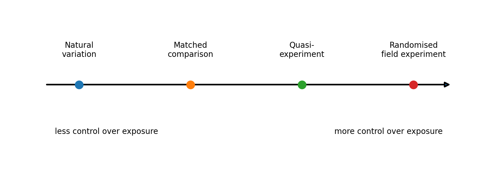
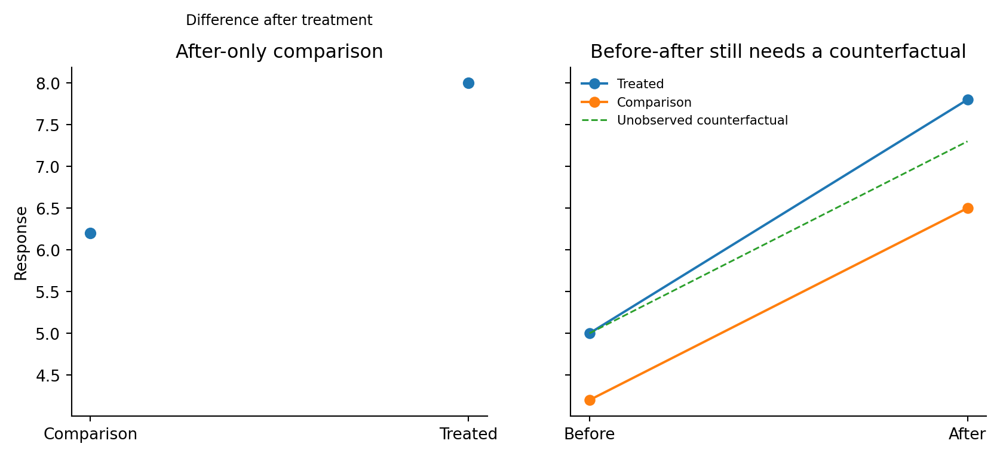
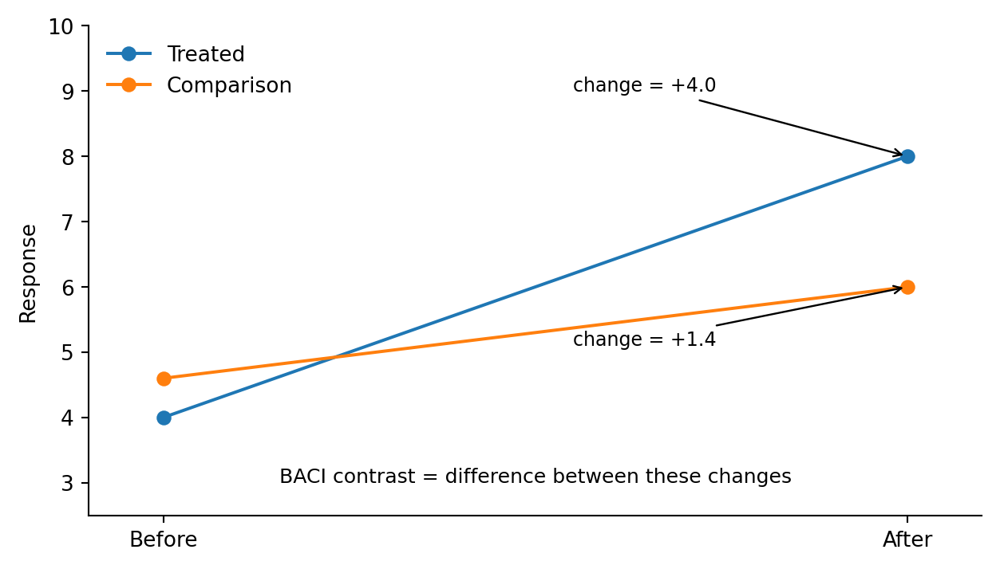
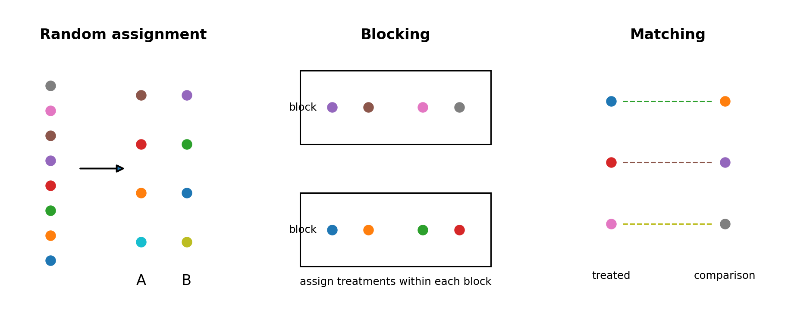
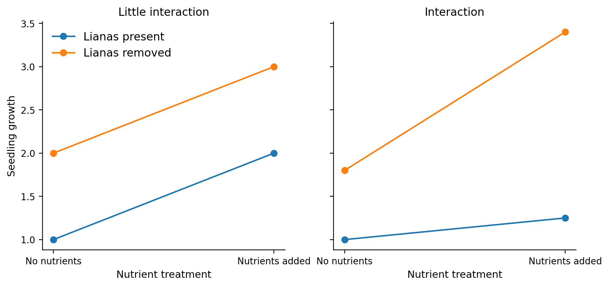

The preceding chapters have concentrated on learning from environmental variation that already exists: differences among sites, individuals, environmental conditions and trajectories through time. Those observational studies are indispensable because they describe systems at realistic scales and under combinations of conditions that researchers often cannot assign. They can also leave causal pathways difficult to separate when several drivers vary together. Field experiments and structured interventions add information by deliberately changing a condition, or by taking advantage of a change that has been imposed for other reasons, and asking whether the response changes as the causal model predicts. The measurement, sampling, spatial and temporal principles developed in Chapters 3–8 still apply; the additional design problem is how the focal contrast is generated and what comparison can represent the outcome that would have occurred without it. Experiments complement observation rather than replacing it. Monitoring can reveal where and when a process appears important, establish the range of natural variation and identify candidate mechanisms. A field manipulation can then isolate one part of that pathway while leaving much of the surrounding system intact. Conversely, an experimental response observed in a small number of plots needs observational information to show how common the relevant conditions are and whether the effect persists across landscapes or years. Treatments are applied to spatial units, replicated across units and often followed through time, so Chapters 5–7 remain part of experimental design. The useful degree of control depends on the question, feasibility, ethics and the spatial and temporal scale of the process.

## 9.1 From observational patterns to field manipulation

Suppose we want to know whether reduced mowing increases natural woody regeneration on campus. One option is to compare existing low- and high-mowing areas. This uses natural variation in management and may be highly realistic, but mowing frequency may be entangled with site history, soil, irrigation, surrounding vegetation and the reasons managers chose a particular regime. A stronger observational design could match sites on some of those factors or sample enough sites that the focal management contrast appears across a range of conditions. A quasi-experimental opportunity might arise if a policy changes mowing in some areas but not others. A field experiment could go further by assigning mowing regimes to comparable management units before regeneration develops. Each approach trades control against feasibility, realism and the scale that can be studied. Observational studies can address processes that cannot ethically or practically be manipulated, while experiments can isolate mechanisms that would remain ambiguous in natural variation. The design should therefore be judged by the alternative explanations it leaves open and by whether the degree of control is appropriate for the intended inference.

{width=82% fig-alt="Continuum from natural observational variation through matched comparisons and quasi-experiments to randomised field experiments."}

**Figure 9.1.** Field studies can range from observations of natural variation to randomised manipulation, with matched and quasi-experimental designs between them. The useful degree of control depends on the question, feasibility, ethics and scale.

::: {.try-it-yourself}
**Try it yourself – Monitoring suggests a mechanism: what would you manipulate?**

Suppose repeated forest censuses show that seedling recruitment is consistently lower where lianas are abundant. The association could reflect direct competition, but lianas may also be common in sites with a different disturbance history, canopy structure or soil environment. Design a field manipulation that changes liana competition while preserving enough of the natural setting to make the result ecologically interpretable. What unit receives the treatment? What is independently replicated? Which pre-treatment measurements would help, and how long would the plots need to be followed?

There is no single correct layout. What you should be able to show at this stage is how the proposed causal pathway connects to treatment assignment, replication and temporal comparison; the more formal terminology comes afterwards.
:::

## 9.2 Baseline, comparison, control, reference and counterfactual

Intervention studies use several kinds of comparison that are easily treated as interchangeable even though they answer different questions. A baseline describes the condition of the treated unit before intervention. A comparison site is another unit used to judge whether change was specific to the treated unit. In a randomised experiment, a control is an experimental unit assigned not to receive the focal treatment, or to receive a defined alternative treatment. A reference condition is a benchmark or desired state, such as an old-growth forest used to describe restoration goals. The counterfactual is broader: it is the unobserved outcome that would have occurred to the treated unit had the intervention not taken place. Reference conditions, controls, baselines and counterfactuals serve different roles. An old forest may define a restoration target while being unsuitable as a control for a young restoration site because its history and starting conditions are fundamentally different. A pre-intervention measurement shows where the treated site began but cannot tell us whether rainfall, climate or regional management would have changed the site anyway. Intervention designs become stronger when their comparison units and temporal observations make the counterfactual trajectory more credible.

## 9.3 Why before-after or after-only comparisons can mislead

A before-after design follows the treated unit through time and can show that it changed. If stream nitrate concentration fell after a treatment system was installed, the change is real information. Yet the same period may have included lower factory production, higher rainfall or changes in upstream pollution. Without information about what happened elsewhere, the before-after contrast combines the intervention with every background change that occurred between the two measurements. The opposite design, comparing treated and untreated sites only after intervention, has a complementary weakness. A restored wetland may contain more birds than an unrestored wetland after five years, but perhaps the two sites already differed in vegetation, hydrology or landscape context before restoration. The post-treatment difference does not reveal whether the intervention created the difference or inherited it. Measuring both change through time and a defensible comparison can reduce these ambiguities.

{width=82% fig-alt="Comparison of an after-only treatment contrast with a before-after design that still requires an unobserved counterfactual."}

**Figure 9.2.** After-only and before-after comparisons leave different ambiguities. The causal problem is to estimate what would have happened to the treated unit without the intervention.

## 9.4 BACI and the logic of comparing changes

Before-After-Control-Impact, usually abbreviated BACI, combines these two contrasts. The question is whether the treated unit changed differently from the comparison unit. Suppose biomass in a treated patch increases from 12 to 20 units, while biomass in a comparable untreated patch increases from 10 to 15. The treated patch changed by +8 and the comparison patch by +5. The additional +3 change is the part associated with treatment under the assumption that, without treatment, the treated patch would have followed a change similar to the comparison. That assumption deserves attention. One impact site and one control site do not provide a general experiment merely because measurements were made before and after. The two sites may differ in trends for reasons unrelated to treatment, and one unusual event at either site can dominate the result. Strong BACI designs therefore benefit from repeated observations before intervention, repeated observations afterwards and, where possible, several independently treated and comparison units. The design becomes a way of estimating how treatment changes the trajectory relative to background temporal variation rather than a formula that automatically creates causal inference.

::: {.worked-example}
**Worked example 9A – Difference in differences**

The simplest BACI contrast can be written as (After_treated - Before_treated) - (After_comparison - Before_comparison). In the example above, (20 - 12) - (15 - 10) = 8 - 5 = 3. This calculation is often called a difference-in-differences estimate. With many units and times, statistical models estimate the same logic through an interaction between treatment group and time. A treatment effect is indicated when the temporal change differs between groups, rather than merely because one group is higher overall. The interpretation still depends on design assumptions. In a non-randomised study, the key counterfactual assumption is that treated and comparison units would have followed comparable trends in the absence of treatment. Pre-intervention time series can help evaluate that assumption but cannot prove it for the future.
:::

{width=68% fig-alt="Treated and comparison responses before and after an intervention, illustrating a difference-in-differences or BACI contrast."}

**Figure 9.3.** BACI logic: the contrast of interest is the difference in change between treated and comparison units, not simply the post-treatment difference or the before-after change in the treated unit.

## 9.5 Experiments and interventions embedded in monitoring

Monitoring and experimentation become especially informative when they share sampling units or at least the same study landscape. A long-term record establishes how much units differ before treatment, whether their trajectories are parallel, and how strongly the response fluctuates through time. When an intervention is introduced later, the treatment response can be interpreted against that background rather than against a single before measurement. Imagine a secondary-forest monitoring network in which tree recruitment has been followed annually and repeated observations suggest that liana abundance is associated with lower tree growth or recruitment. The observational pattern was recorded across the natural range of canopy, soil and landscape conditions, but liana abundance may itself covary with disturbance history or forest structure. A field manipulation that removes lianas from randomly assigned plots while retaining paired or blocked comparison plots asks a more specific question: does reducing liana competition change the demographic response under otherwise comparable conditions? Continued monitoring then shows whether the effect is immediate, delayed or transient. The logic also works for restoration and management interventions that cannot be assigned freely. Hydrological repair, planting, mowing changes or stream restoration may be implemented by managers at selected sites. Repeated pre-intervention observations, multiple treated and comparison units, and explicit matching or blocking can make the resulting comparison much more informative than an after-only assessment. The design remains partly observational when assignment is not randomised, and the interpretation should retain that limitation rather than treating every intervention as an experiment in the strict sense.

## 9.6 Experimental units, replication and random assignment

The experimental unit is the smallest unit that can receive a treatment independently. If mowing is assigned to whole 20 × 20 m patches, the patch is the experimental unit even when fifty seedlings are measured inside it. If nutrient addition is applied separately to individual plots within a forest, the plots may be experimental units. Replication must occur at the level of treatment assignment. Many seedlings or repeated measurements within one treated patch improve our description of that patch but do not provide independent replicates of the mowing treatment. Random assignment strengthens causal interpretation because, before treatment, each eligible experimental unit has a defined chance of receiving each treatment. With enough replication, randomisation tends to distribute measured and unmeasured background differences across treatment groups without requiring the researcher to decide which units look comparable. This is conceptually different from random sampling. Random sampling concerns how units enter the study from a target population and primarily supports generalisation; random assignment concerns how treatments are allocated among units already in the study and primarily supports causal attribution. A study can have one without the other. Randomisation does not guarantee that small treatment groups will be perfectly balanced. By chance, one group can contain wetter or larger plots. Recording important pre-treatment characteristics remains useful, and blocking can sometimes protect against known heterogeneity before treatments are assigned.

## 9.7 Blocking, matching and quasi-experiments

Blocking groups experimental units that are similar in a factor expected to influence the response, after which treatments are randomised within each block. A mangrove experiment might block plots by elevation class before assigning a planting treatment; an urban heat experiment might pair locations with similar canopy exposure before assigning a shade intervention. Blocking does not remove the environmental gradient. It prevents that gradient from becoming systematically aligned with treatment and can improve the efficiency of the comparison when the blocking variable explains substantial variation. This extends the paired-comparison logic introduced in [Chapter 4](04-variability-uncertainty.qmd): a meaningful pairing or block can hold some background variation in common, allowing the focal contrast to be estimated from differences within those groups rather than from unrelated units that may differ for many reasons. When random assignment is impossible, matching uses related reasoning in an observational or quasi-experimental setting. Treated units are compared with untreated units that are similar in measured background conditions. Matching can make comparisons more defensible, but it only balances variables that were measured and used in the match. Unmeasured history or context can still differ. Natural experiments and policy changes occupy a similar middle ground: the focal exposure is not assigned by the researcher, but the way it arose may create a comparison that is more informative than ordinary observational variation. The strength of the causal interpretation depends on understanding that assignment process in detail.

{width=82% fig-alt="Three schematic panels showing random assignment, treatment assignment within blocks, and matched treated and comparison units."}

**Figure 9.4.** Random assignment, blocking and matching solve related but different design problems. Randomisation allocates treatments by chance, blocking constrains randomisation within known sources of variation, and matching constructs comparable pairs or groups when treatment has not been assigned randomly.

## 9.8 Factorial experiments and interactions

Some questions involve more than one manipulable factor. Suppose we want to know whether seedling growth responds to nutrient addition and whether that response depends on liana competition. A factorial experiment includes combinations of the factors: no addition/no removal, nutrient addition only, liana removal only and both nutrient addition and liana removal. This allows the experiment to estimate the average effect of each treatment while also asking whether the effect of one depends on the other. The dependence is an interaction. If nutrient addition increases growth by roughly the same amount with and without lianas, the effects are approximately additive. If nutrient addition has little effect under dense lianas but a large effect after liana removal, the nutrient response depends on competition. Interactions are common in environmental systems because processes rarely operate in isolation. Factorial experiments can therefore be more informative than running two separate one-factor experiments, but they also require enough experimental units to replicate the treatment combinations and can become logistically demanding quickly.

::: {.worked-example}
**Worked example 9B – What an interaction means**

In a two-factor model, an interaction asks whether the effect of factor A changes across levels of factor B. Graphically, parallel treatment-response lines indicate little interaction; non-parallel lines indicate that the size or direction of one effect depends on the other factor. The statistical interaction is not a separate biological mechanism by itself. It is a pattern that needs ecological interpretation. In the nutrient-by-liana example, a strong interaction could arise because nutrients become useful only when light competition is reduced, or because liana removal changes soil moisture or root competition. The experiment identifies dependence between treatment effects; additional measurements may be needed to explain the mechanism.
:::

{width=76% fig-alt="Parallel versus non-parallel treatment response lines for nutrient addition under lianas present and lianas removed."}

**Figure 9.5.** Parallel response lines indicate similar treatment effects across levels of a second factor; non-parallel lines indicate an interaction, in which the size or direction of one effect depends on the other factor.

## 9.9 Repeated measurements in experiments

Interventions often change trajectories rather than producing an immediate permanent step. Seedlings may respond quickly to nutrient addition and then converge later as nutrients become depleted. A restored wetland may take several years before vegetation structure affects birds or hydrology. Repeated measurements therefore add information about timing, lag and persistence of treatment effects. The same caution from [Chapter 7](07-time.qmd) applies: repeated observations of one experimental unit are not new treatment replicates. With repeated measurements, the experimental question often becomes whether treatment groups follow different temporal trajectories. A single before-and-after difference summarizes only one segment of those trajectories. Multiple pre-treatment censuses can show whether groups already had different trends; multiple post-treatment censuses can reveal transient responses, delayed effects or recovery after an initial disturbance. Statistical models commonly express this as a treatment-by-time interaction while accounting for repeated observations from the same units.

## 9.10 Control, realism and scale in field experiments

Greater experimental control can strengthen causal interpretation but can also narrow the system being represented. A small shade structure around seedlings can isolate a light mechanism yet tell us less about whole-forest regeneration, where canopy change also alters moisture, litter, competitors and seed dispersal. A plot-level nutrient addition may reveal nutrient limitation over several square metres without showing whether landscape-scale management would have the same effect. Controlled experiments are therefore most informative when the manipulated scale matches the process in the question or when the study is explicit that it is testing one mechanism rather than reproducing the full system. Field experiments also face practical and ethical limits. Treatments cannot always be assigned to whole catchments, neighbourhoods or protected habitats. Long-lived organisms may require durations that exceed funding cycles. Interventions that are acceptable at small scale may be unacceptable when replicated broadly. These constraints determine which combination of observational evidence, natural experiments, modelling and manipulation is feasible. Combining approaches with different limitations can strengthen inference because the same alternative explanation is less likely to account for all of their results.

## 9.11 A design check for experiments and interventions

Before interpreting an intervention effect, ask which unit actually received the treatment, what comparison represents the unobserved alternative, and which parts of the design were controlled rather than merely observed. The following questions provide a final check:

1. What is the causal question, and what outcome is expected to change?
2. What is the experimental or intervention unit, and how many independently treated and comparison units are available?
3. How were treatments assigned, and could the assignment process itself be related to the outcome?
4. Is a baseline needed, and would repeated pre- and post-intervention observations help capture the expected timing of the response?
5. Which environmental gradients should be blocked, matched or measured?
6. If more than one factor is manipulated, can the design estimate interactions without sacrificing the replication needed for the main comparisons?
7. Over what spatial and temporal scales can the intervention effect reasonably be generalised?
8. Which alternative explanations remain because the design could not control or measure them?

Experimental design extends the sampling logic developed in Chapters 5–7. It still depends on identifying the right unit, representing relevant variation, allocating effort across levels and measuring at appropriate times. What changes is the way the focal predictor enters the study. By assigning or exploiting an intervention and building a defensible comparison, we try to make the counterfactual less hypothetical and the causal interpretation more secure.

## Further reading for Chapter 9

Ruxton and Colegrave (2016) and Quinn and Keough (2023) provide broader
introductions to experimental design for biological and field research.

Underwood (1992, 1996) develops the logic of environmental-impact
comparisons, BACI-type designs and replicated field experiments in
variable natural systems.

Schnitzer et al. (2010, 2014) and Estrada-Villegas and Schnitzer (2018)
provide concrete tropical-forest examples of how liana-removal
experiments can test mechanisms suggested by observational patterns.
